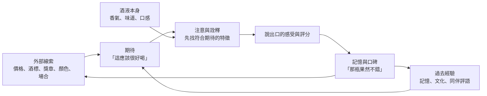

# 10 價格、標籤與期待如何介入品飲？

尾牙抽獎，阿哲抽到一瓶包裝很講究的酒，瓶頸掛著一面金色獎牌貼紙。回家後他和小林各倒一杯，小林喝了一口說：「果然不一樣。」阿哲問：「哪裡不一樣？」小林想了很久，只說得出「比較順」。他們都沒有注意到，在喝下第一口之前，那張獎牌貼紙和精裝禮盒已經先說了很多話。

!!! info "本章要回答"
    - **核心問題**：價格、酒標、顏色與獎章，會不會改變我們「喝到」的東西？研究能說到哪裡、不能說到哪裡？
    - **讀完能做什麼**：分辨盲測、公開品飲、專家評分與個人偏好各自回答什麼問題；拆開「手工、老年份、限量、得獎、無添加、天然」這些廣告詞，找出可以查證的部分。
    - **不處理**：風味詞彙怎麼用（見[第 09 章](09-describing-flavour.md)）；酒標上的法定欄位怎麼讀（見[附錄 C](appendix-c-labels-units.md)）；健康宣稱（見[第 13 章](13-body-health.md)）。

## 期待不是雜訊，而是感知的一部分

我們常把品嚐想成「酒液進入口腔，感官如實回報」。實際上，大腦在收到味道與氣味之前，已經先從顏色、瓶子、價格、同桌者的反應，以及自己過去的經驗，建立一個「這杯應該是什麼」的預測。接著，感官訊號與預測一起被整理成我們說出口的感受。

這不代表感受是假的。期待會影響的是整個經驗：注意力放在哪裡、找哪些詞來描述、覺得多愉快。對日常生活來說，這些都是真實的；但如果目的是「比較兩杯酒液本身的差異」，期待就成了需要控制的變因。下圖是本章的核心概念。

這個迴圈的最後一步最值得注意：評分與口碑會回頭變成下一次的外部線索。一瓶酒被說好喝，下一個人拿起它時就帶著更高的期待。

## 四項常被引用的研究，各自說了什麼

以下四項研究常在酒類文章裡被簡化成「品酒都是騙人的」。回到原始摘要，它們的設計與結論範圍其實窄得多。

**價格與愉悅感（Plassmann 等，2008）。** 一項 20 位受試者的腦造影（fMRI）實驗。研究者讓受試者品嚐幾種葡萄酒，並告知不同價格；受試者不知道其中有些「不同的酒」其實是同一種。結果是：同一款酒標上較高價格時，受試者自評的風味愉悅度較高，大腦內側眶額皮質（一般認為與體驗到的愉悅感有關的區域）的血氧訊號也較強。這項研究支持「價格資訊可以改變愉悅感的報告與相關腦區活動」。限制是樣本小、在掃描儀內以小量液體品嚐、受試者被明確告知價格，且只測試特定酒款；它不能推論每一次價格差異都只是心理作用，也不能說明長期或有訓練的品飲者會怎樣。

**顏色與氣味描述（Morrot 等，2001）。** 研究分兩部分。第一部分分析專家的品酒筆記，發現描述葡萄酒氣味的物件，多半與酒的顏色相同：白葡萄酒常被說成白色或黃色水果，紅酒常被說成紅色莓果。第二部分是實驗：把白葡萄酒用無氣味的色素染紅，由 54 位品嚐者描述氣味，結果他們用描述紅酒的方式描述它。作者認為，這種錯覺主要發生在「把氣味說成語言」的階段。限制是作業形式偏向用詞，而且只測試顏色這一種線索；它說明視覺會牽動描述，但不代表品嚐者「完全分不出」紅、白葡萄酒。

**價格與盲飲評分（Goldstein 等，2008）。** 研究整理了超過 6,000 次盲飲紀錄（原文指出約 500 位參與者、500 多款酒），品嚐者不知道價格與酒款身分。整體而言，價格與評分呈「小幅的負相關」，也就是一般參與者平均沒有比較喜歡較貴的酒；但受過葡萄酒訓練的參與者，這個關係不是負的。作者的結論是：非專家不應只因價格較高，就期待自己會更享受酒液本身。限制是參與者多為自願參加品酒活動的美國民眾，評分方式與日常飲用不同，而且「偏好」與「品質」是兩回事。

**評審的一致性（Hodgson，2008）。** 研究在美國一項大型葡萄酒競賽內進行，時間是 2005–2008 年。每組 4 位評審、每輪 30 款酒，其中暗藏同一瓶酒倒出的三份樣本，每年約 65–70 位評審參與。結果約 10% 的評審能讓同一款酒的三次分數維持在同一獎牌等級內；另有約 10% 的評審，有時會對同一款酒給出從銅牌到金牌的不同等級。評審對他們不喜歡的酒較一致。限制是只研究單一競賽、單一評分制度；它指出競賽獎牌的可重複性有限，但沒有證明所有評審都在亂評，也不能直接推論到其他競賽或其他酒類。

| 研究 | 設計與樣本 | 比較了什麼 | 可以支持 | 不能推出 |
|---|---|---|---|---|
| Plassmann 等，2008 | fMRI，20 人 | 同一款酒標示不同價格 | 價格資訊可改變愉悅感報告與相關腦區活動 | 所有價差都是心理作用 |
| Morrot 等，2001 | 用詞分析＋54 人實驗 | 白葡萄酒染紅後的氣味描述 | 視覺線索會牽動氣味用詞 | 品嚐者完全無法辨識酒 |
| Goldstein 等，2008 | 6,000 多次盲飲 | 價格與盲飲評分的關係 | 該樣本中非專家的價格與喜好呈小幅負相關 | 貴的酒一定比較差 |
| Hodgson，2008 | 單一競賽 4 年資料 | 同一瓶酒的重複評分 | 競賽獎牌的重複性有限 | 所有酒評都是騙局 |

把四項放在一起看，比較穩妥的說法是：**外部線索會影響我們說出的感受；在這批盲飲資料中，價格與一般參與者的喜好關係很弱；被研究的競賽中，個別評審的重複判斷帶有不確定性。**這些是關於「資訊與判斷」的研究，不是關於「酒好不好」的宣判。

## 盲測、公開品飲、專家評分、個人偏好：用途各不相同

常見的爭論是「到底要不要盲測」。其實不同的品嚐方式回答不同的問題，沒有哪一種在所有情境都比較正確。

| 方式 | 回答的問題 | 優點 | 限制 |
|---|---|---|---|
| 盲測 | 拿掉標籤與價格後，我能不能分辨、比較喜歡哪一杯？ | 控制外部線索，最接近「只比較酒液」 | 脫離真實用餐情境；單次結果容易受順序、溫度影響 |
| 公開品飲 | 知道產地、製法、年份後，我怎麼理解這杯酒？ | 可以學習製程與風味的關聯 | 期待效應無法排除，容易「找到」預期中的特徵 |
| 專家評分 | 受過訓練的人，在某套標準下怎麼評？ | 詞彙一致、經驗多，可作為線索 | 標準由評分者或機構決定；可能有商業關係；重複性不一定高 |
| 個人偏好 | 我在這個情境下喜不喜歡？ | 對自己的選擇最直接 | 不代表別人的感受，也不等於品質 |

公開品飲並非「被騙」。學習時，先知道「這是酸度較高的白葡萄酒」再去找酸，是建立連結的正常方法；博物館導覽也是先告訴你看哪裡。問題只在於把公開品飲的感受，說成是酒液本身的客觀性質。

專家評分也不是毫無價值。評審與酒評者通常喝過大量樣本，可以提供風格、缺陷、製程的線索。讀評分時，把它當成「某人在某個情境下的判斷」，並留意評分機構是否收費、是否與產業有關係，就能用得比較安心。

自己做一次簡單盲測的方法，見[附錄 B](appendix-b-tasting-sheet.md)。

## 常見誤解：研究結果被放大成口號

**誤解一：「研究證明貴的酒都是騙人的。」** Goldstein 等人的研究顯示一般參與者盲飲時不偏好較貴的酒，但受過訓練者並非如此；價格也可能反映產量、土地、人工、稅費、運輸與品牌行銷，這些與「喜不喜歡」本來就是不同問題。

**誤解二：「專家連紅、白葡萄酒都分不出來。」** Morrot 等人的實驗改變的是顏色線索與描述用詞，參與者在錯誤的視覺提示下用了紅酒詞彙。這說明語言容易被視覺帶走，不等於味覺或嗅覺失靈。

**誤解三：「得獎等於好喝。」** 獎牌是某次競賽、某組評審、某套規則的結果。Hodgson 的研究提醒我們，單一獎牌的重複性有限；更實際的讀法是查：哪個競賽、多少款酒參賽、多少比例得獎、參賽是否要付費。

**誤解四：「知道了期待效應，就能不受影響。」** 研究中的受試者多半也知道自己在做實驗。比較可靠的做法不是靠意志力，而是改變條件：遮住標籤、隨機排列、請別人倒酒。

## 廣告說法拆解表

以下六個詞常出現在酒類包裝與廣告。它們不一定是假的，但各自能證明的事情有限。拆解時問四個問題：宣稱什麼？哪部分可以驗證？需要什麼證據？不能推出什麼？

| 宣稱 | 可驗證部分 | 所需證據 | 不能推出的結論 |
|---|---|---|---|
| 手工 | 哪些步驟由人工完成、哪些使用機器 | 製程說明、生產規模、第三方參訪或報導 | 風味比較好、衛生比較好、比機械生產更健康 |
| 老年份 | 採收或裝瓶年份、熟成期間 | 法定標示、年份規定（各地不同）、熟成紀錄 | 越老越好喝；開瓶後仍一定在適飲狀態（見[第 03 章](03-distill-age-blend.md)） |
| 限量 | 這一批的生產或販售數量 | 批號、總瓶數、編號方式 | 品質較高；未來一定升值（本書不討論投資） |
| 得獎 | 哪個競賽、哪一年、什麼等級 | 競賽名稱、參賽數、得獎比例、評審方式、是否收費 | 所有人都會喜歡；每一批都和得獎那批相同 |
| 無添加 | 沒有加入哪些特定成分 | 成分標示、適用地區法規、檢驗報告 | 更健康、酒精比較不傷身；酒精本身仍是主要風險來源（見[第 13 章](13-body-health.md)） |
| 天然 | 原料來源、是否使用特定加工 | 查適用地區是否有定義，以及業者對這個詞的具體承諾 | 對身體比較好、風味比較純粹、比較安全 |

這張表的重點在最右欄。即使某項製程或數量宣稱屬實，也未必支持讀者聯想到的品質、健康或價值結論；不能因此反過來預設所有廣告大部分都不實。遇到新詞，也可以照同樣四欄自己拆一次。

!!! tip "不喝酒也能做的觀察"
    找兩個相同的杯子，泡同一包茶，分成兩杯。請家人在其中一杯旁邊放一張寫著「高山手採・限量」的紙卡，另一杯放「一般茶包」。

    - 先各喝一口，記下你覺得哪杯比較香、比較順。
    - 再請家人把紙卡拿走、交換位置，你閉眼各喝一口，再記一次。
    - 比較兩次紀錄：你的描述詞有沒有跟著紙卡移動？

    也可以用同一種果汁，加一滴食用色素改變顏色，看看同伴描述的水果種類會不會跟著顏色改變。這是觀察練習，單次結果可能受順序、溫度或猜測影響；出現差異不能證明期待是唯一原因，沒出現差異也不能證明自己不受期待影響。

## 常見說法查證

??? question "說法：「價格越高，酒一定越好。」"
    - **可驗證的部分**：價格反映成本、產量、稅費、品牌與市場需求，這些可以分別查詢。
    - **研究結果**：Goldstein 等人整理 6,000 多次盲飲，一般參與者的評分與價格呈小幅負相關；受過訓練者則非負相關。
    - **本書判斷**：價格是市場資訊，不是風味資訊。想知道自己喜不喜歡，盲測比看標價可靠。

??? question "說法：「酒評與得獎都不可信。」"
    - **可驗證的部分**：Hodgson 的研究顯示單一競賽中，評審對同一瓶酒的重複評分一致性有限。
    - **不能推出的結論**：研究只涵蓋一個競賽；不代表所有評審或所有評分制度都一樣。
    - **本書判斷**：把評分當成「特定人、特定規則下的一個線索」，同時查評分方的利益關係。

??? question "說法：「只要夠專業，就不會受標籤影響。」"
    - **可驗證的部分**：Morrot 等人的研究顯示，顏色線索會影響品嚐者的氣味用詞；Goldstein 等人的研究中，受訓者與一般參與者的價格關係不同。
    - **本書判斷**：訓練可能改變人對線索的反應，但本章引用的研究不能支持「專業就能免疫」。控制條件比依賴個人意志可靠。

## 本章小結

價格、酒標、顏色與獎章都在我們喝下之前就開始說話。原始研究支持「外部線索會影響愉悅感與描述」，也提醒我們盲飲時價格與一般人的喜好關係很弱、單一獎牌的重複性有限；但這些研究的樣本與情境都有邊界，不能延伸成「品酒全是騙局」。實用的做法是：想比較酒液本身時就遮住資訊，想學習時就公開資訊，並且把「我喜歡」「有證據支持」「廣告這樣說」分開記錄。

## 來源

| 來源 | 類型 | 本章用途 |
|---|---|---|
| [Plassmann H 等，2008，PNAS，Marketing actions can modulate neural representations of experienced pleasantness](https://pmc.ncbi.nlm.nih.gov/articles/PMC2242704/) | 研究論文 | 價格資訊與愉悅感、腦區活動；20 人 fMRI 實驗 |
| [Morrot G 等，2001，Brain and Language，The color of odors](https://doi.org/10.1006/brln.2001.2493) | 研究論文 | 白葡萄酒染紅後的氣味描述；54 位品嚐者 |
| [Goldstein R 等，2008，Journal of Wine Economics，Do More Expensive Wines Taste Better?](https://doi.org/10.1017/S1931436100000523) | 研究論文 | 6,000 多次盲飲中價格與評分的關係 |
| [Hodgson RT，2008，Journal of Wine Economics，An Examination of Judge Reliability at a major U.S. Wine Competition](https://doi.org/10.1017/S1931436100001152) | 研究論文 | 競賽評審對同一瓶酒重複評分的一致性 |
| [菸酒管理法](https://law.moj.gov.tw/LawClass/LawAll.aspx?pcode=G0330011) | 法規（台灣） | 酒類標示與廣告的法定規定（對照廣告詞的法律地位） |

查閱日：2026-09-20。
