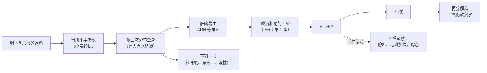

# 13 酒精與身體：劑量、風險與研究怎麼讀

尾牙散場後，阿哲兩杯啤酒下肚，臉已經紅到脖子。坐隔壁的同事拍拍他：「臉紅是代謝好，多喝幾次就練出來了。」美玲則說自己只喝紅酒，「對心臟好」。另一位同事喝了大半瓶高粱，走路還很穩，說：「我又沒醉，沒事啦。」

這三句話都在說身體，卻分別牽涉代謝、流行病學研究和劑量。本章把它們一一拆開。

!!! info "本章要回答"
    - 核心問題：酒精進入身體後發生什麼事？「喝多少」要怎麼算？關於酒與健康的研究，該怎麼讀？
    - 讀完能做什麼：用公克而不是「杯」來思考酒精量；說出 ALDH2 與臉紅的關係；看到「適量飲酒有益」的新聞時，知道要問比較組是誰。
    - 不處理什麼：不提供個人醫療判斷，也不給「每天可以喝多少」的建議。聚餐拒酒、懷孕、服藥、開車與求助資源見[第 14 章](14-choosing.md)；換算表見[附錄 C](appendix-c-labels-units.md)。

## 一杯酒進到身體之後

酒裡對身體起作用的主角是乙醇。它不需要消化，喝下後直接經由胃和小腸吸收進入血液。一篇肝臟醫學綜述（Cederbaum，2012）指出，小腸前段吸收得比胃快，所以**胃排空的速度**影響酒精進入血液的快慢；胃裡有食物時排空變慢，吸收也跟著變慢。這就是「不要空腹喝酒」的生理基礎。空腹與否改變的是吸收速度，喝下的總量不會因此變少。

進入血液後，乙醇會分布到全身含水的組織。同一篇綜述提到，女性體脂比例通常較高、體內水分比例較低，酒精的分布體積較小，同樣的量喝下去，血中濃度往往較高。

身體清除乙醇主要靠氧化：約九成經代謝移除，只有不到一成從呼氣、尿液和汗液排出。代謝大部分在肝臟進行，分兩步：

第一步由乙醇脫氫酶（ADH）把乙醇轉成**乙醛**；第二步由乙醛脫氫酶（主要是 ALDH2）把乙醛轉成**乙酸**。另有 CYP2E1 等酵素分擔一部分，大量或長期飲酒時角色較明顯（Zakhari，2006）。乙醛是整條路線中最麻煩的中間產物：國際癌症研究機構（IARC）把酒精飲料中的乙醇，以及與飲用酒精飲料相關的乙醛，都列為第 1 類致癌物。這項分類表達致癌證據的確定性，不是說所有第 1 類暴露的風險大小相同。

肝臟處理的速度有上限，而且個人差異很大。Cederbaum 的綜述以「平均約每小時 7 公克」作為估算，但這是群體平均，不是每個人的時刻表，不能拿來倒算多久後能安全或合法駕駛。喝得比代謝快，血中酒精就累積。美國國家酒精濫用與酒癮研究所（NIAAA）也提醒，停止喝酒後，胃腸裡還沒吸收的酒精仍會繼續進入血液，血中濃度可能在停杯後繼續上升。

## 劑量要用公克算，「一杯」不是單位

比較風險時，研究者算的是**純酒精公克數**，不是杯數或酒的種類。算法很簡單：

> 容量（ml）× 酒精濃度（ABV）× 0.8 ≈ 純酒精（g）

0.8 來自乙醇密度（約 0.789 g/ml）。一罐 350 ml、5% 的啤酒約 14 g；500 ml、5% 約 20 g。日本厚生勞動省 2024 年的飲酒指引就直接以這個公式教民眾計算，並且不另訂「標準杯」。

各國的「標準杯」定義不同：美國約 14 g，英國 1 unit 為 8 g，澳洲 10 g，全球疾病負擔（GBD）研究採 10 g。台灣的「一份」是多少克，本書查閱時未能開啟國民健康署原文核實，因此不寫數字。**標準杯只是計算單位**，不是建議量，更不是「安全量」。詳細換算與國別比較見[附錄 C](appendix-c-labels-units.md)。

同樣是「一杯」，差距可以很大：

| 情境中的「一杯」 | 假設容量與濃度 | 純酒精約 |
|---|---|---|
| 一罐啤酒 | 350 ml × 5% | 14 g |
| 一大罐啤酒 | 500 ml × 5% | 20 g |
| 一杯葡萄酒 | 150 ml × 13% | 15.6 g |
| 一小杯烈酒 | 30 ml × 40% | 9.6 g |

公式中的 ABV 要代入小數，例如 5% 代入 0.05。這張表只示範換算，不代表任何一種份量是合適或安全的。

## 短期與長期的風險

酒精的影響大致可分兩種時間尺度。

**短期**：酒精作用於中樞神經，判斷、反應與協調都會變差，這是酒駕與各種意外傷害的來源。NIAAA 說明，當血中酒精高到一定程度，腦中控制呼吸、心跳與體溫的區域會開始失靈，可能出現記憶斷片、失去意識，甚至死亡；嘔吐時咽反射變弱，也有嗆到的危險。冷水澡、熱咖啡或走一走都不能讓人「退酒」，反而可能讓情況更糟。

**長期**：世界衛生組織（WHO）的酒精概況指出，2019 年全球約 260 萬人的死亡歸因於飲酒，相關疾病包括心血管疾病、癌症、肝病、精神健康問題與各類傷害；風險取決於飲用量、頻率、個人健康狀況與情境，並寫明「沒有任何形式的飲酒是沒有風險的」。WHO 歐洲區 2023 年的聲明更直接：「no level of alcohol consumption is safe for our health」，並指出歐洲區酒精相關癌症中，約有一半發生在並非重度飲酒的人身上。

日本厚生勞動省的指引列出不同疾病開始增加風險的飲酒量，其中高血壓、男性食道癌、女性出血性腦中風等項目標為「0 g＜」，也就是少量就開始增加。指引另以「每日純酒精男性 40 g、女性 20 g 以上」作為提高生活習慣病風險的飲酒量，並明文註記：這些數字**不是個人的容許量**。

| 時間尺度 | 主要機制 | 例子 | 證據類型 |
|---|---|---|---|
| 幾分鐘到幾小時 | 中樞神經抑制 | 反應變慢、意外傷害、酒駕、急性中毒 | 生理研究、公共衛生統計 |
| 數年到數十年 | 乙醇與乙醛的長期暴露 | 多種癌症、肝病、高血壓 | 世代研究、致癌性評估 |
| 懷孕期間 | 酒精經胎盤影響胎兒 | 胎兒酒精譜系障礙 | 公共衛生機關整理（見[第 14 章](14-choosing.md)） |

## ALDH2 與臉紅：台灣讀者特別該知道的事

回到阿哲的臉紅。ALDH2 有一種常見的低活性變異。帶有這種變異的人，乙醛轉成乙酸的速度慢，喝酒後乙醛在體內累積，於是出現臉紅、心跳加快、噁心等反應。

Brooks 等人 2009 年在《PLOS Medicine》發表的轉譯研究文章整理了當時的證據；下列人口數與比例是該文的歷史估計，並非 2026 年人口統計：

- 全球估計至少有 5.4 億名 ALDH2 缺乏者，約占人口 8%。
- 約 36% 的東亞人（日本、中國、韓國）喝酒後出現臉紅等典型反應。
- 在日本與台灣的**病例對照研究**中，把飲酒量納入調整後，低活性 ALDH2 的異型合子者與 ALDH2 活性完整者相比，食道癌的勝算比（OR）介於 3.7 到 18.1。

勝算比來自病例對照研究，範圍很寬，而且比較的是「同樣喝酒時，兩種基因型之間」的差別，不能直接換算成某個人一生罹癌的機率。台灣人口中 ALDH2 缺乏者的比例，本書查閱時未能以原始研究核實，因此不寫百分比。

同一篇文章還提到：部分異型合子者會對乙醛與臉紅反應產生耐受，之後成為習慣性的大量飲酒者。換句話說，「練出來、不再臉紅」不代表乙醛不再累積，外觀反應減弱不能當作代謝功能已恢復的證據。臉紅也不一定都出於 ALDH2；喝酒容易臉紅的人如果想知道自己的狀況，可以詢問醫師是否需要進一步評估。

## 研究怎麼讀：三個常見陷阱

「適量飲酒對心臟好」這類說法，多數來自**觀察研究**：研究者追蹤一群人，記錄他們喝多少，多年後看誰生病或死亡。觀察研究很有價值，但有三個陷阱需要特別留意。

**一、混雜因素。**低量飲酒者可能同時比較富裕、社交活躍、飲食與就醫條件較好。這些因素本身就和健康有關，未必是酒帶來的。

**二、「病後戒酒者」偏誤（sick-quitter）。**有些人因為生病才戒酒。如果研究把這些「前飲酒者」和從不喝酒的人一起算成「不喝酒組」，不喝酒組的健康就會被拉低，低量飲酒者相比之下好像比較健康。

**三、比較組是誰。**「風險降低」一定是相對於某一組人。比較組是「終身不喝酒者」還是「目前不喝酒者（含戒酒者）」，結論可能不同。WHO 歐洲區的聲明也指出，所謂對心臟和糖尿病的保護作用，與研究所選的比較組和統計方法緊密相關。

Zhao、Stockwell 等人 2023 年在《JAMA Network Open》發表的系統性回顧與統合分析，就是針對這些陷阱而做的。他們納入 1980 至 2021 年間 107 項世代研究、約 484 萬名參與者，以「終身不喝酒者」為比較組，並在模型中調整前飲酒者偏誤等研究品質因素。結果：偶爾飲酒（每日少於 1.3 g）的相對風險（RR）為 0.96，低量飲酒（每日 1.3–24 g）為 0.93，兩者都**沒有顯著差異**；每日 45–64 g 與 65 g 以上的 RR 分別為 1.19 與 1.35，死亡風險顯著增加。

這項研究的意思是「調整偏誤後，未觀察到低量飲酒與總死亡率的統計顯著保護關聯」，而不是「證明低量飲酒完全無害」。它也有限制：飲酒量多半來自自我報告，只看總死亡率，而且發表後已有其他學者撰文評論。

GBD 研究則提供另一種示範。GBD 2016（《刺胳針》，2018）綜合 23 項健康結果，估計讓整體健康損失最小的飲酒量是零飲酒（該研究以 10 g 定義一標準杯）。GBD 2020（《刺胳針》，2022）進一步估計依年齡、性別、地區及背景疾病負擔加權的風險曲線：15–39 歲族群的最低風險量介於 0 到每日 0.603 杯；40 歲以上族群的曲線呈 J 形，最低風險量介於每日 0.114 到 1.87 杯，依地區而異。兩次分析的分層、資料與加權方式有差異；背景疾病負擔會影響綜合曲線，所以不能只摘出曲線低點，比成各年齡的建議飲用量。本書的判斷是：這條 J 形曲線的低點仍建立在觀察研究的相對風險上，同樣受到上述比較組問題的影響，不能讀成「40 歲以上每天喝一點比較健康」。

| 研究 | 設計與規模 | 比較組 | 主要結果 | 讀的時候要問 |
|---|---|---|---|---|
| Zhao 等，2023 | 系統性回顧＋統合分析，107 項世代研究、約 484 萬人 | 終身不喝酒者 | 調整偏誤後，低量飲酒 RR 0.93，無顯著差異；每日 45 g 以上風險顯著上升 | 飲酒量靠自我報告；只看總死亡率 |
| GBD 2016 | 系統性分析，195 個國家與地區、23 項健康結果 | 不喝酒 | 健康損失最小的點估計為零飲酒 | 模型假設；1 杯＝10 g 的換算 |
| GBD 2020 | 依背景疾病率加權的劑量反應曲線，204 個國家與地區 | 不喝酒 | 15–39 歲最低風險量近 0；40 歲以上 J 形，依地區而異 | J 形的來源；群體估計能否套到個人 |
| Brooks 等，2009 | 整理日本與台灣的病例對照研究 | ALDH2 活性完整者 | 調整飲酒量後，食道癌 OR 3.7–18.1 | 勝算比範圍寬；不是個人機率 |

!!! tip "不喝酒也能做的觀察"
    - 泡一壺茶，分別倒進小杯、馬克杯和保溫瓶，量一量各自的容量。同樣說「一杯茶」，實際的量差了多少？
    - 拿一包含糖飲料，看營養標示的「每份」與「本包裝含幾份」，想想「喝一瓶」和「喝一份」的差別。這就是酒精「一杯」與「公克」的差別。
    - 找一則「某某食物有益健康」的新聞，試著找出：研究設計是什麼？比較組是誰？有沒有提到混雜因素？

## 常見說法查證

??? question "說法：紅酒養生，每天一杯對心臟好"
    - 可驗證部分：過去不少觀察研究發現低量飲酒者的心血管或總死亡風險較低，這是這種說法的來源。
    - 本書判斷：這些結果受比較組與病後戒酒者偏誤影響。Zhao 等 2023 調整偏誤後，低量飲酒與死亡風險無顯著差異；WHO 歐洲區指出沒有證據顯示心血管方面的可能益處超過癌症風險。紅酒一樣含乙醇，酒精飲料中的乙醇及與飲酒相關的乙醛被列為第 1 類致癌物。台灣《菸酒管理法》第 32 條也規定酒不得標示醫療保健用語。文化上的餐桌意義可以存在，但不能寫成健康效益。

??? question "說法：喝酒臉紅代表代謝好，多喝就練出來"
    - 可驗證部分：臉紅與 ALDH2 活性低、乙醛累積有關；部分人喝久了臉紅會變淡。
    - 本書判斷：方向正好相反。臉紅常代表乙醛代謝**慢**。Brooks 2009 整理的研究顯示，調整飲酒量後，低活性 ALDH2 者的食道癌勝算比明顯較高；對臉紅產生耐受，不代表乙醛不再累積。

??? question "說法：不醉就沒事"
    - 可驗證部分：酒量（耐受性）因人而異，有些人喝很多仍看似清醒。
    - 本書判斷：「醉」是短期神經反應，長期風險看的是累積的酒精量。日本指引把高血壓、男性食道癌等列為少量即增加風險；Zhao 2023 的死亡風險在每日 45 g 以上顯著上升，與當事人覺得自己醉不醉無關。看起來清醒，也不代表反應時間與判斷力沒有受影響。

## 來源

| 來源 | 類型 | 本章用途 |
|---|---|---|
| [Cederbaum, Alcohol metabolism, Clin Liver Dis 2012](https://pmc.ncbi.nlm.nih.gov/articles/PMC3484320/) | 研究論文（綜述） | 吸收、分布、代謝比例、平均代謝速度 |
| [Zakhari, Overview: how is alcohol metabolized by the body? 2006](https://pubmed.ncbi.nlm.nih.gov/17718403/) | 研究論文（綜述，作者任職 NIAAA） | ADH、ALDH、CYP2E1 等代謝酵素 |
| [NIAAA：Understanding the Dangers of Alcohol Overdose](https://www.niaaa.nih.gov/publications/brochures-and-fact-sheets/understanding-dangers-of-alcohol-overdose) | 政府機關 | 急性中毒、停杯後血中濃度上升、退酒迷思 |
| [NIAAA：What Is a Standard Drink?](https://www.niaaa.nih.gov/alcohols-effects-health/what-standard-drink) | 政府機關 | 美國標準杯 14 g |
| [WHO：Alcohol fact sheet](https://www.who.int/news-room/fact-sheets/detail/alcohol) | 政府機關（國際組織） | 2019 年全球死亡數、疾病類別、沒有無風險的飲酒形式 |
| [WHO 歐洲區：No level of alcohol consumption is safe for our health（2023）](https://www.who.int/europe/news/item/04-01-2023-no-level-of-alcohol-consumption-is-safe-for-our-health) | 政府機關（國際組織） | 無安全量、比較組與心血管宣稱 |
| [IARC Monographs Volume 100E](https://publications.iarc.who.int/Book-And-Report-Series/Iarc-Monographs-On-The-Identification-Of-Carcinogenic-Hazards-To-Humans/Personal-Habits-And-Indoor-Combustions-2012) | 政府機關（國際組織） | 乙醇與乙醛的致癌分類 |
| [IARC：酒精減量／停止與癌症問答（2024）](https://www.iarc.who.int/faq/iarc-handbooks-of-cancer-prevention-volume-20a-reduction-or-cessation-of-alcohol-consumption/) | 政府機關（國際組織） | 複核飲酒相關乙醛的第 1 類分類範圍 |
| [日本厚生勞動省《健康に配慮した飲酒に関するガイドライン》（2024）](https://www.mhlw.go.jp/content/12200000/001211974.pdf) | 政府機關 | 純酒精計算、少量即增加風險的疾病、非個人容許量 |
| [Zhao, Stockwell 等，JAMA Netw Open 2023](https://doi.org/10.1001/jamanetworkopen.2023.6185) | 研究論文 | 低量飲酒與總死亡率、偏誤調整（作者揭露研究外曾收受工會與酒類零售機構個人費用） |
| [GBD 2016 Alcohol Collaborators, Lancet 2018](https://doi.org/10.1016/S0140-6736%2818%2931310-2) | 研究論文 | 健康損失最小的飲酒量（資金：蓋茲基金會） |
| [GBD 2020 Alcohol Collaborators, Lancet 2022](https://doi.org/10.1016/S0140-6736%2822%2900847-9) | 研究論文 | 依年齡與地區的最低風險量（資金：蓋茲基金會） |
| [Brooks 等，PLOS Medicine 2009](https://journals.plos.org/plosmedicine/article?id=10.1371/journal.pmed.1000050) | 研究論文 | ALDH2 缺乏者人數、臉紅比例、食道癌勝算比、耐受 |
| [台灣《菸酒管理法》第 32 條](https://law.moj.gov.tw/LawClass/LawSingle.aspx?pcode=G0330011&flno=32) | 法規 | 酒不得標示醫療保健用語 |

查閱日：2026-09-20。
