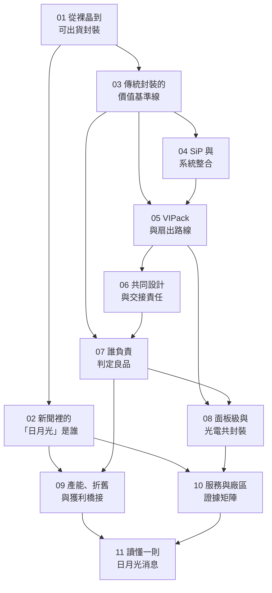

# 全書地圖

## 這本書在回答什麼

**晶片設計完成之後，日月光如何把不同晶粒整合成可交付的產品，又如何把封裝測試能力轉成營收與獲利？**

十一章分成兩條線：**技術線**建立判斷工具（封裝怎麼做、會怎麼壞、誰負責），**公司線**把工具用在公開證據上（哪個法人做什麼、錢怎麼進來、一則新聞能證明到哪一步）。兩條線在 [07](07-test-and-quality.md) 與 [10](10-ase-service-evidence.md) 交會。

## 依賴關係

## 三條閱讀路線

| 你想要什麼 | 路線 |
|---|---|
| 完整理解 | 01 → 11 依序 |
| 只關心公司與營運 | [01](01-osat-value-chain.md) → [02](02-group-and-business.md) → [09](09-capacity-and-economics.md) → [10](10-ase-service-evidence.md) → [11](11-reading-news.md) |
| 只關心技術 | [01](01-osat-value-chain.md) → [03](03-packaging-service-baseline.md) → [04](04-sip-system-integration.md) → [05](05-vipack-and-fanout.md) → [06](06-codesign-and-handoff.md) → [07](07-test-and-quality.md) → [08](08-emerging-platforms.md)，再讀 [10](10-ase-service-evidence.md) 核對公司能力 |

## 全書共用的四階段證據尺規

這是本書最常用的一把尺。**任何技術主張都要先問它落在哪一階段**——四個階段的證據強度完全不同，而公司新聞稿經常同時包含好幾階段的訊息：

| 階段 | 什麼算這一階段 | 能支持什麼 | **不能**支持什麼 |
|---|---|---|---|
| 研發 | 內部專案、專利、論文投稿 | 公司在投入這個方向 | 技術可行、可量產 |
| 展示 | 研討會展示、測試載具（test vehicle）、demo 數據 | **在特定條件下做出來過** | 良率、成本、可重複性 |
| 客戶驗證 | 送樣、認證通過、qualification | 有客戶願意花時間驗 | 已有量產訂單 |
| 量產 | 出貨、產線投產、財報認列營收 | 這門生意真的在賺錢 | 規模與持續性 |

!!! warning "常見的跳階"
    - 「**發布平台**」被讀成「**六項技術都在量產**」——見 [05](05-vipack-and-fanout.md)。
    - 「**展示了 CPO**」被讀成「**CPO 有訂單**」——見 [08](08-emerging-platforms.md)。
    - 「**董事會通過資本支出**」被讀成「**產能已經開出來**」——見 [09](09-capacity-and-economics.md)。
    - 「**媒體說台積電委外給日月光**」被讀成「**日月光供應整套 CoWoS**」——見 [05](05-vipack-and-fanout.md)。

來源的證據**等級**（誰說的）與技術主張的**階段**（做到哪）是兩把不同的尺，要分開用。等級定義見[來源索引](appendix-sources.md)。

## 三個口徑陷阱

公司線的章節反覆回到這三件事，先記在這裡：

1. **主體**：「日月光」可能指投控（3711）、日月光半導體（ASE Inc.）、矽品（SPIL）或環旭（USI）。不同主體的數字不能互相代換——[02](02-group-and-business.md)。
2. **分部**：ATM 與 EMS 的營收**不會加總成合併營收**（中間有分部間沖銷），也不能自行拆出「先進封裝分部」——[09](09-capacity-and-economics.md)。
3. **幣別與期間**：營收多以 **NT$** 揭露、資本支出多以 **US$** 揭露；年度預算、修訂預算與實際支出是三個不同的數字——[09](09-capacity-and-economics.md)。

## 本書不做什麼

不預測股價、不給買賣建議、不建估值模型。財務章解釋的是**營運機制與數字口徑**，讓你能自己判斷一則消息支持到哪一步。

未解決的查證問題集中在[待查事項](appendix-open-questions.md)——**那是證據缺口，不是還沒寫的章節**。
