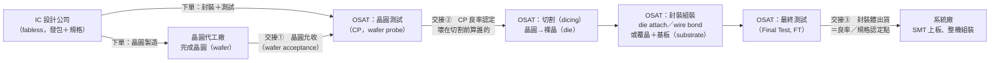

# 01　封測廠替誰解決什麼問題？

## 開場問題：晶圓廠把晶圓做好了，為什麼不能直接裝進手機？

晶圓代工廠（foundry）跑完全部微影、蝕刻、金屬層製程之後，交出來的是一片直徑 200 mm 或 300 mm 的**晶圓（wafer）**——上面印著幾百到幾萬顆還沒切開、還沒接腳、甚至還沒確認能不能動的電路。它既不能插進手機主機板，也禁不起手指觸碰：晶圓上每一顆電路單元叫**裸晶（die）**，裸晶的接點只是幾十微米見方的金屬墊，沒有任何機械保護，稍微一碰就報廢。

要讓這顆電路變成主機板上那顆黑色小方塊，中間還要做三件晶圓廠不做的事：把裸晶從晶圓上分開、給它一個扛得住焊接與跌落的外殼（**封裝體，package**）、並且用機器確認每一顆真的會動。這三件事——分割、封裝、測試——就是**封測廠（OSAT，Outsourced Semiconductor Assembly and Test，委外封裝測試服務商）**存在的理由。本章不談任何一種封裝技術怎麼做（那是 03 章之後的事），只回答一個更前面的問題：從晶圓到出貨，工件經過幾手、責任在哪裡交接、材料算誰的。

為什麼這件事要外包，而不是晶圓廠自己做到底？半導體業存在兩種商業模式：**IDM（Integrated Device Manufacturer，整合元件製造商）**自己蓋晶圓廠也自己做封裝測試，設計、製造、封測一條龍；另一種是**分工模式**——IC 設計公司（fabless，無晶圓廠）只做設計，晶圓製造外包給晶圓代工廠，封裝測試外包給 OSAT。晶圓製造與封裝測試是兩種完全不同的資本投入與良率管理專業，把兩段拆給專精的廠商各自優化，比一家公司同時養兩套產線更有效率——這也是 OSAT 這個產業存在的根本原因，不是晶圓廠「不想做」，而是分工之後整體更划算。

本章是全書第一章，無先備章節。測試站在整條流程中的位置，另一本書有更深入的討論：[測試插入點](../../sigurd/html/01-test-in-the-flow.html)。

## 先看結構：工件與責任流程

下圖畫出一顆晶片從晶圓到上板的物理路徑，以及四個角色各自在哪一段交接工件、承擔什麼風險。**IC 設計公司**是發包方，出規格、下單、通常也是付款方；晶圓代工廠與 OSAT 各自對自己那一段的良率負責；系統廠是最終收貨方。

每一個「交接」箭頭都是一個潛在的爭議點：晶圓允收時發現的壞點算晶圓廠的，CP 測試之後才浮現的異常，責任就要看切割前後的測試記錄能不能切開。這張圖的重點不是流程本身（每個人都能背出來），而是**每一個箭頭背後都有一份驗收文件在撐著**，沒有文件，責任就說不清。

<figure class="external-image">
  
  <figcaption>圖 01-1｜晶圓與裸晶的實物關係。看晶圓上被切割道分隔開的方形單元——每一個就是上圖流程裡的一顆裸晶（die），晶圓邊緣那圈殘缺的方格則是先天不可用的區域。這是一片 125 mm、90 顆晶粒的舊製程晶圓，顆粒大而容易辨識；現行量產多為 200／300 mm，單片晶粒數以千計。此圖用於辨識「晶圓→裸晶」的幾何關係，不代表日月光的任何產品或製程。攝影：Eclipse，CC BY-SA 3.0，原圖未修改（以 960 px 版本外連）。 <a href="99-image-credits.html#img-01-1">出處與授權</a>。</figcaption>
</figure>

## 輸入／操作／輸出

| 站別 | 拿到什麼（輸入） | 做什麼（操作） | 交出什麼（輸出） |
|---|---|---|---|
| 晶圓代工廠 | 光罩、製程配方 | 前段製程（FEOL/BEOL） | 完整晶圓（wafer） |
| OSAT－凸塊 | 未凸塊晶圓 | 晶圓級凸塊（bump）製程：UBM、電鍍、迴焊 | 已凸塊化晶圓（可獨立出貨給客戶自行覆晶） |
| OSAT－CP 測試 | 晶圓（已凸塊或未凸塊） | 探針卡逐顆量測，標記良／壞 die | 帶良率地圖（wafer map）的晶圓 |
| OSAT－切割 | 已測試晶圓 | 雷射或刀輪切割 | 分離的裸晶（die），已依 wafer map 分堆 |
| OSAT－封裝組裝 | 良品裸晶＋基板或引腳框架 | 貼片、打線或覆晶接合、模封 | 未測試的封裝體 |
| OSAT－最終測試 | 封裝體 | 插入測試機，跑完整測試程式 | 可出貨、有序號可追溯的成品 |
| 系統廠 | 成品封裝體 | SMT 上板、整機測試 | 終端產品 |

材料誰供應，決定了 OSAT 收的是「服務費」還是「完整報價」。**交鑰匙（turnkey）**模式下，基板、錫球、模封料等材料由 OSAT（或其材料子公司）自行採購並計入報價，客戶只拿到一個總價；**委外代工（consigned）**模式下，客戶自己指定甚至自己採購關鍵材料（例如指定的基板供應商），OSAT 只收加工服務費，材料品質問題就落在客戶身上，不算 OSAT 的製程風險。這兩種模式是封測業界的通用商業機制描述，不是針對特定公司的事實陳述。

turnkey 與 consigned 不是二選一的品牌標籤，同一家 OSAT 同時對不同客戶用不同模式很常見：大客戶議價能力強，往往傾向 consigned，自己掌握材料成本與供應鏈；中小型客戶為了省事，多半直接用 turnkey，把材料採購的麻煩整包丟給 OSAT。這個選擇也會回頭影響上一節流程圖裡「交接①晶圓允收」之外的另一種爭議來源——材料本身的品質問題，究竟算誰的。

## 失敗會長什麼樣子

| 現象 | 機制 | 需要的證據 |
|---|---|---|
| 封裝後測試良率突然下降 | 可能是晶圓本身帶來的瑕疵，也可能是封裝製程新引入的損傷（例如打線疲勞、靜電放電） | CP 良率地圖與 FT 失效模式逐批比對，才能界定損傷發生在切割前還是切割後 |
| 委外代工材料批次出包 | OSAT 依客戶指定材料生產，材料本身有問題，OSAT 製程即使正確仍會失效 | 材料批號與失效批次的對應紀錄、材料進料驗收報告 |
| 各方互推責任、無法結案 | 交接點沒有書面允收標準，出問題時各說各話 | 允收文件（wafer acceptance report）是否存在、是否有雙方簽核 |
| 晶圓允收後才發現隱性瑕疵 | 部分失效模式（如潛伏性缺陷）在 CP 測試當下測不出來，要經過封裝熱循環才顯現 | 失效批次的 CP 原始測試記錄，確認當時是否在允收規格內 |
| turnkey 客戶抱怨材料成本不透明 | OSAT 一次報總價，客戶看不到材料與加工費的拆分，議價時缺乏依據 | 合約是否約定材料成本明細揭露條款，以及變更材料供應商時的通知機制 |

## 如何檢查與控制

| 控制項 | 怎麼量 | 常見的誤用 |
|---|---|---|
| 晶圓允收標準 | 書面規格：CP 良率門檻、外觀檢查項目、抽樣比例 | 沒有書面允收就直接進封裝線，出問題後已經賠上封裝成本，無法追溯 |
| 材料供應模式條款 | 合約是否明列 turnkey 或 consigned，以及材料規格書 | 口頭承諾材料規格，未落實文件化，出事後各執一詞 |
| 各站良率可追溯性 | CP 良率、封裝後 FT 良率是否分開記錄，並可依批號查詢 | 只看最終出貨良率，看不出良率損失發生在流程的哪一站 |
| 交接時效與逾期規則 | 各站允收期限，以及逾期後責任如何轉移 | 沒有書面時效規則，交期延誤時責任歸屬說不清 |
| CP／FT 測試涵蓋範圍 | 比對 CP 與 FT 測試程式各自涵蓋哪些故障類型，是否重疊或互補 | 誤以為 CP 已經涵蓋所有失效模式，封裝後省略對應的 FT 項目，漏掉封裝製程才會引入的新故障 |

## 回到日月光

日月光投控（ASEH）官網「About」頁面（[A0](appendix-sources.md#A0)）自述，公司是整合日月光半導體（ASE）、矽品精密（SPIL）與環旭電子（USI）三家公司而成，藉此為半導體產業創造價值；頁面同時載明 ASEH 於 2018 年在台灣證交所（3711）與紐約證交所（ASX）掛牌。官網把服務分為三大類：**IC 封裝（IC Packaging）、IC 測試（IC Testing）、系統組裝（System Assembly）**——對照本章的流程圖，前兩類大致對應 OSAT 在圖中「切割→組裝→最終測試」這幾站，第三類則延伸到系統廠端的整機組裝。

要提醒的是：**官網列出這三類服務，只證明公司對外這樣陳述自己的業務範圍，不證明每一類服務在每個地點、每個時間點都有實際訂單在出貨**。

「有能力提供」與「正在出貨」是兩件事，本書之後每次引用官網的服務類別敘述時，都會刻意保持這個區分，不會把服務名錄直接讀成營運實績。本章不引用任何財務數字——分部營收、毛利率這些口徑留到本書後面談集團營運的章節處理。

## 理解檢查

??? question "為什麼晶圓廠不能直接把晶圓賣給系統廠？"
    晶圓上的裸晶沒有機械保護，接點是幾十微米的裸露金屬墊，無法承受一般的搬運、焊接與使用環境。系統廠需要的是已經封裝、測試過、有標準接腳或球腳的成品，這中間的分割、封裝、測試是晶圓廠製程之外的專業分工。

??? question "turnkey 與 consigned 兩種材料供應模式，各自把什麼風險留給誰？"
    turnkey 由 OSAT 採購材料並報一個總價，材料品質問題原則上算 OSAT 的製程風險；consigned 由客戶指定或自行採購材料，OSAT 只收加工費，材料本身出問題不算 OSAT 的責任，除非能證明是加工過程造成的損傷。

??? question "流程圖上的『交接①晶圓允收』，如果沒有書面允收報告，會造成什麼後果？"
    出現良率異常時，晶圓代工廠與 OSAT 都無法證明問題發生在交接前還是交接後，責任無法歸屬，糾紛只能靠協商而不是文件解決，等於把商業風險留到事後才處理。

??? question "本章寫『IC 封裝、IC 測試、系統組裝』三類服務，我們能不能進一步說『日月光在某個廠區做哪一類服務』？為什麼？"
    不能。[A1](appendix-sources.md#A1) 顯示官網的廠區列表頁只有地址與分組名稱，**沒有標示各廠區的製程用途**。這是一個證據缺口：本書只取得「集團層級提供哪些服務類別」，取得不了「哪個廠做哪一類」的對應，兩者不能混為一談。

??? question "IDM 和『IC 設計公司＋晶圓代工廠＋OSAT』分工模式，本質差異是什麼？"
    IDM 自己包辦設計、晶圓製造、封裝測試，一家公司對整條鏈的良率與成本負全責；分工模式把晶圓製造與封裝測試拆給各自專精的廠商，每一段由專業廠商優化，但代價是責任要靠交接點的驗收文件釐清，不像 IDM 內部可以用同一套管理系統貫穿。

## 來源與待查

本章關於日月光集團組成與三類服務的敘述引用 [A0](appendix-sources.md#A0)；廠區資訊取用限制引用 [A1](appendix-sources.md#A1)。

流程圖中的站別劃分（凸塊、CP 測試、切割、封裝組裝、最終測試）、turnkey／consigned 材料供應模式的說明，以及責任交接的一般性描述，均為封測產業的**工程通則**，不是針對日月光或任何特定公司的事實陳述，本章未附公司來源 ID。財務數字與分部口徑留待後續章節，本章刻意不觸及。
