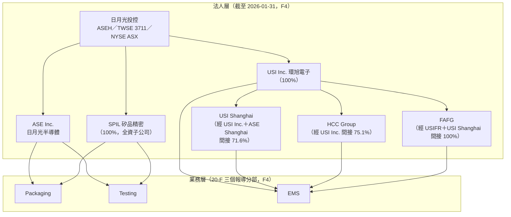

# 02　新聞裡的「日月光」到底是哪個主體？

## 開場問題

一則新聞寫「日月光斥資百億擴產」。這個「日月光」是股票代號 3711、在台北與紐約掛牌的那家公司嗎？錢是從哪個口袋出的——是封測本業，還是做 EMS 的環旭電子？如果同一則新聞又提到「ATM 分部營收成長」，這個「ATM」跟財報附註裡的「Packaging」「Testing」是不是同一件事？

本章要拆的是**主體**：新聞、官網、財報新聞稿、20-F 四種文件，各自習慣用不同顆粒度講「日月光」，把它們當成同一件事讀，數字會直接對不起來。這件事會在 [09](09-capacity-and-economics.md) 與 [10](10-ase-service-evidence.md) 反覆用到，先在這裡建立判斷方法。

## 第一段：主體

至少有四個名字容易被新聞混用：

- **日月光投控**（ASE Technology Holding，ASEH；TWSE 3711／NYSE ASX）——2018 年成立的控股公司，**是合併財報揭露的主體**。依 [A0](appendix-sources.md#A0) 逐字原文："ASE Technology Holding Co (ASEH) combines the strengths and expertise of Advanced Semiconductor Engineering, Inc. (ASE), Siliconware Precision Industries Co., Ltd. (SPIL), and USI Inc. (USI)."
- **日月光半導體**（ASE Inc.）——1984 年成立的封測公司，是投控下的營運子公司之一。
- **矽品精密**（SPIL）——依 [F4](appendix-sources.md#F4) 20-F 逐字："Siliconware Precision Industries Co., Ltd., which was established on May 17, 1984, is our **wholly owned subsidiary**."已於 2018 年下市，不再是獨立上市公司，新聞裡若仍把矽品當成可交易股票的主體，是錯的。
- **環旭電子**（USI）——上海證交所上市（601231），做 EMS。**這是最容易算錯的一個**：依 [F4](appendix-sources.md#F4)，截至 **2026-01-31**，投控持有 USI Inc. **100.0%**、透過 USI Inc. 與 ASE Shanghai 間接持有 USI Shanghai **71.6%**、透過 USI Inc. 持有 HCC Group **75.1%**、透過 USIFR 與 USI Shanghai 持有 FAFG **100.0%**。環旭不是單一持股比例的子公司，把它當成「100% 子公司」整包讀，會弄錯合併報表裡的非控制權益（少數股權）。

## 第二段：口徑——本書最重要的發現之一

依 [F4](appendix-sources.md#F4)，**經查核的 20-F 財務報表附註**逐字寫："OPERATING SEGMENTS INFORMATION　The Group has the following reportable segments: **Packaging, Testing and EMS.**"另有不可單獨報導、併入「Others」揭露的其他業務。**全文檢索「ATM」這個縮寫，出現次數是 0。**

但**未經查核的季度財報新聞稿**（[F1](appendix-sources.md#F1)）用的是 **ATM／EMS 兩分部**，公司自述為 "the leading provider of semiconductor assembly and testing services (\"ATM\")"，並把 ATM 分部（2026 年第二季營收 NT$126,148 百萬）與 EMS 分部（同期 NT$65,789 百萬）並列揭露。

**結論要說清楚**：「ATM」是公司對外自我描述的業務簡稱，**不是 SEC 申報文件裡的會計分部名稱**。讀季報的 ATM 數字，與讀 20-F 的 Packaging／Testing 數字，是兩套顆粒度不同的口徑——季報把封裝與測試合併成一個 ATM 數字，20-F 把它們拆成兩個報導分部。兩者**不可互相代換**，也不能自行把 20-F 的 Packaging＋Testing 加總去對季報的 ATM 數字（會計項目定義未必完全對齊）。這件事在 [09](09-capacity-and-economics.md) 會再用到一次。

## 第三段：機制——為什麼會有控股公司

依 [M3](appendix-sources.md#M3)，中國反壟斷機構於 **2017-11-24** 有條件核准日月光與矽品共組控股公司案，條件是要求兩家公司在公司治理、財務、人資、定價、銷售、產能與採購等事項**維持獨立運作一段期間**；此限制於 **2020 年**解除。這解釋了一件讀舊新聞時容易誤判主體的事：在 2018 年投控成立到 2020 年限制解除之間，日月光與矽品名義上同屬一個控股母公司，但**實際上是兩家維持獨立營運的公司**，不能把這段期間的任一方新聞直接讀成「投控整體」的動作。

[M4](appendix-sources.md#M4) 是 **2016-06-30** 的聯合換股協議公告，內容為雙方董事會決議簽訂協議、共同成立控股公司。**注意**：該公司原始頁面回應 HTTP 403，本書取得的是搜尋摘要，引用時視為二手。

## 第四段：證據——查廠區要看哪份文件

同樣一組廠區，兩個來源給的資訊完全不同顆粒度：

- [A1](appendix-sources.md#A1)（官網廠區頁）：**只有地址與分組名稱**，沒有製程用途、產能、面積、所屬法人。
- [F4](appendix-sources.md#F4)（20-F "PROPERTY, PLANTS AND EQUIPMENT" 表格）：有地點、啟用或取得時間、**主要用途**、樓地板面積與所有權。

節錄 8 個代表性廠區對照：

| 設施 | 地點 | 啟用／取得 | 20-F 記載的主要用途（F4） | 官網有沒有寫用途（A1） |
|---|---|---|---|---|
| ASE Inc.（高雄） | 台灣高雄 | 1984-03 | 主要封裝設施；覆晶、晶圓凸塊、細間距打線 | 無 |
| ASE Inc.（中壢） | 台灣中壢 | 1999-07 取得 | 整合封裝與測試；通訊與消費性電子 | 無 |
| ASE Test Taiwan | 台灣高雄 | 1990-04 取得 | 主要測試設施；先進邏輯／混合訊號／RF／3D IC 測試 | 無 |
| ASE Malaysia | 馬來西亞檳城 | 1991-02 | 整合封裝與測試；主要服務 IDM | 無 |
| ASE Korea | 南韓 Paju | 1999-07 取得 | 整合封裝與測試；RF、感測器、車用 | 無 |
| ISE Labs | 美國加州 | 1999-05 取得 | 前段工程測試與最終測試 | 無 |
| USI（南投） | 台灣南投 | 2010-02 取得 | 電子零組件製造與銷售 | 無 |
| USI Shanghai | 中國上海 | 2010-02 取得 | 電子零組件設計、製造與銷售 | 無 |

**結論**：要查「哪個廠做什麼」，該去看 20-F，不是官網。20-F 原表可能還有本書未擷取到的其餘設施（含矽品自身廠區與其餘環旭廠區），查不到用途的廠區，本書停在「這個地址存在」這個層級，不猜製程分工。

## 理解檢查

??? question "一則新聞說『日月光 ATM 分部本季營收成長』，這句話能不能直接拿去對 20-F 的 Packaging 分部數字？"
    不能。20-F 財務報表附註逐字定義的報導分部是 Packaging、Testing、EMS 三個（另有 Others），全文檢索「ATM」出現次數是 0（[F4](appendix-sources.md#F4)）。ATM 是公司在未經查核的季度財報新聞稿（[F1](appendix-sources.md#F1)）裡使用的業務簡稱，屬於把 Packaging 與 Testing 合併呈現的另一套顆粒度，兩者不是同一份文件裡的同名項目，不可直接代換或相加比對。

??? question "『投控持有環旭電子 100%』這句話對不對？"
    不完全對。依 [F4](appendix-sources.md#F4)，截至 2026-01-31，投控持有 USI Inc. 100.0%，但透過 USI Inc. 與 ASE Shanghai 間接持有的 USI Shanghai 只有 71.6%，經 USI Inc. 持有的 HCC Group 是 75.1%，只有 FAFG 是 100.0%。「環旭電子」在合併報表裡對應的是一組不同比例的實體，不是單一持股比例，把它當 100% 子公司讀，會低估合併報表裡歸屬非控制權益的部分。

??? question "矽品精密（SPIL）現在還能在股市買賣嗎？"
    不能。依 [F4](appendix-sources.md#F4)，矽品是投控的全資子公司（wholly owned subsidiary），已於 2018 年下市，不再是獨立上市公司。新聞若提到「矽品股價」或把矽品當成可交易主體，指的多半是舊聞或誤植。

??? question "本章的 20-F 廠區對照表只列了 8 個設施，這代表日月光集團全球只有這幾個廠嗎？這裡有什麼證據缺口？"
    不代表。本章的表格是從 20-F "PROPERTY, PLANTS AND EQUIPMENT" 表格中節錄的部分項目，20-F 原表可能還記載其餘設施——包括矽品自身的廠區、其餘環旭（USI）廠區——本書**未完整核對**（[F4](appendix-sources.md#F4)）。官網廠區頁（[A1](appendix-sources.md#A1)）雖列出更多地址（例如新竹、台中、蘇州、昆山等），但那些地址沒有對應的 20-F 用途記載，本書因此不把它們填進「主要用途」欄，而是留白，作為未核對的證據缺口。

??? question "2019 年一則新聞說『矽品調高報價』，能不能直接讀成『日月光投控調高報價』？"
    要看時間點。依 [M3](appendix-sources.md#M3)，中國反壟斷機構在 2017-11-24 有條件核准合併案時，要求兩公司在定價、銷售等事項於一段期間內維持獨立運作，此限制到 2020 年才解除。2019 年正落在這段期間內，矽品的定價決策當時是獨立於日月光半導體之外進行的，不能直接等同於「投控」整體的定價動作，也不能等同於日月光半導體本身的動作。

## 來源與待查

本章引用來源 ID：[A0](appendix-sources.md#A0)、[A1](appendix-sources.md#A1)、[F1](appendix-sources.md#F1)、[F4](appendix-sources.md#F4)、[M3](appendix-sources.md#M3)、[M4](appendix-sources.md#M4)。

待查事項：

- [F4](appendix-sources.md#F4) 的 "PROPERTY, PLANTS AND EQUIPMENT" 表格本書僅擷取到部分項目，矽品自身廠區與其餘環旭廠區的地點、用途、面積尚未逐項核對。
- [M4](appendix-sources.md#M4)（2016-06-30 聯合換股公告）原始頁面回應 HTTP 403，本書僅取得搜尋摘要，未取得公告全文，引用時已標為二手處理。
- 2020 年中國反壟斷限制解除後，日月光與矽品實際整合到什麼程度（例如是否已合併採購或共用產能調度），[M3](appendix-sources.md#M3) 未說明，本書未另行查證，列為證據缺口。
