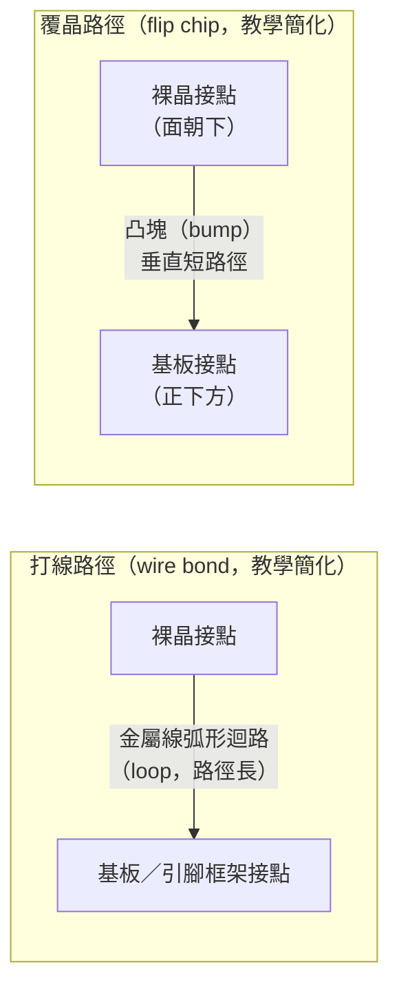

# 03　傳統封裝提供的到底是什麼價值？

## 開場問題：都 2026 年了，為什麼還有一大半晶片用「打線」這種看起來很老的技術？

**打線（wire bond）**是用一根比頭髮還細的金屬線，靠熱、壓力和超音波能量，把裸晶上的接點一根一根焊到基板或引腳框架上——這聽起來像上個世紀的工藝，事實上也差不多是。但打開一台微控制器、一顆類比感測器 IC，裡面十之八九還是打線。這不是廠商偷懶，是因為打線便宜、成熟、良率穩定，而多數晶片根本不需要更貴的技術去解決它沒有的問題。

真正該問的不是「打線是不是落後」，而是「每一種封裝形式，各自替哪一種需求解決問題、又在哪裡撐不住」。本章比較打線、**覆晶（flip chip）**、**凸塊（bump）**製程、**晶圓級封裝（WLP／WLCSP，Wafer Level Package／Wafer Level Chip Scale Package）**這四種傳統與晶圓級封裝路線，先備是 [01 封測廠的工件與責任流程](01-osat-value-chain.md)。更先進的扇出與面板級封裝，另一本書有專章討論：[Fan-Out／FOPLP](../../copos/html/04-fan-out-and-foplp.html)。

## 先看結構：需求決定形式

下表把常見的應用需求對到四種封裝形式，格內寫「為什麼適合」或「為什麼不適合」，這是本章的核心心智模型：**沒有一種封裝形式全面勝出，選型是拿需求換代價**。

| 需求 | 打線（wire bond） | 覆晶（flip chip） | 純凸塊服務（bumping only） | WLP／WLCSP |
|---|---|---|---|---|
| I/O 數 | 適合中低（數十至數百腳），接點沿晶片邊緣排列，數量受周邊長度限制 | 適合高 I/O，接點可佈滿整個晶片面積（area array），不受邊緣長度限制 | 本身不是封裝形式，是覆晶／WLP 的前段製程，I/O 上限由後續組裝方式決定 | 適合中低 I/O 且晶片本身夠小，I/O 隨凸塊間距與晶片面積受限 |
| 球距／腳距 | 打線間距受限於打線機精度與線與線間絕緣，難以做到極細間距 | 覆晶凸塊可做到比打線細得多的間距，密度高 | 決定下游覆晶或 WLP 能做到多細，是密度的上游瓶頸 | 間距受限於晶片尺寸與板階可靠度（見下節），不能無限縮小 |
| 電氣路徑長度與電感 | 路徑長（晶片→弧形金屬線→基板），電感較大，高頻與大電流不利 | 路徑短（晶片直接朝下貼合基板），電感小，適合高速訊號與大電流 | 不適用（非組裝形式，不構成電氣路徑） | 路徑最短，但受限於晶片本身可承載的電流與訊號規模 |
| 散熱路徑 | 熱主要靠模封料與基板往外傳，路徑較長 | 晶片背面可直接裸露或加散熱片，散熱路徑較短 | 不適用 | 無基板緩衝，散熱路徑短，但整體熱容量小，適合中低功耗 |
| 封裝厚度 | 中等，受限於打線弧高（loop height）與模封厚度 | 較薄，因為晶片與基板間距只由凸塊高度決定 | 不適用（未成形封裝體） | 最薄，接近裸晶厚度加凸塊 |
| 可靠度考量 | 成熟製程，失效模式明確、可控 | 需底填膠緩衝應力，製程窗口較窄 | 凸塊本身的金屬間化合物是後續可靠度的起點 | 板階可靠度是已知的弱項（見下節） |
| 單位成本傾向 | 材料與設備成熟，單位成本低 | 需要基板、底填膠、精密設備，成本較高 | 作為中間品出貨，成本由買方後段製程分攤 | 省去基板，材料成本可低，但良率風險轉嫁到板階 |

打線與覆晶的差異，最直觀的地方在電流從晶片接點到基板的走法——下圖是教學簡化，**電流路徑長度、迴路形狀與各元件比例均非實際尺寸**：

打線的路徑要繞一個弧才能從晶片接點到基板，覆晶則是晶片翻過來、凸塊直接對齊基板接點，路徑最短。這個差異就是後面「電氣路徑長度與電感」那一列的來源。

<figure class="external-image">
  
  <figcaption>圖 03-1｜打線的球形鍵合（ball bond）實物特寫。看那顆被壓扁的球與從球上拉出的金線——上圖「打線路徑」裡那一段弧形迴路就是從這裡起跑，路徑長度與電感的代價也從這裡開始累積。此為某顯示器元件的金線打在金接墊上，用於辨識鍵合點外觀，不代表任何公司的製程參數。攝影：Shaddack，公有領域，原圖未修改（以 960 px 版本外連）。 <a href="99-image-credits.html#img-03-1">出處與授權</a>。</figcaption>
</figure>

<figure class="external-image">
  
  <figcaption>圖 03-2｜覆晶的側視結構示意。晶片翻面朝下，凸塊（bump）垂直落在正下方的載板接點上，這就是上表「電氣路徑長度與電感」那一列說的短路徑；凸塊之間填滿的是底填膠（underfill），對應「需底填膠緩衝應力」。此為概念示意圖，<strong>各層厚度與凸塊間距均非實際比例</strong>。繪者：Twisp，公有領域，原圖未修改（以 960 px 版本外連）。 <a href="99-image-credits.html#img-03-2">出處與授權</a>。</figcaption>
</figure>

<figure class="external-image">
  
  <figcaption>圖 03-3｜BGA 封裝的剖面示意，說明「基板」在封裝裡扮演什麼角色。晶粒的細密接點先接到基板上，再由基板把訊號重新分配（fan-out）到底下間距大得多的錫球陣列——這層轉接正是本章表中覆晶路線「需要基板」而 WLP／WLCSP「省去基板」的差別所在。此為概念示意圖，<strong>層厚與球距非實際比例</strong>。原圖：Tosaka，向量化：Serenthia，CC BY-SA 3.0，原圖未修改（以 960 px 版本外連）。 <a href="99-image-credits.html#img-03-3">出處與授權</a>。</figcaption>
</figure>

## 輸入／操作／輸出

| 封裝形式 | 輸入 | 操作 | 輸出 |
|---|---|---|---|
| 打線 | 已切割、通過 CP 測試的裸晶＋基板或引腳框架 | 打線機以熱／壓力／超音波形成金屬線鍵合，再模封 | 未測試的打線封裝體 |
| 覆晶 | 已凸塊化的裸晶＋基板 | 覆晶接合（迴焊）＋底填膠（underfill）填充晶片與基板間隙 | 未測試的覆晶封裝體 |
| 純凸塊服務 | 未凸塊化晶圓（未切割） | 晶圓級凸塊製程：UBM 沉積、電鍍、迴焊 | 已凸塊化但未切割的晶圓，交還客戶自行覆晶或 WLP |
| WLP／WLCSP | 未凸塊化晶圓 | 晶圓級重佈線（RDL）＋凸塊，不外加基板 | 晶粒尺寸的封裝體，切割後即可直接上板 |

## 失敗會長什麼樣子

以下是各封裝形式的通用失效模式，屬於**工程通則**，不是針對特定公司產線的觀察：

| 現象 | 機制 | 需要的證據 |
|---|---|---|
| 打線：wire sweep（線被沖偏） | 模封時模封膠流動的壓力把金屬線沖偏，導致線與線間距不足甚至短路 | X 光或切樣檢查金屬線實際走位，對照原始佈線設計 |
| 打線：球窩脫落（ball/wedge bond lift-off） | 鍵合面污染、鍵合參數（熱／壓力／時間）不足，或墊面金屬層附著力不足 | 拉力測試（wire pull test）與球剪力測試（ball shear test）數據是否低於規格門檻 |
| 覆晶：底填不足與 CTE 不匹配 | 底填膠未完全填充或有空洞，晶片與基板因熱膨脹係數（CTE）不同，溫度循環時應力集中在凸塊上 | 超音波掃描（C-SAM）檢查底填空洞，加上溫度循環測試後的凸塊裂紋檢查 |
| 凸塊：金屬間化合物（IMC）脆化 | 長時間高溫下錫與銅／鎳反應生成的 IMC 層持續增厚，材質變脆，容易在應力下產生裂紋 | 切樣量測 IMC 層厚度隨老化時間的變化，並與凸塊剪力強度的下降做對照 |
| WLP：板階可靠度（BLR）不足 | 沒有基板緩衝，凸塊直接連到 PCB，溫度循環下的應力集中在凸塊與 PCB 的界面，裂紋常從這裡開始 | 板階溫度循環測試後的凸塊裂紋率，以及裂紋位置的失效分析 |

## 如何檢查與控制

| 控制項 | 怎麼量 | 常見的誤用 |
|---|---|---|
| 鍵合強度 | 拉力測試（wire pull）、球剪力測試（ball shear），對照規格下限 | 只抽測少數幾點就判定全批合格，未涵蓋不同鍵合位置 |
| 底填品質 | C-SAM 超音波掃描檢查空洞率 | 只做外觀目檢，看不到底填膠內部的空洞 |
| 溫度循環可靠度 | 依 JEDEC 溫度循環測試方法（[T1](appendix-sources.md#T1)）跑固定循環數後檢查裂紋 | 循環數不足就判定合格，實際失效模式要到更多循環才顯現 |
| 濕熱應力可靠度 | 依 JEDEC HAST 高加速應力測試方法（[T2](appendix-sources.md#T2)）驗證潮濕環境下的可靠度 | 只做一種應力測試就宣稱「通過可靠度驗證」，忽略溫度循環與濕熱是不同失效機制 |
| IMC 層厚度 | 切樣搭配金相顯微鏡量測，隨老化時間追蹤變化 | 只在初始狀態量測一次，沒有老化後的對照數據，看不出脆化趨勢 |

## 回到日月光

本書撰寫期間，日月光的品牌技術站（`ase.aseglobal.com`）直接抓取一律回傳 HTTP 403，文字代理也失敗，**正文未能取得**（詳見[附錄 A 取用限制](appendix-sources.md)）。因此本節只能引用日月光官網技術頁**名稱的存在**，不引用規格數字——[A8](appendix-sources.md#A8) 記錄了透過搜尋引擎摘要確認可見的頁面名稱，包括：打線（wire-bond-bga）、覆晶（flip-chip-packaging）、凸塊製程（bumping-services）、晶圓級封裝（wafer-level-packaging）、扇出封裝（fan-out-packaging）。[A8](appendix-sources.md#A8) 本身是二手・轉述，本節依其取用限制，只引用「這些服務類別的名稱在官網上存在」，不引用其中任何規格數字（例如球距、機台裝機量）。

哪個廠區實際執行哪一種封裝，本書查不到。[A1](appendix-sources.md#A1) 顯示官網的廠區與辦公室列表頁只有地址與分組名稱，**沒有標示各廠區的製程用途、產能或面積**。所以「哪個廠做打線、哪個廠做覆晶」這類問題，本書只能停在集團層級——列得出服務類別的名稱，對應不到廠區。

## 理解檢查

??? question "覆晶的電氣路徑比打線短，是不是代表覆晶永遠比打線好？"
    不是。覆晶需要凸塊、基板與底填膠，設備與材料成本較高，製程窗口也較窄（底填空洞、CTE 不匹配）。對 I/O 數不多、頻率不高的晶片，打線的成熟度與低成本反而是更合理的選擇。選型是拿需求換代價，不是單向的技術落後與先進之分。

??? question "WLP／WLCSP 省掉了基板，為什麼可靠度反而可能是弱項？"
    基板原本的作用之一是緩衝晶片與 PCB 之間的熱膨脹係數差異。WLP 沒有基板，凸塊直接連到 PCB，溫度循環時的應力集中在凸塊與 PCB 的界面，板階可靠度（BLR）因此成為 WLP 的已知限制，而不是打線或覆晶會遇到的問題。

??? question "IMC 脆化和底填不足，兩者都會在溫度循環測試中出現裂紋，怎麼分辨是哪一種機制？"
    要看裂紋的位置與切樣的金相結構：IMC 脆化的裂紋通常出現在金屬間化合物層內部或其與金屬的界面，且會隨老化時間累積增厚；底填不足造成的裂紋則常伴隨可見的空洞，且集中在底填膠缺失的區域。單看「有裂紋」不足以判斷機制，需要切樣與失效分析佐證。

??? question "本章能不能寫出『日月光哪一座工廠負責覆晶、哪一座負責打線』？為什麼不行？"
    不行。[A1](appendix-sources.md#A1) 的廠區列表頁只列地址和分組名稱，沒有製程用途的資訊；技術站正文又因 403 未能取得。這是一個明確的證據缺口：本書確認得了「這些封裝服務類別的名稱在集團層級存在」，確認不了「哪個廠做哪一種」，兩者不能互相替代。

??? question "為什麼溫度循環測試通過，不能直接宣稱『這個封裝形式的可靠度沒問題』？"
    溫度循環（[T1](appendix-sources.md#T1)）和濕熱應力（[T2](appendix-sources.md#T2)）是不同的失效機制，各自模擬不同的環境應力。只通過其中一種測試，不能推論另一種應力下也沒問題；完整的可靠度驗證需要多種應力測試的組合，而且要明寫測試條件與循環數。

## 來源與待查

本章引用 [A1](appendix-sources.md#A1) 說明廠區資訊的取用限制；[T1](appendix-sources.md#T1)、[T2](appendix-sources.md#T2) 說明溫度循環與 HAST 兩種標準測試方法的存在與用途。日月光官網封裝服務類別名稱的存在引自 [A8](appendix-sources.md#A8)（二手・轉述），本章只引用名稱、不引用規格數字。

打線、覆晶、凸塊、WLP 的需求比較矩陣，以及 wire sweep、底填不足、IMC 脆化、板階可靠度等失效模式，均為封測產業的**工程通則**，本章刻意寫成通用機制說明，不指向日月光或任何特定公司的實際產線案例。電流路徑示意圖標明為**教學簡化**，比例與尺寸不代表真實結構。
