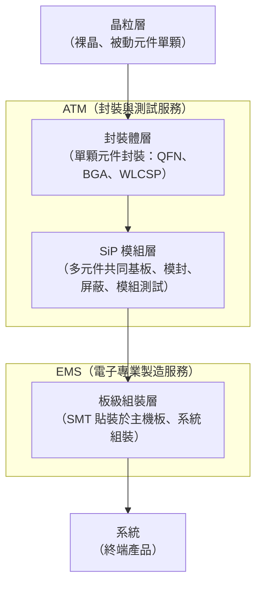

# 04　SiP 如何把多顆元件變成一個系統？

## 開場問題：十幾顆元件擠在一塊小板子上，為什麼還算封裝？

一顆邏輯晶片裝進一個外殼，直覺上叫「封裝」。但如果這個外殼裡塞的不是一顆晶片，而是一顆邏輯 IC、幾顆記憶體、一顆濾波器、幾顆被動元件、甚至一根天線——看起來已經很像一塊迷你電路板了，為什麼業界還是把它叫做**封裝**，而不是「組裝」？

答案在於**誰交付什麼給誰**。SiP（System in Package，系統級封裝）把多顆**異質元件**（邏輯、記憶體、被動元件、濾波器、天線等不同製程、不同材料的元件）整合進**一個封裝體**，交付出去的是一顆可以直接被下一階組裝的「元件」，而不是一塊已經定位在系統上的電路板。這條界線聽起來抽象，卻是本書後面讀財報時最容易混淆的一點：本章會把它講清楚。

先備是 [03](03-packaging-service-baseline.md)：理解傳統單晶片封裝的良率與工序基準線，才看得出 SiP 多做了什麼。

## 先看結構：模組層次與交付邊界

從晶粒到系統，中間隔著四個層次。SiP 落在哪一層、由誰完成、算進哪個財務分部，是本章的核心。

SiP 模組層與板級組裝層都會用到 SMT（表面貼裝技術），這是兩者最容易被混為一談的地方——**製程手法重疊，不代表業務性質相同**。

### 封裝模組（SiP）與板級組裝（EMS）的分界

| 比較項 | SiP 模組（屬 ATM） | 板級組裝（屬 EMS） |
|---|---|---|
| 交付物 | 一顆完整的封裝體，有自己的物料編號與電性規格書 | 一塊已完成組裝的電路板或整機模組 |
| 典型客戶 | IC 設計公司、系統廠的零組件採購 | 系統廠的整機或次系統採購 |
| SMT 用途 | 把元件貼裝在**模組內部的小型載板**上，之後整顆模組還要再被貼到別的板子上 | 把模組、連接器等貼裝在**終端產品的主機板**上，這一步之後通常直接進整機組裝 |
| 是否再封裝 | 是：模封、屏蔽、切割成獨立單元後才出貨 | 否：組裝完的板子不再被封裝成一顆元件 |
| 財報分部 | ATM（日月光、SPIL 主體） | EMS（USI，環旭電子） |

依 [A0](appendix-sources.md#A0)，ASEH（日月光投控）由 ASE、SPIL、USI 三家公司整合而成；依 [F1](appendix-sources.md#F1)，集團財報把業務分成「semiconductor assembly and testing services (ATM) and the provider of electronic manufacturing services (EMS)」兩個分部。SiP 模組製造算在 ATM，USI 的板級與整機組裝算在 EMS——**兩者手法有重疊，但交付物、客戶與財報歸屬不同**，這是後面 [09](09-capacity-and-economics.md) 讀分部營收時要先記住的分界。

<figure class="external-image">
  
  <figcaption>圖 04-1｜SiP 模組的內部實物。一塊基板上同時擺著處理器、DRAM 與快閃記憶體等不同來源的晶粒——這正是本章說的「異質元件整合進一個封裝體」；請注意整顆仍然以單一物料編號交付，所以它落在上圖的 SiP 模組層（ATM），不是板級組裝層（EMS）。此圖用於辨識 SiP 的內部構成，不代表日月光的任何產品。作者：Verdel，CC BY-SA 4.0，原圖未修改（原尺寸外連）。 <a href="99-image-credits.html#img-04-1">出處與授權</a>。</figcaption>
</figure>

<figure class="external-image">
  
  <figcaption>圖 04-2｜堆疊晶粒與打線的 X 光影像。多顆晶粒上下堆起、各層用打線拉回基板，是 SiP 把體積壓下來的常見手法之一；同時也說明本章「模組測試」為什麼難——內部互連被模封包住之後，只能靠 X 光這類非破壞手段或電性測試間接判定。此圖用於辨識堆疊結構，不代表任何公司的產品設計。作者：Janolaf30，公有領域，原圖未修改（原尺寸外連）。 <a href="99-image-credits.html#img-04-2">出處與授權</a>。</figcaption>
</figure>

<figure class="external-image">
  
  <figcaption>圖 04-3｜疊層封裝（PoP）的側視示意。與 SiP 把多顆裸晶放在同一塊基板上不同，PoP 疊的是兩顆<strong>各自已經封裝完成</strong>的元件——這個差別直接決定交付邊界：疊上去的記憶體是誰買的、誰測的、良率算誰的。此為概念示意圖，<strong>非實際比例</strong>。繪者：Tosaka，CC BY 3.0，原圖未修改（原尺寸外連）。 <a href="99-image-credits.html#img-04-3">出處與授權</a>。</figcaption>
</figure>

## 輸入／操作／輸出

**輸入**：已完成前段封裝或仍是裸晶的異質元件（邏輯 IC、記憶體、濾波器、被動元件、天線模組）、模組載板（substrate 或 laminate）。

**操作**：
- SMT 貼裝：把各元件依設計位置貼上載板
- 底部填充（underfill，視元件而定）：加固覆晶接點
- 模封（molding）：整體或局部包覆保護，同時作為機構支撐
- 電磁屏蔽（shielding）：濺鍍導電層或植入屏蔽罩，隔離模組內部射頻元件與外部干擾
- 散熱處理：散熱片、散熱膠或散熱通孔，視功耗分佈設計
- 模組層級測試：功能測試、必要時做 SLT（系統級測試）

**輸出**：一顆獨立的 SiP 模組，具備自己的電性、機構與可靠度規格書，可直接被下一階 SMT 貼裝到終端產品主機板上。

## 失敗會長什麼樣子

| 現象 | 機制 | 需要的證據 |
|---|---|---|
| 模組通過電性測試，裝機後仍有間歇性干擾 | 屏蔽層接地不良或有破孔，射頻元件與鄰近數位電路互相干擾 | 屏蔽層剖面檢查、EMI 量測報告與量測頻段是否涵蓋實際工作頻率 |
| 模組長時間運作後降頻或當機 | 高功耗元件與低耐熱元件距離太近，散熱路徑設計未考慮實際負載分佈 | 熱像儀量測與熱模擬的對照，需標明量測時的實際功耗條件 |
| 出貨前 AOI 良好，客戶端仍有短路 | SMT 貼裝微幅偏移或迴焊溫度曲線不當，缺陷在冷卻後才顯現 | X-ray／CSAM 掃描影像、迴焊爐溫度曲線紀錄 |
| 模組單體測試全過，裝進系統後失效 | 模組測試項目只覆蓋單體功能，未涵蓋與系統其他模組的互動情境 | 模組測試規格書涵蓋範圍，對照客戶端實際失效模式 |

## 如何檢查與控制

| 控制項 | 怎麼量 | 常見的誤用 |
|---|---|---|
| 屏蔽效能 | 電磁遮蔽效度（dB），需在目標應用頻段量測 | 只量測單一頻點，未涵蓋模組實際工作頻段 |
| 模組良率 | 出貨模組數 ÷ 投入模組數，需注明是否含重工 | 把重工救回的模組計入「一次通過良率」，掩蓋真實製程能力 |
| 熱阻 | 依封裝熱阻量測方法在實際功耗條件下量測 | 用模擬值取代實測，未標明模擬邊界條件是否貼近實際負載 |
| SMT 製程能力 | 依貼裝精度與迴焊溫度曲線計算製程能力指數 | 只報良率數字，不揭露製程能力指數，看不出製程是否穩定 |

## 回到日月光

依 [A0](appendix-sources.md#A0)，ASEH 整合了 ASE、SPIL、USI 三家公司；該頁本身**未出現 ATM／EMS 兩個分部的定義文字**。分部定義來自 [F1](appendix-sources.md#F1)：公司自述為「semiconductor assembly and testing services (ATM) and the provider of electronic manufacturing services (EMS)」——這句逐字原文就是本章前段那張分界表的依據。

需要明寫的是：**SiP 營收與先進封裝、測試營收的口徑是否重疊，公司並未公開拆分**。[F1](appendix-sources.md#F1) 只揭露 ATM 與 EMS 兩個分部層級的營收與毛利率，沒有進一步拆出「SiP 模組」相對於「其他先進封裝」「測試」各自的營收占比。這是 [Q05](appendix-open-questions.md) 的未解問題，本書不會用推測填補。

## 理解檢查

??? question "為什麼 SiP 模組層和板級組裝層都用 SMT，卻分屬不同財報分部？"
    分類依據不是製程手法，而是交付物、客戶與財報歸屬。SiP 模組交付的是一顆還要再被貼裝的獨立元件，屬 ATM；板級組裝交付的是已完成的板子或整機，屬 EMS。製程手法重疊不代表業務性質相同。

??? question "A0 頁面提到 ASEH 由三家公司整合而成，這是否等於官方定義了 ATM／EMS 兩個分部？"
    不是。[A0](appendix-sources.md#A0) 只描述組織整合的事實，**未出現**分部定義文字。ATM／EMS 的正式分部劃分要看 [F1](appendix-sources.md#F1)（財報新聞稿）與 F4（Form 20-F）。這是提醒：同一家公司的不同頁面，證據等級與能證明的內容不同，不能互相替代。

??? question "本章能不能回答「SiP 業務去年賺了多少錢」？為什麼？"
    不能。這是一個明確的證據缺口：[F1](appendix-sources.md#F1) 只揭露到 ATM／EMS 兩個分部層級，沒有拆出 SiP 模組的獨立營收或獲利數字。公司也沒有公開 SiP 營收與先進封裝、測試營收之間是否重疊計算。這個問題留在 [Q05](appendix-open-questions.md)，不能用其他數字推算填補。

??? question "屏蔽（shielding）在 SiP 模組裡解決的是什麼問題？如果只做電性測試，能不能驗證屏蔽有效？"
    屏蔽解決的是模組內部射頻元件與周邊數位電路之間的電磁干擾。單純的電性功能測試只驗證訊號邏輯是否正確，無法直接證明干擾隔離是否足夠——這需要在目標工作頻段做專門的 EMI 量測，兩者是不同的驗證項目。

## 來源與待查

本章「回到日月光」段落引用 [A0](appendix-sources.md#A0)（ASEH 組織整合自述）與 [F1](appendix-sources.md#F1)（ATM／EMS 分部逐字定義）。SiP 與板級組裝的界線判讀、模組層次架構為本書歸納，非任一來源逐字內容。SiP 營收是否與先進封裝、測試營收重疊計算，公司未公開，列為 [Q05](appendix-open-questions.md) 待查。技術章節「輸入／操作／輸出」與「失敗會長什麼樣子」段落的製程描述為產業一般知識，未逐項標示公司特定來源；讀者不應把這些流程細節當成日月光特定產線的實際做法。
