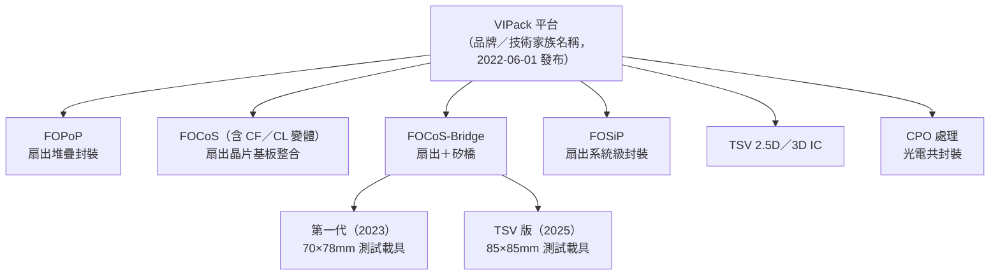

# 05　VIPack 是一個什麼層級的名稱？

## 開場問題：VIPack 跟 CoWoS 是同一種東西嗎？

新聞常常把「日月光有 VIPack（維帕克）」和「台積電有 CoWoS」放在同一句話裡比較，好像兩者是互相替代的競品。但這個比較本身可能問錯了問題：**VIPack 是不是跟 CoWoS 同一個層級的名字？**

答案要從官方怎麼定義 VIPack 開始查。依 [A2](appendix-sources.md#A2)，日月光官方把 VIPack 定義為 "an advanced packaging platform designed to enable vertically integrated package solutions"——**一個平台**，底下列出六項組成技術：高密度 RDL 扇出堆疊（FOPoP）、扇出晶片基板整合（FOCoS）、扇出晶片基板橋接（FOCoS-Bridge）、扇出系統級封裝（FOSiP）、矽穿孔（TSV）為基礎的 2.5D／3D IC，以及光電共封裝（CPO）處理。CoWoS 則是台積電對「晶片堆在晶圓上再堆在基板上」這一條特定製程路線的命名。**平台名稱和製程名稱不是同一個層級**，把兩者直接畫等號會誤導讀者以為日月光有一個統一取代 CoWoS 的單一製程。

本章要處理的核心判讀是：**VIPack 這個平台發布的事實，跟底下六項技術各自量產的事實，是兩件不同的事**——前者已經發生，後者要逐項查證。先備是 [03 傳統封裝的價值基準線](03-packaging-service-baseline.md)與 [04 SiP 如何把元件變成系統](04-sip-system-integration.md)：知道扇出（fan-out）、RDL、基板這些構件怎麼組成封裝，才看得懂 VIPack 底下各技術差在哪裡。跨書可對照[先進封裝平台的橫向比較](../../cowos/html/09-competing-technologies.html)與[扇出與面板路線](../../copos/html/04-fan-out-and-foplp.html)。

## 先看結構：一個平台名稱，底下是六條技術線

這張圖要傳達一件事：**平台是傘，六項技術是傘下各自獨立發展的枝**。VIPack 發布於 2022-06-01（[A2](appendix-sources.md#A2)），但這不代表六項技術在同一天、同一階段量產——後面幾節會逐項核對每一項技術實際公開到哪個階段。

依 [A2](appendix-sources.md#A2)，官方把 VIPack 定位為「垂直整合封裝解決方案」（vertically integrated package solutions），設計理念是以晶粒（chiplet）為基礎的共同設計與多晶片整合，鎖定的市場包含 HPC、AI／ML、5G 通訊、物聯網、車用、行動裝置與光通訊。這句定位說明了為什麼六項原本各自獨立的技術要收進同一個平台名稱下：**對客戶來說，重點不是單一技術規格，而是同一家封裝廠能不能把設計、扇出、橋接、TSV、光學這幾種構件組合進同一套交付流程**。這也是「平台」跟「製程」的關鍵差異——製程解決一個具體的結構問題，平台解決的是客戶要不要把整條路線都交給同一家供應商的問題。

把六項技術收進一個平台名稱下，對讀新聞的人有三個實際影響：

- **命名層級容易被壓平**：媒體標題常把「VIPack」與底下某一項技術（最常見是 FOCoS-Bridge）交換使用，讀者要自己回頭核對原文指的是平台還是單一技術。
- **公開階段不會一起升級**：六項技術各自有自己的研發、展示、驗證時程，平台名稱底下的技術不會因為平台本身「已發布」而集體晉級到量產。
- **跨技術比較需要先對齊層級**：拿 VIPack 跟 CoWoS 比較之前，正確的做法是先問「CoWoS 對應到 VIPack 底下哪一項或哪幾項技術」，而不是直接比較兩個不同層級的名字。

<figure class="external-image">
  
  <figcaption>圖 05-1｜扇出晶圓級封裝（FOWLP）的三種製程路線剖面對照。看重佈線層（RDL）與晶粒的上下順序——先做晶片再做 RDL，或先做 RDL 再貼晶片，決定了良率風險落在哪一段。VIPack 底下的 FOPoP、FOCoS、FOSiP 都建立在「扇出」這個共同構件上，這張圖是理解那些名稱的結構底子。此為產業通則示意，<strong>不對應日月光的任何特定製程流程</strong>；圖中文字為簡體中文。作者：思考的苇丛，CC BY 4.0，原圖未修改（以 960 px 版本外連）。 <a href="99-image-credits.html#img-05-1">出處與授權</a>。</figcaption>
</figure>

<figure class="external-image">
  
  <figcaption>圖 05-2｜矽穿孔（TSV）的三種製程時序。TSV 可以在電晶體層之前（via-first）、之後但在金屬層之前（via-middle）、或全部完成之後（via-last）製作，三者的難度、良率與由誰負責都不同。本章表中「TSV 2.5D／3D IC」一列標為<strong>階段未公開</strong>，意思正是公司自述並未說明落在哪一種；這張圖用來說明那個空格有多大，不是日月光採用何種路線的證據。作者：Jknechtel，CC BY-SA 4.0，原圖未修改（以 960 px 版本外連）。 <a href="99-image-credits.html#img-05-2">出處與授權</a>。</figcaption>
</figure>

<figure class="external-image">
  
  <figcaption>圖 05-3｜矽中介層（interposer）方案的實物：一顆 GPU 晶粒與旁邊的高頻寬記憶體（HBM）堆疊，一起坐在同一片方形矽片上。這是本章表中「TSV 2.5D／3D IC」一列所說「對標矽中介層方案」的對照物——要判斷 VIPack 與 CoWoS 是不是同一層級的名稱，先要看清楚被比較的是這種結構，還是整個平台。此為第三方產品（AMD Vega 10）的拆解照片，<strong>與日月光無關，不作為任何公司製程能力的證據</strong>。攝影：FritzchensFritz，CC0 公眾領域貢獻，原圖未修改（以 960 px 版本外連）。 <a href="99-image-credits.html#img-05-3">出處與授權</a>。</figcaption>
</figure>

## 輸入／操作／輸出：VIPack 六項技術各自在解決什麼

| 平台／技術 | 結構 | 適用需求 | 公開階段 | 來源 |
|---|---|---|---|---|
| FOPoP | RDL 扇出底層＋標準上層封裝，銅柱做模封內垂直互連 | 應用處理器、天線封裝、矽光子相關應用 | **公司自述已發布**；本書未取得獨立驗證其量產出貨規模 | [A2](appendix-sources.md#A2) |
| FOCoS（基礎版） | 扇出封裝覆晶貼裝於高接腳數 BGA 基板，多層 RDL 做晶片間互連 | HPC、多晶片整合 | **公司自述已發布為平台組成** | [A2](appendix-sources.md#A2) |
| FOCoS-CF／FOCoS-CL | CF：封膠分離式 RDL，降低機械應力；CL：先組後測，鎖定 HBM 整合 | CF 適用窄接墊間距；CL 適用 HPC／伺服器／網通 | 公司自述已發布，**未取得量產出貨的獨立驗證** | [A2](appendix-sources.md#A2) |
| FOCoS-Bridge 第一代 | 矽橋嵌入 RDL 層，提供 L/S<0.5/0.5μm 高密度繞線 | 多顆 ASIC 與 HBM 的高頻寬互連 | **驗證中（qualifying）＋測試載具**，非量產出貨 | [A3](appendix-sources.md#A3) |
| FOCoS-Bridge with TSV | TSV 橋接晶片＋扇出模組，RDL 3 層、5 µm 線寬線距 | 同上，訴求更低功率損耗與寄生參數 | **展示（ECTC 2025 發表）**，公司自述改善幅度 | [A4](appendix-sources.md#A4) |
| FOSiP | RDL 基礎扇出封裝，用於緊耦合分散式 SoC、HBM 與加速器 | 系統級整合 | **階段未公開**——來源僅列為平台組成，無獨立規格或階段描述 | [A2](appendix-sources.md#A2) |
| TSV 2.5D／3D IC | 矽穿孔為基礎的垂直堆疊 | 對標矽中介層方案 | **階段未公開**——公司自述電性與成本優於矽中介層，但未見獨立規格 | [A2](appendix-sources.md#A2) |
| CPO 處理 | 光引擎貼裝於基板 | AI／HPC 高頻寬互連 | **展示**（詳見 [08 面板級與光電共封裝](08-emerging-platforms.md)） | [A2](appendix-sources.md#A2)、[A5](appendix-sources.md#A5) |

**讀這張表的方法**：「公司自述已發布」代表官方新聞稿把它列為平台的一部分，但這不等於第三方驗證過量產規模；只有 FOSiP 與 TSV 2.5D／3D 兩項連公司自己的階段用語都沒有給出，所以誠實地寫「階段未公開」，不能用「量產」去填這個空。**平台發布本身不是六項技術同步量產的證明**——[A2](appendix-sources.md#A2) 的取用限制明白寫著「這是平台命名與範圍的發布，不是六項技術同步量產的證明」，這是本章最關鍵的判讀原則。

## 失敗會長什麼樣子：把「平台」讀成「單一製程」的常見誤讀

| 現象 | 機制 | 需要的證據 |
|---|---|---|
| 把 VIPack 等同於某一項具體製程（如只等於 FOCoS-Bridge） | 平台名稱被簡化報導成技術名稱 | 逐項核對官方原文列出的六項組成技術 |
| 把「平台發布」讀成「六項技術都量產」 | 混淆發布（announcement）階段與量產（production）階段 | 逐項技術各自的階段用字（qualifying／demonstration／production） |
| 把 FOCoS-Bridge 兩代規格混用比較 | 忽略 2023 年與 2025 年是不同測試載具、不同尺寸 | 逐條核對發布日期與載具尺寸 |
| 把「日月光承接 CoWoS 工站」讀成「日月光供應整套 CoWoS」 | 媒體轉述被簡化為公司公告 | 核對原始報導的用字是「委外特定工站」還是「整套服務」 |
| 把 A4 的改善幅度當成獨立驗證的效能指標 | 公司新聞稿的改善幅度沒有公開完整量測條件與對照組定義 | 尋找第三方量測或論文全文 |

## 如何檢查與控制：讀一則 VIPack 相關新聞的檢查清單

| 控制項 | 怎麼查 | 常見的誤用 |
|---|---|---|
| 這則新聞說的是平台還是單一技術 | 對照 [A2](appendix-sources.md#A2) 六項組成技術清單，看新聞指的是哪一項 | 標題寫「VIPack」，內文其實只講 FOCoS-Bridge 一項 |
| 這項技術目前到哪個階段 | 找原文動詞：qualifying／demonstrate／announce production | 把新聞稿的「發布」直接讀成「量產」 |
| FOCoS-Bridge 講的是哪一代 | 核對測試載具尺寸（70×78mm 為第一代、85×85mm 為 TSV 版）與發布日期 | 把兩代的規格或改善幅度混在同一句話裡 |
| 改善幅度的比較基準是什麼 | 查新聞稿有沒有寫對照組定義與量測條件 | 把公司自述的倍數當成獨立第三方測得的數字 |
| 「日月光做 CoWoS」這句話的原始出處 | 追到 [M1](appendix-sources.md#M1) 的原文，看是「委外特定工站」還是「供應整套服務」 | 把媒體轉述當成台積電或日月光的官方公告 |

這張檢查清單的共通原則是：**每一則新聞都可以拆成「主體＋動詞＋階段」三個部分**，缺任何一部分就先不下結論。主體要問清楚是哪家公司、哪一項技術；動詞要對照原文用字，不要用中文報導的意譯；階段要對照 [00 全書地圖](00-map.md) 的四階段定義（研發→展示→客戶驗證→量產），沒有明確動詞支持的階段，一律寫「階段未公開」，不用「應該快了」之類的推測去填。

## 回到日月光

依 [A2](appendix-sources.md#A2)，VIPack 於 2022-06-01 由日月光官方發布，定義為平台，列出六項組成技術；本書只能引用這份公司自述作為「公司這樣說過」的證據，不能當成獨立驗證。

FOCoS-Bridge 有兩代公開資料，**必須分開寫**：第一代（[A3](appendix-sources.md#A3)，2023-05-31）的測試載具為 70 mm × 78 mm，整合兩顆 ASIC、八顆 HBM、八個矽橋，原文用字為 "qualifying"，屬於**驗證階段**，未具名客戶。TSV 版（[A4](appendix-sources.md#A4)，2025-05-28）的測試載具為 85 mm × 85 mm，RDL 3 層、線寬線距 5 µm，公司宣稱相對傳統作法功率損耗降低 3 倍、相對標準 FOCoS-Bridge 電阻降低 72%、電感降低 50%，發表於 ECTC 2025。**這些改善幅度是公司自述，新聞稿未說明完整量測條件與對照組定義**，兩代測試載具尺寸、晶片組成、發布年份都不同，不得混寫成同一代的規格。

與晶圓代工廠的分工方面，依 [M1](appendix-sources.md#M1)，媒體報導台積電擴大 CoWoS 中 CoW（Chip-on-Wafer）段的委外規模，由日月光等封測廠承接，此前主要委外的是 WoS 段。**這是媒體轉述，不是台積電或日月光任一方的公告**，本書因此只能寫「日月光承接特定工站」，絕不能寫成「日月光供應整套 CoWoS」。

回到開場問題：VIPack 跟 CoWoS 不是同一種東西，因為它們根本不在同一個層級——VIPack 是涵蓋六項技術的平台品牌，CoWoS 是台積電對單一製程路線的命名。真正能比較的，是把 VIPack 底下的 FOCoS、FOCoS-Bridge 這類具體技術，拿去跟 CoWoS 這類具體技術做結構與階段的對照，而不是拿兩個品牌名稱互相比較。

## 理解檢查

??? question "VIPack 跟 CoWoS 是同一層級的名字嗎？"
    不是。VIPack 是平台／技術家族的名稱，底下包含六項組成技術；CoWoS 是台積電對一條特定製程路線（晶片堆晶圓再堆基板）的命名。把兩者直接對比，等於拿一個傘的名字去比傘下一根骨架的名字。

??? question "VIPack 平台在 2022 年發布，是否代表六項組成技術當時都已量產？"
    不是。[A2](appendix-sources.md#A2) 的取用限制明白寫著平台發布不是六項技術同步量產的證明。本章的表格顯示，FOSiP 與 TSV 2.5D／3D 兩項連公司自己的階段用語都沒有公開，FOCoS-Bridge 第一代在 2023 年仍是「驗證中」而非量產。

??? question "FOCoS-Bridge 的兩代規格可以直接放在一起比較功率損耗改善幅度嗎？為什麼？"
    不建議直接比較。[A4](appendix-sources.md#A4) 的改善幅度（電阻降 72%、電感降 50%）是相對「標準 FOCoS-Bridge」而非相對第一代測試載具本身的量測，而且新聞稿未公開完整量測條件與對照組定義。兩代測試載具尺寸（70×78mm 對 85×85mm）與晶片組成也不同，屬於不同世代的公開資料，不能視為同一組實驗的前後對照。

??? question "如果想知道 FOSiP 的實際規格（例如線寬線距、支援的晶片數量），本章的來源夠不夠？還缺什麼證據？"
    不夠。[A2](appendix-sources.md#A2) 只把 FOSiP 列為 VIPack 平台的組成技術之一，並給出功能性描述（緊耦合分散式 SoC 與 HBM），但沒有公開專屬的結構規格、線寬線距或階段用字。要升級判讀，需要取得日月光官方技術頁（目前 `ase.aseglobal.com` 回傳 403，正文未取得）或第三方工程媒體對 FOSiP 的具體報導，本書目前沒有這類來源。

??? question "看到新聞寫「日月光跟台積電合作 CoWoS」，可以直接理解成日月光供應整套 CoWoS 服務嗎？"
    不行。依 [M1](appendix-sources.md#M1)，媒體報導的原文是台積電擴大委外 CoW 段給日月光等封測廠，此前主要委外的是 WoS 段——這是「承接特定工站」，不是「供應整套 CoWoS」。這則報導也是媒體轉述，並非台積電或日月光的正式公告，引用時要一併寫明。

## 來源與待查

本章引用 [A2](appendix-sources.md#A2)（VIPack 平台發布）、[A3](appendix-sources.md#A3)（FOCoS-Bridge 第一代）、[A4](appendix-sources.md#A4)（FOCoS-Bridge with TSV）、[A5](appendix-sources.md#A5)（CPO 展示，於 08 章詳述）、[M1](appendix-sources.md#M1)（CoWoS 委外媒體轉述）。

FOSiP 與 TSV 2.5D／3D IC 兩項技術的專屬規格與階段用字**未取得**，本書只能標示「階段未公開」；FOCoS-Bridge with TSV 的改善幅度比較基準**未完整公開**，一併列入 [待查事項](appendix-open-questions.md)。`ase.aseglobal.com` 技術站正文因 HTTP 403 未取得，是本章多數規格細節無法逐字核對原始技術頁的主因。
