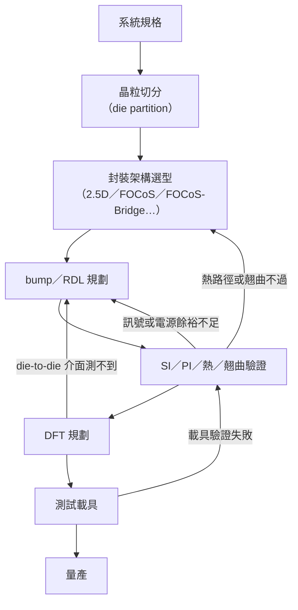

# 06　為什麼不能設計完才找封裝廠？

## 開場問題：晶片設計公司把 GDS 交出去，封裝廠照著做就好了——這哪裡行不通？

直覺上，封裝聽起來像是設計後段的「代工」：晶片公司把 GDS（版圖檔）交出去，封裝廠依規格把晶粒放進封裝、接好線、測一測、出貨。這個順序對傳統單晶片封裝大致成立——但先進封裝把多顆晶粒放進同一個封裝之後，這個順序會失效。

原因是：訊號完整性（SI）、電源完整性（PI）、熱、翹曲與可測試性（DFT）這五件事**互相咬住**。改動任何一項的方案，幾乎都會回頭動到另外四項。晶片公司若先把 die 切分好、把 GDS 定案，才把整包丟給封裝廠，封裝廠發現「這樣繞線會超出翹曲上限」時，能改的空間已經很小——退回去重切 die 的成本，遠高於一開始就一起定案。本章要把這五個約束怎麼咬合寫清楚，這也是後面談責任歸屬（[07](07-test-and-quality.md)）的前提：如果連「誰在什麼時候該改什麼」都說不清楚，失效之後也難以歸責。

先備是 [05 VIPack](05-vipack-and-fanout.md)：先知道 FOCoS、FOCoS-Bridge 這類平台的結構，才看得懂本章講的繞線與疊構限制發生在哪裡。不同封裝平台在結構自由度上的差異，另見[既有書對競爭平台的討論](../../cowos/html/09-competing-technologies.html)。

## 先看結構：五個約束互相咬合，不能序列交接

產業對 chiplet／2.5D／3D 的共同設計流程已有公開討論，其中一個反覆出現的結論是：測試考量不能留到設計流程尾端才處理，必須在早期規劃階段就與封裝、電性、機構一起定案。[T3](appendix-sources.md#T3)

下表是五個約束兩兩互相影響的方向——「改列項會怎麼影響欄項」：

| 改下列項目 ↓ ／ 影響 → | SI | PI | 熱 | 翹曲 | DFT |
|---|---|---|---|---|---|
| **SI**（RDL 繞線／通道） | — | 增加 RDL 層數與電源平面搶空間，PDN 阻抗上升 | 更密的 RDL、更多 bump 擠壓散熱銅路徑，熱阻上升 | 增層讓疊構更不對稱，翹曲風險上升 | 窄線寬線距壓縮可留給探針的接觸面積 |
| **PI**（電源網路／IPD） | 電源平面佔用的層數擠壓可用 RDL 層，訊號通道變少 | — | 加 IPD／去耦電容提高局部功耗密度，形成熱點 | 加金屬電源層改變整體 CTE 平均，牽動翹曲 | 新增電源域需要獨立的量測點，DFT 分區變複雜 |
| **熱**（散熱路徑／晶粒間距） | 溫度改變介電常數與導體電阻，時序隨溫度飄移 | 溫度升高使銅導體電阻上升，IR drop 惡化 | — | 蓋板／散熱片改變疊構，也帶入新的 CTE 落差來源 | 只在高溫下浮現的缺陷需要 burn-in 等高溫測項 |
| **翹曲**（材料／晶粒尺寸／基板厚度） | 翹曲造成 bump／RDL 接點應力，通道阻抗偏移 | 翹曲導致電源 bump 微裂紋，局部電阻上升 | 翹曲造成晶粒與基板間出現空隙，散熱路徑劣化 | — | 翹曲相關失效多半漸進出現，靜態測試測不到 |
| **DFT**（測試埠／可測接取點） | 留測試埠、探針墊佔用 RDL 繞線資源 | 測試埠需要獨立供電與地平面，PDN 更複雜 | 測試結構對熱路徑影響相對次要 | 測試結構對翹曲影響相對次要 | — |

這張表要傳達的不是「五件事都一樣重要」，而是**沒有一格可以填「無關」**——除了對角線，任何一個改動都至少牽動另外一到兩項。這也是為什麼共同設計不能拆成五個獨立小組各自簽核再拼起來：拼起來之後才發現的衝突，代價比一開始一起看更高。

翹曲這一列有公開的工程文獻可對照：扇出封裝的翹曲主要來自環氧模封膠（EMC）固化收縮，加上各材料熱膨脹係數（CTE）不匹配；重構後的晶粒放置誤差在面板格式下會被放大，文獻記載 50 µm 以上的偏移並不罕見。[T4](appendix-sources.md#T4)

下圖把上面的耦合關係畫成一條設計到驗證的交接流程，並標出哪幾步會把結果打回前面：

四條回饋線分別對應：繞線不夠好就退回 bump／RDL 重排；散熱或翹曲問題大到繞線救不了，就退回架構選型（例如改用有矽橋的方案分攤應力）；DFT 發現介面沒有可測接取點，退回 RDL 規劃補測試埠；測試載具實測與模擬對不上，整批打回驗證階段重跑。**這條線越晚被打回，成本越高**——因為越晚，牽動的下游工作（治具、產線設定、客戶端整合）越多。

## 輸入／操作／輸出

| 階段 | 拿到什麼（輸入） | 做什麼（操作） | 交出什麼（輸出） |
|---|---|---|---|
| 晶粒切分 | 系統功能規格、製程節點選擇 | 決定哪些功能放哪顆 die、定 die-to-die 介面規格 | die 清單與介面規格書 |
| 封裝架構選型 | die 清單、介面頻寬需求、良率目標 | 在 2.5D、FOCoS、FOCoS-Bridge 等方案中選型 | 封裝疊構草案、初版 bump map |
| bump／RDL 規劃 | 疊構草案、SI／PI 初步預算 | 排布 bump、定 RDL 層數與線寬線距 | bump map、RDL 繞線圖 |
| SI／PI／熱／翹曲驗證 | RDL 繞線圖、材料資料庫、功耗地圖 | 模擬通道損耗、IR drop、溫度場、翹曲 | 驗證報告、待修改清單 |
| DFT 規劃 | 介面規格、驗證報告 | 定測試埠位置與覆蓋範圍 | DFT 規格書、測試載具需求 |
| 測試載具 | DFT 規格書、定案疊構 | 製作 test vehicle，量測與失效分析 | 良率數據、失效模式清單 |
| 量產 | 測試載具驗證結果 | 依定案規格量產 | 出貨產品 |

每一站的輸出都是下一站的輸入，但**驗證站是唯一會往回寫兩個方向的節點**——它同時可能打回 bump／RDL，也可能打回架構選型。這是整條流程裡最容易被低估的一站。

## 失敗會長什麼樣子

| 現象 | 機制 | 需要的證據 |
|---|---|---|
| 封裝後訊號時序不過 | RDL 被電源平面或 bump 密度擠壓，被迫繞遠路，通道長度超出 SI 預算 | 用實際 RDL 萃取值跑的 SI 模擬報告，不是規格書估計值 |
| 大電流通道電壓掉落超標 | 電源層數不足，或去耦電容離負載太遠，PDN 阻抗在目標頻段過高 | 頻域 PDN 阻抗量測，或 IR drop 模擬對照實測 |
| 高功耗晶粒讓鄰近晶粒異常 | 晶粒間距太近，熱串擾把鄰近晶粒推高溫，時序或漏電流偏移 | 封裝級熱像圖，與鄰近晶粒的溫度—性能曲線 |
| 良率在可靠度測試後才掉 | CTE 不匹配疊加溫度循環，bump 或 RDL 接點逐漸出現微裂紋 | 溫度循環後的切片或 X-ray CT，不只看初測良率 |
| 系統故障但查不出是哪顆 die | die-to-die 介面沒留測試埠，封裝後只能量到系統輸出 | DFT 覆蓋率報告，標明每個介面是否可個別存取 |

最後一列直接連到下一章：如果封裝定案時沒有為 die-to-die 介面留測試埠，失效發生時就**沒有證據可以把責任定位到單一晶粒**——這不是測試工程師事後能補救的事，是設計階段的決定。留多少測試埠、怎麼規劃覆蓋範圍，屬於 DFT（可測試性設計）工程師的職務範圍，實際工作內容見[既有書對 DFT 職務的介紹](../../semi-jobs/html/04-dft.html)。

## 如何檢查與控制

| 控制項 | 怎麼量 | 常見的誤用 |
|---|---|---|
| RDL 可用繞線資源 | 依線寬線距與層數換算可繞線密度，對照 die-to-die 所需通道數 | 只看標稱層數，不扣掉被電源平面、bump 佔走的部分 |
| PDN 阻抗 | 目標頻段內的阻抗曲線，對照負載瞬態電流需求 | 只做靜態 IR drop，不做瞬態響應 |
| 熱阻與晶粒間距 | 封裝級熱模擬，含鄰近晶粒的交互作用 | 只算單顆 die 的熱阻，忽略群聚效應 |
| 翹曲 | 常溫到製程溫度區間（含 reflow）的翹曲曲線 | 只測常溫，漏掉 reflow 溫度區間的翹曲峰值 |
| DFT 覆蓋率 | die-to-die 介面可測項目 ÷ 應測項目 | 只報整體良率，不拆解到介面層級 |

這五項控制項的共同特徵是：**單獨達標不代表整體可行**。RDL 繞線資源夠、PDN 阻抗也過關，可能是因為翹曲餘裕被犧牲掉——這正是前面矩陣表要凸顯的耦合，檢查時必須同時看，不能逐項簽核了事。

## 回到日月光

以 FOCoS-Bridge 為例，可以看到這種耦合在公司自述的數字裡實際發生。第一代測試載具的矽橋區線寬線距小於 0.5/0.5 µm，用來換取高密度的 die-to-die 繞線。[A3](appendix-sources.md#A3) 到了 FOCoS-Bridge with TSV 版本，RDL 做到 3 層、線寬線距 5 µm，公司同時宣稱相對傳統作法功率損耗降低 3 倍、相對標準 FOCoS-Bridge 電阻降低 72%、電感降低 50%。[A4](appendix-sources.md#A4) 這組數字把「更精細的繞線（SI 面）」與「電性改善（PI 面）」放在一起宣傳，但新聞稿**未說明完整量測條件與對照組定義**——讀者無法獨立判斷這些改善有多少來自共同設計方法本身，多少來自製程世代進步。310 mm 面板級封裝的發布稿同樣只給了線寬線距與面板尺寸，時程寫「預計 2027 上半年量產」，**良率與客戶均未公開**。[A6](appendix-sources.md#A6)

日月光把「共同設計」包裝成一項服務，名為 IDE（Integrated Design Ecosystem），2023 年 10 月發布，2025 年再發布 IDE 2.0。[A7](appendix-sources.md#A7) 但本書撰寫期間，IDE 的官方技術頁（`ase.aseglobal.com`）直接抓取一律回 HTTP 403，正文未能取得——這件事必須明寫：**本章引用的所有 IDE 效益數字，都是二手轉述，而且比較基準與測試條件未公開**。媒體轉述過「週期縮短 50%」一類說法，但沒有交代對照組是什麼設計規模、誰量的、量測條件為何；本書不把這類數字當成可驗證的性能指標，只當成「公司對外這樣宣稱」。設計套件（PDK）依轉述為需求提供且受 NDA 保護，本書**無法驗證**其實際涵蓋的設計規則範圍（線寬、間距、過孔尺寸等）。

因此，「日月光提供共同設計服務」這句話，目前的證據只能支持「公司對外這樣宣稱、且確實發布了名為 IDE 的平台」，**不能支持「設計公司實際能取得多少設計規則、能做到多完整的驗證」**——因為後者取決於 NDA 之後的內容，本書拿不到。

要判斷一家封裝廠的共同設計能力是不是真的，可操作的判準至少有四項：

1. **設計規則的公開程度**——是官網就能查，還是全部要簽 NDA 才看得到第一頁。
2. **EDA 工具鏈的相容性**——PDK 能不能直接插進設計公司現有的驗證流程，還是需要另外重建。
3. **測試載具的實績**——有沒有具體、可查證的 test vehicle 結果（尺寸、良率、失效模式），而不只是新聞稿裡的示意圖。
4. **失效回饋的迴路時間**——封裝端測到失效之後，多久能把資訊回饋到設計端、定位到是哪一層的問題。

這四項本書目前都**沒有拿到日月光特定的答案**，只能停在「公司對外宣稱」這一層。

## 理解檢查

??? question "為什麼晶片設計公司不能等 GDS 做完才找封裝廠？"
    因為 SI、PI、熱、翹曲、DFT 五項互相牽制，任何一項在設計定案後才被封裝廠發現不可行，回頭修改的通常不只一項，而是牽動另外幾項一起重驗。序列交接會讓每次修改都重跑一輪流程，成本遠高於一開始就共同設計、同時檢查。

??? question "RDL 線寬線距變細對訊號完整性是好事，可能有哪些副作用？"
    製程容忍度更低，翹曲敏感度上升；金屬截面積變小，電源 RDL 的 IR drop 風險上升；線距更窄也讓測試探針更難接觸，DFT 可及性下降。單一項改善經常是拿其他項的餘裕去換的。

??? question "熱如何回頭影響訊號完整性？"
    溫度升高會改變介電材料的介電常數與導體電阻，使訊號延遲與衰減隨溫度飄移。SI 裕度必須用最壞情況（最高溫）下的參數重新計算，不能只用常溫模擬結果，否則量產後在高溫工作點可能超出時序預算。

??? question "日月光宣稱 IDE 能把設計迭代時間大幅縮短，你要看到什麼證據才會相信這個數字適用於自己的專案？"
    需要看到比較基準的定義（對照組是誰、什麼複雜度的設計）、量測方法（誰量的、用什麼工具、樣本數）、以及「縮短」是否涵蓋完整的 DRC 與可靠度驗證，而不只是佈線這一步。目前只有二手轉述的結論數字，官方原文未取得，比較基準與測試條件都不清楚，不能直接套用到任何特定專案上。

??? question "要判斷一家封裝廠的共同設計能力是不是真的，可以問哪些問題？"
    設計規則對外公開到什麼程度（還是全部要 NDA 才看得到）、EDA 工具鏈跟自己既有的設計流程相不相容、有沒有可查證的測試載具實績（不是只有新聞稿）、失效發生後回饋到設計端需要多久的迴路時間。

## 來源與待查

工程通則：五個約束互相耦合的討論依據 [T3](appendix-sources.md#T3)（chiplet 共同設計流程的產業討論）；翹曲的物理機制依據 [T4](appendix-sources.md#T4)（扇出封裝翹曲的技術文獻整理）。這兩項是產業通識，不代表日月光特定產線的實測數據。

公司自述：FOCoS-Bridge 第一代規格見 [A3](appendix-sources.md#A3)；FOCoS-Bridge with TSV 的規格與效益宣稱見 [A4](appendix-sources.md#A4)；310 mm 面板級封裝發布見 [A6](appendix-sources.md#A6)；IDE／IDE 2.0 見 [A7](appendix-sources.md#A7)。以上效益數字全部標記為公司自述或二手轉述，**未經第三方獨立驗證**。

未取得：IDE 官方技術頁正文（`ase.aseglobal.com` 回 HTTP 403）；PDK 實際涵蓋的設計規則範圍（NDA 保護）；IDE 效益數字（例如週期縮短的比例）的比較基準、樣本與測試條件；FOCoS-Bridge with TSV 效益宣稱的對照組定義。這些缺口見 [附錄 A 的取用限制](appendix-sources.md)。
