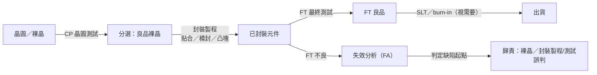

# 07　封裝與測試一起交付，誰負責判定良品？

## 開場問題：封裝廠把晶片裝壞了，是誰的責任？

一顆晶片從晶圓廠出來時是良品，送到封裝廠之後卻測不過——這是晶圓廠給的裸晶本來就藏著缺陷，只是晶圓測試（CP）沒抓到；還是封裝過程（貼合、模封、電性互連）把原本的良品弄壞了？

這個問題聽起來像技術問題，其實是**商業問題**：誰要為這顆報廢的晶片付錢。封裝與測試綁在一起交付，中間任何一站都可能是缺陷的起點，但只有留下對的證據，才能把責任歸到對的一方。本章要串起測試插入點、KGD（已知良品晶片）、失效分析（FA）與可靠度驗證，說明「良品判定」實際上是怎麼被證明出來的。

先備是 [03](03-packaging-service-baseline.md)、[06](06-codesign-and-handoff.md)：前者建立封裝流程與良率基準，後者談共同設計階段的責任交接，本章接著談製造完成後的判責機制。

## 先看結構：責任隨測試插入點移轉

一顆晶片從裸晶到出貨，會經過多個測試插入點，每一站攔下的缺陷類型不同，能歸責的對象也不同。



CP 只能抓到裸晶狀態下量得到的缺陷；封裝製程引入的問題（貼合偏移、模封應力、凸塊缺陷）要到 FT 才會現形；有些缺陷連 FT 都測不到，得靠 SLT 或 burn-in 才會在系統工作環境或長時間應力下暴露。**測試插入點越晚，越難把缺陷起點回溯清楚**，因為晶片已經經過更多道工序，可能的肇因也更多。測試插入點的完整分類見[測試插入點](../../sigurd/html/01-test-in-the-flow.html)。

<figure class="external-image">
  <a href="https://commons.wikimedia.org/wiki/File:Probe_card.JPG"></a>
  <figcaption>圖 07-1｜探針卡實物。上圖流程最左端的「CP 晶圓測試」就是靠這類治具的細探針接觸裸晶接墊完成——每一次接觸都會在接墊上留下針痕，這也是本章判責時要比對的痕跡之一：接墊上的異常是探測造成的，還是封裝製程造成的。此圖用於辨識探針卡外觀，不代表日月光的設備。攝影：Ajoones，CC BY 3.0，原圖未修改（以 500 px 版本外連）。 <a href="99-image-credits.html#img-07-1">出處與授權</a>。</figcaption>
</figure>

## 輸入／操作／輸出

**輸入**：待判責的失效樣本（FT 不良品、客戶端退貨、可靠度應力測試後樣本）、對應的製程與測試紀錄。

**操作**：
- 失效分析（FA）：電性定位、開封、剖面、掃描電顯微鏡等手段，找出缺陷的物理起點
- 比對製程紀錄：貼合機台參數、模封批號、測試程式版本
- 可靠度驗證：依既有標準對樣本施加應力，重現或排除特定失效機制
- 依歸責結果，回饋給對應站別（晶圓廠、封裝製程、測試工程）

**輸出**：一份失效分析報告，說明缺陷的物理機制與起點，作為責任歸屬與後續改善的依據；若涉及商業合約，這份報告直接決定材料與良率損失由誰吸收。

## 失敗會長什麼樣子：缺陷／檢查／責任矩陣

| 缺陷來源 | 哪一站可能攔到 | 通常由誰負責 | 歸責所需證據 |
|---|---|---|---|
| 裸晶本身缺陷（製程瑕疵，CP 未顯現） | FT、SLT、可靠度應力測試後才顯現 | 晶圓代工廠／IC 設計公司（若封裝廠僅代工組裝，即 consigned 模式） | 失效分析報告，證明缺陷物理起點在矽晶本體，且封裝製程參數在規格範圍內 |
| 凸塊（bump）缺陷：空洞、共面度不良、脫層 | 封裝廠出貨前目檢、X-ray、FT | 封裝廠（若凸塊製程屬其交付範圍） | 凸塊製程監控紀錄、剖面檢查對照製程規格書 |
| 貼合（die attach）不良：對位偏移、空洞、翹曲 | 封裝製程中段 AOI、FT | 封裝廠 | 貼合設備製程參數紀錄、X-ray／CSAM 掃描影像 |
| 模封（molding）不良：分層、裂縫、翹曲 | 出貨前目檢、可靠度應力測試後 | 封裝廠 | 溫度循環、HAST 等應力後失效模式對照模封製程批號 |
| 基板（substrate）缺陷：線路開短路、翹曲 | 基板進料檢驗、FT | 基板供應商（consigned material）或封裝廠（turnkey 採購） | 基板進料檢驗紀錄，證明缺陷在封裝廠收到基板時已存在 |
| 測試誤判（test escape／overkill） | 只能靠下游 FA 回溯或客戶端 DPPM 統計發現 | 測試工程（程式覆蓋率、guard band 設定者） | 測試程式版本紀錄、良品／不良品重測結果比對 |

**KGD（Known Good Die，已知良品晶片）**的意義，就是把「裸晶是良品」這件事在進入封裝前先確認清楚，減少上表第一列的爭議空間。但 KGD 不是免費的：晶圓級測試受限於探針間距與高速訊號環境，很難做到與封裝後 FT 同等的覆蓋率，多做的每一項 KGD 測試都要有人付機台時間——這條取捨與 [測試成本結構](../../sigurd/html/02-test-cost-model.html) 講的機台小時成本是同一件事。

可靠度驗證回答的是另一個問題：**平時測不到的缺陷，會不會在使用壽命內才爆發**。溫度循環測試（用途：加速累積熱機械疲勞，用於發現焊點疲勞、封裝裂縫、分層、打線失效等機制）與 HAST（高加速應力測試，用途：在高溫高濕偏壓下加速水氣滲透造成的失效）都屬於這一類，本書只引用其用途，不引用條文內容。[T1](appendix-sources.md#T1)、[T2](appendix-sources.md#T2)

## 如何檢查與控制：turnkey 與 consigned，誰吃良率風險

| 商業模式 | 材料採購方 | 良率風險由誰吸收 | 常見的誤用 |
|---|---|---|---|
| Turnkey（交鑰匙） | 封裝廠代為採購基板、模封料等材料 | 封裝廠承擔多數材料來源與供應風險，客戶主要承擔交期延誤風險 | 把「turnkey」等同於「封裝廠對所有缺陷負責」，忽略裸晶本身缺陷仍需歸責到晶圓廠 |
| Consigned（客供料） | 客戶指定並提供材料給封裝廠 | 客戶承擔材料短缺、來源真偽、運送損傷等供應鏈風險；進料檢驗不代表責任邊界消失 | 以為「客供料出問題就是客戶的責任」，忽略封裝廠仍須對製程引入的缺陷負責 |

| 控制項 | 怎麼量 | 常見的誤用 |
|---|---|---|
| KGD 覆蓋率 | 晶圓級測試涵蓋的功能與參數項目 ÷ 封裝後 FT 的對應項目 | 只看「有沒有做 KGD」，不看覆蓋率實際涵蓋哪些項目 |
| FA 回饋週期 | 從發現不良到 FA 報告產出、回饋到製程改善的時間 | 只統計 FA 完成率，不追蹤回饋是否真的改了製程 |
| 可靠度應力後失效率 | 依標準應力條件（如溫度循環次數）量測後的失效比例 | 引用應力測試「有做」，卻不揭露迴圈數、溫度範圍等條件 |
| 歸責證據完整度 | 是否同時具備製程紀錄與失效分析報告 | 只憑失效現象猜測起點，沒有製程紀錄比對就下結論 |

### 教學算例：良率乘法與責任成本

以下數字為**教學假設**，不是任何公司的實際良率。假設一個模組配置為 1 顆 ASIC ＋ 4 顆 HBM（共 5 顆裸晶），各裸晶入料良率（通過各自 CP 判定為良品的比例）為 99%，封裝良率（貼合、模封、電性互連整體）為 98%，且各環節相互獨立：

```
模組良率 ≈ 入料良率^5 × 封裝良率
        = 0.99^5 × 0.98
        ≈ 0.951 × 0.98
        ≈ 93.2%
```

換算成報廢代價：每 10,000 次模組組裝嘗試，5 顆裸晶都通過入料檢驗、進入封裝的約有 9,510 次；封裝良率 98%，代表這 9,510 次裡有約 190 次在封裝環節報廢。**這 190 次報廢的模組，裡面的裸晶在進入封裝前都已經是入料良品**——換句話說，190 次封裝報廢總共損失約 950 顆（190 × 5）原本已驗證良好的裸晶，而不是 190 顆。最終良品模組約 9,320 個（93.2%）。

**這就是良率乘法的痛點**：封裝環節 2 個百分點的良率損失，不是「2% 的模組壞掉」這麼簡單——因為報廢一個模組，等於同時報廢模組裡每一顆已經先付出測試成本、被判定為良品的裸晶。裸晶顆數越多（HBM 堆得越多），這個乘數效應越痛，這也是為什麼封裝環節出的問題特別難用「材料成本」估算，必須算進被連帶報廢的良品裸晶。完整的良率乘法與 KGD 邏輯見[測試與已知良品](../../cowos/html/13-test-and-kgd.html)。

## 回到日月光

依 [A8](appendix-sources.md#A8)，日月光官方技術頁面（`ase.aseglobal.com`）公開列出的測試與可靠度能力**名稱**包括：晶圓測試（wafer sort）、最終測試（涵蓋邏輯、混合訊號、RF）、系統級測試（SLT，特別提及 SiP／MEMS／Discrete 模組與 5G mmWave 模組的 OTA 測試）、老化測試（burn-in，由 ISE Labs 提供）、以及環境測試、機械測試、ESD 測試、失效分析等可靠度與品質項目（ISE Labs San Jose 設施）。

必須明寫的取用限制：這些官方技術頁的**正文因 HTTP 403 未能取得**（見 [appendix-sources.md](appendix-sources.md) 取用限制表），本書取得的是搜尋摘要層級的內容。因此本章**只能引用這些能力名稱的存在**，不能引用其官方原文對這些能力的規格描述、量測條件或效益數字，也不能把能力名稱的存在當成任何特定產線良率或責任歸屬的證明。

## 理解檢查

??? question "封裝廠把晶片裝壞了，怎麼判定是裸晶本身的問題還是封裝製程的問題？"
    靠失效分析（FA）找出缺陷的物理起點，並比對製程紀錄（如貼合機台參數、模封批號）是否在規格範圍內。單看「FT 測不過」無法判責，因為裸晶缺陷、封裝製程缺陷、測試誤判三種可能都會表現成同一個「不良」結果。

??? question "KGD 測試做得越多，就一定能避免所有的封裝報廢損失嗎？為什麼？"
    不能。KGD 只能減少「封裝了才發現裸晶本身就是不良品」的情況，無法防止封裝製程本身（貼合、模封）造成的缺陷。本章算例裡的封裝良率 98%，發生在 KGD 已經確認裸晶為良品之後，這部分報廢無法靠加強 KGD 消除。

??? question "turnkey 模式下，是不是所有缺陷都由封裝廠負責？"
    不是。Turnkey 只決定材料採購由封裝廠代辦、封裝廠承擔多數材料來源風險；裸晶本身的缺陷仍要回溯到晶圓廠或 IC 設計公司，需要失效分析證據支持，不會因為採購模式是 turnkey 就自動歸責給封裝廠。

??? question "本章能不能確認日月光晶圓測試或最終測試的具體規格（如溫度範圍、迴圈次數）？證據缺口在哪？"
    不能。依 [A8](appendix-sources.md#A8)，官方技術頁正文因 403 未取得，本書只掌握到搜尋摘要層級的能力名稱，沒有官方原文的規格表可逐字核對。這是明確的證據缺口，不能用產業一般規格代替日月光的實際數字。

??? question "教學算例裡「一個模組報廢損失 950 顆良品裸晶」，這個數字能不能代表日月光的實際損失？"
    不能。算例的入料良率 99%、封裝良率 98% 都是**教學假設**，用來示範良率乘法的效果，並非日月光或任何公司的實際良率。實際良率未公開，也不在本書引用範圍內。

## 來源與待查

本章「先看結構」與「失敗會長什麼樣子」段落的測試插入點與缺陷分類為產業一般知識，未逐項標示公司特定來源。可靠度驗證方法引用 [T1](appendix-sources.md#T1)（JESD22-A104，僅引用用途）、[T2](appendix-sources.md#T2)（JESD22-A110，僅引用用途）。教學算例中的入料良率、封裝良率與模組配置均為**教學假設**，可自行代入重算，不代表任何公司的實際數字。「回到日月光」段落引用 [A8](appendix-sources.md#A8) 所載的能力名稱，因官方技術頁正文 403 未取得，僅引用能力名稱存在，不引用其規格或效益數字；這部分的完整原文取得情況列於 [appendix-sources.md](appendix-sources.md) 取用限制表。
