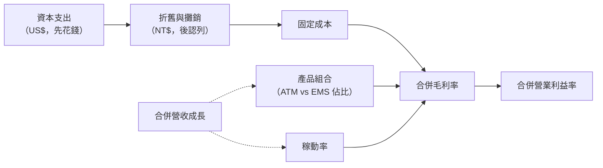

# 09　營收成長為什麼不一定等比例提高獲利？

## 開場問題：錢跑去哪了？

日月光投控 2026 年第二季合併營收年增 26.7%，[F1](appendix-sources.md#F1) 但歸屬母公司淨利呢？如果你直覺認為「營收漲 26.7%，淨利也該漲 26.7%」，這一章要拆掉這個直覺。答案不是「作假帳」或「藏錢」，而是財務報表裡幾個結構性的機制——產品組合、折舊、稼動率、資本支出的時間差——本來就不會讓營收與獲利同步移動。

先備是 [02 新聞裡的「日月光」是哪個主體](02-group-and-business.md)：不先搞清楚主體，口徑會全部錯位。產能與資本支出的通則見[既有書的產能章](../../gpm/html/14-yield-capacity-capex.html)；測試機小時如何變成成本的算式見[測試成本模型](../../sigurd/html/02-test-cost-model.html)，本章只談日月光財報揭露的口徑，不重覆那套算式。

## 主體與口徑：三件事先講死

後面每一個數字都遵守以下三條規則，讀者可以先記下來當檢查清單。

**第一，主體是日月光投控合併（ASEH consolidated）。** 不是 ASE Inc. 單體，不是矽品（SPIL）單獨的數字，也不是環旭電子（USI）單獨的數字。20-F 顯示 SPIL 是投控 100% 全資子公司，USI 集團則是一組不同比例的持股（USI Inc. 100.0%、USI Shanghai 71.6%、HCC Group 75.1%、FAFG 100.0%）。[F4](appendix-sources.md#F4) 把「環旭」當成一個單一 100% 子公司來讀，會弄錯合併報表裡的非控制權益。

**第二，分部不能自行加總。** 依 [F1](appendix-sources.md#F1)，2Q26 ATM 分部營收 NT$126,148 百萬加 EMS 分部營收 NT$65,789 百萬，等於 NT$191,937 百萬；但公司揭露的合併營收是 **NT$191,064 百萬**，差了 NT$873 百萬——這是分部間交易的沖銷。2025 全年同樣的算法：依 [F3](appendix-sources.md#F3)，ATM 的 NT$389,228 百萬加 EMS 的 NT$259,079 百萬等於 NT$648,307 百萬，合併營收卻是 NT$645,388 百萬，差 NT$2,919 百萬。這兩個差額不是誤差，是**分部間交易的沖銷金額**，也是本書不自行把分部加總成新數字的最直接證明。

**第三，幣別不可混用。** 營收、毛利率、淨利以 **新台幣（NT$）** 揭露；資本支出以 **美元（US$）** 揭露。[F1](appendix-sources.md#F1)、[F3](appendix-sources.md#F3) 兩者不能相除、相加或自行換算成同一序列比較，匯率波動會把業務成長和匯率效果混在一起。

另外要提醒一個查證結果：經查核的 Form 20-F 裡，正式的「reportable segments」其實是 **Packaging、Testing、EMS 三個**，「ATM」這個縮寫在 20-F 全文出現 **0 次**。[F4](appendix-sources.md#F4) 「ATM」是公司季報新聞稿裡對外自我描述的業務簡稱，不是 SEC 申報文件裡的會計分部名稱。讀季報時看到的 ATM 數字，跟讀 20-F 時看到的 Packaging／Testing 數字，是兩套不同顆粒度的口徑，不能互相代換——詳細對照見 [02 新聞裡的「日月光」是哪個主體](02-group-and-business.md)。

## 機制：為什麼營收與獲利不同步

把 [F1](appendix-sources.md#F1) 與 [F3](appendix-sources.md#F3) 的數字排在一起看，會看到四個機制同時在起作用。先用一張圖建立心智模型，再逐項對數字：

這張圖說明一件事：**「合併營收成長」本身不會直接決定「合併獲利率」**，中間隔著產品組合、折舊攤提速度與稼動率三層機制，任何一層的變化都可能讓兩條成長曲線分岔。

| 項目 | 2025 全年（[F3](appendix-sources.md#F3)） | 1Q26（[F1](appendix-sources.md#F1) 對照） | 2Q26（[F1](appendix-sources.md#F1)） |
|---|---|---|---|
| 合併營收 | NT$645,388 百萬 | — | NT$191,064 百萬 |
| 合併毛利率 | 17.7% | 20.0% | 21.0% |
| 合併營業利益率 | 7.9% | 10.1% | 11.1% |
| ATM 毛利率／營益率 | 23.5%／11.3% | — | 27.3%／15.7% |
| EMS 毛利率／營益率 | 9.1%／2.9% | — | 8.9%／2.4% |
| 折舊與攤銷 | NT$67,440 百萬 | 未取得 | 未取得 |

**產品組合（mix）**：2Q26 ATM 毛利率 27.3%，EMS 毛利率 8.9%——同樣多一塊錢營收，落在 ATM 分部還是 EMS 分部，毛利差了三倍。[F1](appendix-sources.md#F1) 合併毛利率因此會隨兩個分部的相對成長速度移動，這和「公司整體效率有沒有變好」不是同一件事：即使兩個分部各自的毛利率都不變，只要 ATM 佔比上升，合併毛利率就會上升。

**折舊（depreciation）**：2025 全年折舊與攤銷 NT$67,440 百萬，[F3](appendix-sources.md#F3) 對照全年營收 NT$645,388 百萬，占比約 10.5%。折舊是**先花錢、後認列**的固定成本——資本支出今天砸下去，變成產線之後，未來好幾年、每一季的損益表都要扣這筆錢，跟當季賣了多少貨無關。

**稼動率（utilization）**：營收上升時，折舊、廠房這類固定成本被攤薄，理論上營業利益率應該比毛利率放大得快（營運槓桿）。但把 1Q26 與 2Q26 放在一起看：毛利率從 20.0% 升到 21.0%（升 1.0 個百分點），營業利益率從 10.1% 升到 11.1%（同樣升 1.0 個百分點）。[F1](appendix-sources.md#F1) **兩者的改善幅度幾乎相等，這一段看不出明顯的營運槓桿放大效果**，本書不硬套理論去解釋這一季沒有出現的現象。

**資本支出的時間差**：從資本支出核准，到設備裝機、產能開出，到營收真正認列，中間有落差——這也是下一段要拆三種口徑的原因：法說會上講的「加碼投資」跟財報上真正花出去的錢，往往不是同一個時間點的事。

## 教學算例：產品組合如何決定合併毛利率

下面用 2Q26 的真實分部毛利率當輸入，示範「營收成長本身不決定毛利率，組合才決定」。**這是教學算例，忽略分部間交易沖銷、忽略營業費用、忽略匯率，不是公司實際財務預測，讀者可自行代入重算。**

輸入：ATM 毛利率 27.3%、EMS 毛利率 8.9%（[F1](appendix-sources.md#F1)）；基期營收沿用 2Q26 分部數字 ATM NT$126,148 百萬、EMS NT$65,789 百萬（分部合計 NT$191,937 百萬，**注意這裡用的是分部合計，不是合併營收**）。

- **情境 A（維持實際比例）**：兩分部都不成長。ATM 占分部合計 65.72%，EMS 占 34.28%。加權毛利率 ＝ 0.6572 × 27.3% ＋ 0.3428 × 8.9% ＝ **21.0%**。
- **情境 B（ATM 多成長 10%，EMS 不變）**：ATM 變 NT$138,763 百萬，EMS 仍 NT$65,789 百萬，合計 NT$204,552 百萬（僅成長 6.6%）。ATM 占比升至 67.85%。加權毛利率 ＝ 0.6785 × 27.3% ＋ 0.3216 × 8.9% ＝ **21.4%**。
- **情境 C（兩分部同比例成長 10%）**：ATM 變 NT$138,763 百萬、EMS 變 NT$72,368 百萬，合計 NT$211,131 百萬（成長 10.0%），比情境 B 營收成長更多。但因為 ATM／EMS 的比例沒有變，加權毛利率算出來仍是 **21.0%**，跟情境 A 完全一樣。

**這個算例要證明的事**：情境 C 的營收成長（10.0%）比情境 B（6.6%）更大，但毛利率完全沒動；情境 B 營收成長較少，毛利率卻上升了 0.4 個百分點。**決定合併毛利率的不是「營收成長了多少」，而是「成長發生在哪個分部」。** 看到「營收年增 26.7%」這種頭條數字時，先問一句：這個成長主要來自哪個分部？

## 證據：資本支出的三種口徑

這是本章最實用的部分。日月光 2026 年度資本支出在同一年內公開修訂了兩次，加上實際支出數字，媒體報導時經常把三種不同性質的數字混著寫。時間線如下：

| 日期 | 數字 | 口徑 | 誰說的 | 來源 |
|---|---|---|---|---|
| 2026-02 | US$7.0 十億 | 年度**原始指引** | 公司聲明（媒體轉述） | [F8](appendix-sources.md#F8) |
| 2026-04-30 | 最高 US$8.5 十億 | 年度指引**第一次上修** | 公司（媒體轉述，付費牆） | [M5](appendix-sources.md#M5) |
| 2026-07-30 | US$10.5 十億 | 年度指引**第二次上修** | 財務長法說會逐字 | [F5](appendix-sources.md#F5)、[F6](appendix-sources.md#F6) |
| 2025 全年 | US$3,396 百萬 | **實際設備資本支出** | 公司財報新聞稿 | [F3](appendix-sources.md#F3) |
| 2Q26 單季 | US$1,695 百萬（封裝 840／測試 804／EMS 49） | **實際單季設備資本支出** | 公司財報新聞稿 | [F1](appendix-sources.md#F1) |

要教會讀者的判準：「指引」「修訂指引」「實際支出」是三種不同性質的數字，
**媒體標題常把指引寫成「投資」，容易讓人誤以為錢已經花出去了**。
而且範圍也不一樣——法說會的指引數字是**含廠房與設施在內的總額**，
財報新聞稿的實際支出數字是**只含設備**。
兩者連涵蓋範圍都不同，**不能直接比大小**，更不能拿「指引 US$10.5 十億」除以四去對比「單季設備支出 US$1,695 百萬」。

| 口徑 | 指的是什麼 | 這章用到的例子 |
|---|---|---|
| 年度指引 | 公司對「今年打算花多少」的預告，含廠房＋設備 | US$7.0／8.5／10.5 十億三次版本 |
| 修訂指引 | 同一年度內，指引本身被公司上修 | 2026 年內上修兩次 |
| 實際支出 | 財報新聞稿揭露、當期真正入帳的設備資本支出 | 2025 全年 US$3,396 百萬；2Q26 單季 US$1,695 百萬 |

三者的差別不只是數字大小，還有**揭露來源不同**：指引與修訂指引來自法說會口頭發言或媒體轉述（二手・轉述），實際支出來自公司財報新聞稿的書面數字（一手・公司文件，未經查核）。依 [F7](appendix-sources.md#F7)，2026 年第一次上修的增量中，約三分之二用於廠房與設施，機器設備增量裡約 75% 用於封裝、25% 用於測試——這組拆分同樣是法說會逐字稿轉述，**與財報新聞稿的單季實際支出不是同一個統計口徑**，不能互相替代驗證。

**同一組數字、兩個不同主詞**：依 [F6](appendix-sources.md#F6)，「US$4 十億用於廠房、US$6.5 十億用於設備」這組拆分，同時有兩個來源，主詞卻不一樣。法說會逐字稿裡，財務長親口說：「$4 billion is for factory and facilities, $6.5 billion for equipment」，[F5](appendix-sources.md#F5) 主詞是公司本人。同一天 TrendForce 的報導卻寫「institutional investors estimate about US$4 billion … will be allocated to new fabs」，[F6](appendix-sources.md#F6) 主詞是「機構投資人估計」。本書**並列不調和**，不代為判定哪個在先。讀者引用前，先看清楚句子的主詞是誰。

**LEAP 的口徑陷阱**：依 [F8](appendix-sources.md#F8)，「LEAP」（leading-edge advanced packaging）只出現在法說會口頭發言與媒體報導；經查核的 [F4](appendix-sources.md#F4) 20-F 全文查無此縮寫，用的是完整敘述「leading-edge advanced packages」。公司對 LEAP 營收只給過定性歸屬——「primarily included within our computing applications, with a lesser amount being included in communications」，[F8](appendix-sources.md#F8) **LEAP 營收與 ATM 分部營收、SiP 營收之間是否重疊計算，公司未公開**。所以看到「LEAP 營收要翻倍」這類說法時，要知道它目前**不是財報上可以逐項核對的會計科目**，只能記錄「公司這樣說過」。

## 理解檢查

??? question "2Q26 ATM 營收加 EMS 營收，為什麼不等於合併營收？"
    因為分部間有交易，合併報表會把這部分沖銷掉。依 [F1](appendix-sources.md#F1)，126,148 ＋ 65,789 ＝ 191,937，但合併營收是 191,064，差 873 百萬即為分部間交易沖銷。任何時候看到分部數字，都不能自行加總去對照合併數字。

??? question "法說會說『資本支出上修到 US$10.5 十億』，跟財報新聞稿說『2Q26 設備資本支出 US$1,695 百萬』，這兩個數字可以直接比較嗎？"
    不行，至少有兩層落差。第一，前者是年度**指引**（且是第二次修訂後的數字），後者是**單季實際支出**；第二，前者**含廠房與設施**，後者**只含設備**。範圍與時間性質都不同，媒體常把指引寫成「已投資」，讀者要自己拆開這三層。

??? question "為什麼合併毛利率會因為『成長發生在哪個分部』而變動，即使兩個分部各自的毛利率都沒有改變？"
    因為合併毛利率是兩個分部毛利率的加權平均，權重是各分部占營收的比例。ATM 毛利率遠高於 EMS（2Q26 為 27.3% vs. 8.9%）。教學算例顯示：即使兩分部各自成長 10%（情境 C），比例不變，加權毛利率仍維持 21.0%；但只讓 ATM 多成長（情境 B），即使總營收成長更少，加權毛利率也會上升到 21.4%。決定毛利率的是組合，不是成長幅度。

??? question "『LEAP 服務營收 2027 年要翻倍』這個說法，能不能在日月光的財報上找到對應的一行數字去核對？"
    不能，這是本章明確的證據缺口。「LEAP」這個詞只出現在法說會口頭發言與媒體轉述，經查核的 20-F 全文查無此縮寫；公司對 LEAP 營收只給過「主要落在運算應用」這種定性歸屬，沒有揭露它與 ATM 分部營收、SiP 營收之間是否重疊計算。讀者只能記錄「公司在法說會上這樣說過」，無法拿財報上的某一行數字去驗證這個說法本身。

??? question "如果只看『合併毛利率從 20.0% 升到 21.0%、營業利益率從 10.1% 升到 11.1%』，能不能說『稼動率提升帶來了明顯的營運槓桿』？"
    不能這樣說。兩者的改善幅度都是 1.0 個百分點，完全同步，沒有出現營業利益率放大得比毛利率快的現象。本章刻意不套用「營收上升、固定成本攤薄、營業利益率理論上該放大更快」的理論去解釋這一季，因為 1Q26 到 2Q26 的實際數字並不支持這個推論。

## 來源與待查

本章引用 [F1](appendix-sources.md#F1)、[F3](appendix-sources.md#F3)、[F4](appendix-sources.md#F4)、[F5](appendix-sources.md#F5)、[F6](appendix-sources.md#F6)、[F7](appendix-sources.md#F7)、[F8](appendix-sources.md#F8)、[M5](appendix-sources.md#M5)。第三段「教學算例」的三個情境數字為本書自行計算，**教學假設**，忽略分部間沖銷、營業費用與匯率，不代表公司實際財務預測。LEAP 營收與 ATM／SiP 營收是否重疊計算、20-F「Property, Plants and Equipment」表是否列有本書未擷取到的其餘設施，均為**未取得**，列入待查事項。
