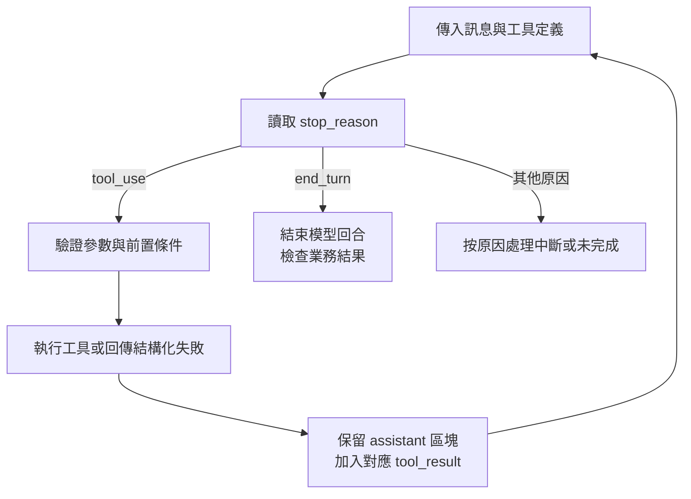

# 01｜Agent 迴圈：請求、執行與停止

**考綱：1.1。** 本章要回答：Claude 說「正在查詢」時，資料庫真的被查過了嗎？先備是能讀懂 JSON；學完後應能追蹤一次工具往返，並指出哪個元件負責執行。

## 模型提出動作，應用程式執行動作

假設讀者設計一個活動訂位助理。使用者問「查詢我的票券是否可以改期」。Claude 可以產生 `lookup_ticket` 的名稱與參數，但自訂 client tool 的程式碼由應用程式執行。只把工具名稱寫在提示詞，並不會讓資料庫連線自動發生。官方文件把這個契約分成工具定義、模型的 `tool_use`、應用端執行，以及送回模型的 `tool_result`。[工具往返原理](https://platform.claude.com/docs/en/agents-and-tools/tool-use/how-tool-use-works)

這裡討論的是 **Messages API 的 client tool 迴圈**。Agent SDK 提供較高階執行環境；不要在 SDK 外又不加區分地重建同一套內部迴圈。伺服器端工具另有執行與續跑方式，不能把下面流程無條件套到所有工具。



圖中最重要的邊是「結果回到下一次請求」：若拿到資料卻沒有送回 Claude，模型下一輪仍不知道查詢結果。每個工具結果必須對應原本的呼叫 ID；有多個請求時，不可拿第一筆結果回覆所有呼叫。

## 一次完整往返

以下是**協定示意**，省略網路認證與完整 API 請求欄位：

```json
{
  "role": "assistant",
  "content": [{
    "type": "tool_use",
    "id": "call_ticket_1",
    "name": "lookup_ticket",
    "input": {"ticket_id": "T-041"}
  }]
}
```

應用程式檢查工具名、輸入與存取權限後，才查詢測試資料，再把這段加入 user message 的 content：

```json
{
  "type": "tool_result",
  "tool_use_id": "call_ticket_1",
  "content": "{\"ticket_id\":\"T-041\",\"status\":\"confirmed\",\"change_allowed\":false}"
}
```

應保留對話中必要的既有訊息和原始 assistant content，不要只保留其中看得見的文字。模型接著可以根據 `change_allowed` 說明限制或詢問其他方案；它不能把查詢結果解讀成「改期已完成」。

## 三種不同的完成

| 判斷層 | 看什麼 | 不能推導什麼 |
|---|---|---|
| 模型回合 | `stop_reason` | 文字說「完成」不能代替協定狀態 |
| 工具執行 | 工具返回的成功／錯誤與操作紀錄 | HTTP 成功不保證業務請求被批准 |
| 使用者目標 | 已確認的業務狀態與未結事項 | `end_turn` 不表示票券已修改 |

考綱要求以 `tool_use` 繼續、以 `end_turn` 判斷回合結束，不能靠搜尋自然語言中的「完成」停止。迭代預算仍有價值，但它是防止失控的邊界；耗盡時應標「未完成」，不可視為任務成功。截斷、拒絕等狀態也要個別處理，而不是所有非 `tool_use` 一律算成功。[官方考綱 §6，1.1](appendix-sources.md)

## 原創案例：文字和工具同時出現

助理先說「我會查看可改期日期」，同一回應還包含一個工具請求。工程師看到有文字就把回應直接呈現、結束流程，結果使用者永遠等不到日期。

修正應從控制流程下手：遍歷 content 內的工具請求、驗證並執行，把結果帶回下一輪。調長 system prompt 或要求「不要先說話」只會改變表面輸出，沒有修好漏執行的分支。若兩個工具有依賴，先拿前者結果再產生下一個請求；不要為了並行讓後者猜 ID。

## 動手檢查

用紙筆寫出兩輪訊息：第一輪查票券，第二輪說明不可改期。逐筆標出 role、工具 ID、結果和 stop reason。如果刪掉第一輪 assistant 區塊，剩下的 tool result 還能對應一個有效請求嗎？如果兩個結果交換 ID，模型會得到什麼錯誤資訊？[離線練習](11-labs.md)提供可執行的模擬程式。

**自測：** 收到 `end_turn`，文字是「查詢失敗，尚未改期」。可否把訂位任務標成功？答案是否：回合結束，但業務結果仍未完成，應留下失敗原因與下一步。

下一章：[如何拆分任務與交接上下文](02-orchestration.md)。回到[考綱地圖](00-exam-map.md)。
