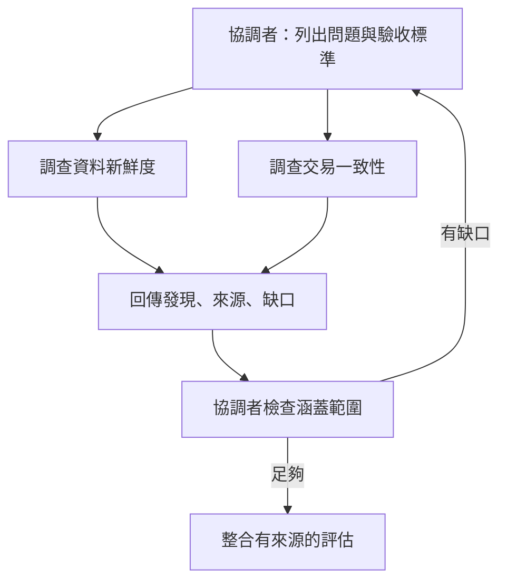

# 02｜任務編排：讓分工保留完整問題

**考綱：1.2、1.3、1.6、1.7。** 先讀[Agent 迴圈](01-agent-loop.md)。本章目標是選出適合問題的分工方式，並寫出足以讓另一個 agent 接手的任務契約。

## 從可預測性選架構

固定流程適合步驟已知的轉換：先抽取欄位，再檢查，再產出報告。開放調查則會根據中間發現改變方向，例如研究一個程式為何在特定輸入下變慢。只有第二類問題需要讓模型動態決定下一個調查步驟。Anthropic 的工程文章以 workflow 與 agent 區分這兩種控制方式；複雜度要有可量測的收益才值得增加。[Building effective agents](https://www.anthropic.com/engineering/building-effective-agents)

本書原創案例是一份「城市活動平臺的上線評估」。如果要把五種固定資料格式轉成同一 schema，固定管線便足夠。如果查到其中一個售票系統資料延遲，才需要新增延遲成因分析，就適合動態拆工。

| 問題形狀 | 首選方式 | 需要驗證的風險 |
|---|---|---|
| 先後輸出有明確依賴 | 串接步驟 | 前段錯誤流入後段 |
| 多個互不依賴的調查問題 | 平行調查再整合 | 重複範圍與矛盾結論 |
| 調查方向由發現決定 | coordinator 動態委派 | 不斷追加子任務而失焦 |
| 多檔程式審查 | 各檔檢查後跨檔整合 | 只看局部會漏資料流 |

## Coordinator 的工作是保留問題邊界



考綱主軸是 hub-and-spoke：由協調者集中分派、處理錯誤、彙整結果。若各 worker 私下轉派，協調者可能不知道同一來源被查了三次，也不知道一項失敗已被隱藏。這是本考綱的設計模式，不表示所有產品版本都禁止 agent 互相通訊。[官方考綱 §6，1.2–1.3](appendix-sources.md)

拆得太窄也有代價。「只查出票時間」可能忽略付款完成但出票失敗。更好的任務是「評估從付款到出票的狀態一致性；列出已確認路徑、例外及缺少的證據」。交付要求限定成果，保留調查方法的彈性。

## 子代理需要什麼上下文

標準非 fork 子代理不自動取得父對話。要在委派 prompt 中附上必要檔案、已知結果、限制與輸出格式。`AgentDefinition` 則描述角色用途、system prompt 及工具集合。描述影響何時被選用，工具集合決定它能用哪些能力，兩者不可互相代替。[SDK subagents](https://code.claude.com/docs/en/agent-sdk/subagents)

以下為本書設計的交接契約，不是 SDK 必填欄位：

```json
{
  "question": "付款成功後，出票失敗是否可恢復？",
  "known_facts": [{"claim": "交易有狀態紀錄", "source": "src/transactions.py"}],
  "scope": ["追蹤出票失敗路徑", "確認重跑行為"],
  "constraints": ["只分析測試環境", "不觸發真實付款"],
  "deliverable": ["findings", "source_locations", "gaps", "next_checks"]
}
```

把「如上所述」當作交接內容，對拿不到父對話的 agent 沒有意義。把整份原始輸出塞進去也未必較好；要傳入能支持判斷的事實與來源，不必傳每一步探索噪音。

!!! note "考綱與目前 SDK 名稱"
    2026 年 7 月考綱以 `Task` 描述派生子代理，並要求 coordinator 的 `allowedTools` 包含它。目前 SDK 文件使用 `Agent`；偵測舊版事件時文件建議兼容兩個名字。讀題依其版本，實作依安裝版本。一般子代理、fork 及 resume 的上下文行為也要分清，不能把一般子代理的隔離規則套到 fork。

真正平行需在沒有資料依賴的情況下同時派發；先等待 A 完成再發 B 是序列執行。若 B 是整合者，就應等待調查結果，而非先啟動讓它自行猜測。

## Resume、fork 或重新開始

Resume 適合延續仍有效的調查；fork 用共同分析基線比較兩個獨立方向；重新開始並注入摘要，適合舊工具結果已過期的情況。考綱列出 `--resume <session-name>` 與 SDK `fork_session`。它們維持或分支對話狀態，並不自動隔離共用檔案。[官方考綱 §6，1.7](appendix-sources.md)

例如昨天已確認的入口檔今天被重構。續跑時應指出哪個 revision、哪些檔案變了，要求重查受影響結論；「繼續昨天的工作」容易讓舊結論被當成現況。可恢復狀態應留下 findings、待辦、來源版本與未結錯誤，下一章之後的[上下文管理](09-context-reliability.md)會細化。

**自測：** 四個子代理都交出漂亮摘要，但沒有人查政策例外。增加第五個整合者會解決嗎？不會，應先回修分工涵蓋範圍，再針對缺口調查；整合無法補出未取得的證據。

下一章：[執行約束與 hooks](03-enforcement.md)。
