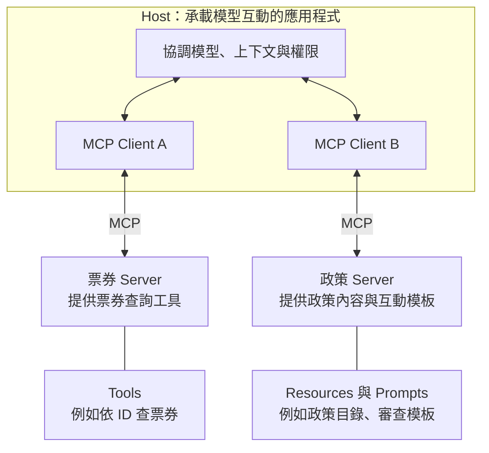

# 05｜MCP：共享能力與內容的入口

**考綱：2.4。** 先讀[工具契約](04-tool-contracts.md)。本章聚焦接入與可發現性，不深入 MCP server 部署、網路或 OAuth 實作，這些不是本考綱範圍。

## 協定解決的是介面，不是業務判斷

MCP 把 AI 應用程式與外部能力以共通協定連接。Host 是承載互動與模型的應用程式，client 負責與 server 通訊，server 提供其能力。這層分工讓來源與工具不必為每個 host 各寫一套完全不同的介面。[MCP architecture](https://modelcontextprotocol.io/docs/2026-07-28/learn/architecture)

能連上 server 不代表資料可信，也不代表每個工具都適合每個 agent。接上後仍需測工具描述、來源範圍、權限與錯誤回應；這正是前一章契約設計的用途。

| 能力 | 核心用途 | 活動平臺的例子 |
|---|---|---|
| Resource | 曝露可讀內容與索引 | 活動目錄、政策文件清單、資料 schema |
| Tool | 執行操作或參數化查詢 | 查票券、變更場次、搜尋條件 |
| Prompt | 可重用的互動模板 | 引導產出活動審查報告 |

Tool 也可以是唯讀查詢；不能用「讀取一定是 resource」來分類。比較實用的問題是：讀者需要瀏覽已知內容，還是由模型決定參數並發起操作？考綱特別強調用 resource 曝露內容目錄，減少為了知道有哪些資料而做的探索性呼叫。[官方考綱 §6，2.4](appendix-sources.md)



*圖 F04｜先看元件邊界：Host 內的 client 各自連接 server；再看能力：server 可以提供 tools、resources 或 prompts。圖中的雙向箭頭代表請求與回應，無箭頭線只表示提供的能力。*

這裡把票券與政策分成兩個 server，方便辨認連線關係，並非要求每種能力各建一個 server。同一個 server 可以同時提供多種能力；查詢工具也可以是唯讀。模型不會因為看見 server，就取得超出 Host 與後端允許範圍的權限。

## 共享設定與個人設定

團隊共用 MCP server 設在專案 `.mcp.json`；個人實驗 server 用使用者 scope。Claude Code 的 user scope 設定存於 `~/.claude.json`，不要誤寫成 `~/.claude/.mcp.json`。另有 local scope，使用時要分清與 user scope 的影響範圍。[Claude Code MCP 設定](https://code.claude.com/docs/en/mcp)

以下是**設定範例，不能直接連線**：`example.invalid` 是佔位網址，需替換成你擁有的測試服務。

```json
{
  "mcpServers": {
    "event-catalog": {
      "type": "http",
      "url": "https://example.invalid/mcp",
      "headers": {"Authorization": "Bearer ${EVENT_CATALOG_TOKEN}"}
    }
  }
}
```

`${EVENT_CATALOG_TOKEN}` 由執行環境展開。把變數名稱提交給團隊，並不代表每個人的 token 已經設定好。除設定檔存在外，要驗證服務可連、工具可被發現、呼叫可成功，以及未設定憑證時回報是否清楚。

考綱描述多個已設定 server 的能力可以同時供 agent 使用；實際呈現還會受連線、權限與工具載入機制影響。不能推論「每次只能選一個 server」，也不要把「工具尚未載入到當前 context」誤判成無法整合多來源。

## 何時客製 server

標準系統整合先評估現有 server 是否符合範圍與維護要求；只有團隊特有流程或現有介面無法表達需求時，再建立客製 server。例如既有議題追蹤工具已能搜尋與讀取，未必需要重新包裝；但跨活動的特殊改期審批可以有專屬工具。

若 agent 一直用 Grep 繞過更完整的 MCP 查詢，先查它是否知道該 MCP 工具的能力。描述「搜尋資料」不如「跨未簽出的專案搜尋議題正文，回傳議題 ID、更新時間及連結」可判斷。能力重疊時，描述應直接說明範圍差異。[官方考綱 §6，2.4](appendix-sources.md)

**自測：** 新同事找不到你上週新增的工具，但你電腦能用。第一個要檢查的是模型能力嗎？不是；先比較 scope、專案設定是否納入版控、環境變數和連線狀態。

下一章：[Claude Code 的規範與工作流程](06-claude-code.md)。
