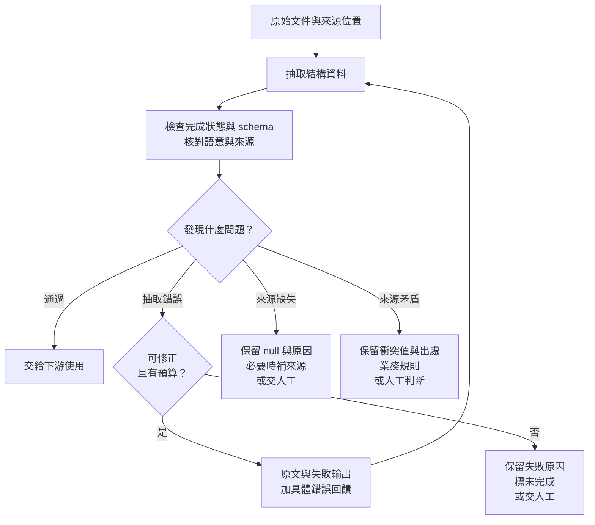

# 08｜結構化輸出：格式、意義與證據

**考綱：4.3、4.4。** 本章以活動報價單為例，說明 JSON 可解析、schema 合法與內容正確是三個不同條件。

## Schema 保證到哪一層

假設文件寫兩項費用為 120 與 80，合計卻印成 250。即使輸出完全符合 schema，這筆資料仍有矛盾。結構約束只能控制可表達的形狀，不能替來源保證真實性。

目前 Claude 文件區分 `output_config.format` 的 JSON outputs 與工具設定 `strict: true` 的 strict tool use。一般工具定義本身不可一律當成嚴格 schema 保證；要使用相應功能，並處理拒絕、截斷等例外。考綱主要沿用以 tool use 輸出結構資料的敘述。[Structured outputs](https://platform.claude.com/docs/en/build-with-claude/structured-outputs)

| 檢查層 | 錯誤例子 | 修正方向 |
|---|---|---|
| 語法 | JSON 括號缺失 | 使用支援的嚴格輸出並處理截斷 |
| Schema | 金額欄位放了物件 | 校驗 schema／類型 |
| 語意 | 明細和總額不一致 | 計算與業務驗證 |
| 證據 | 文件沒有稅號，卻填入猜測值 | 保留缺失，取來源或人工確認 |

## Required 與 nullable 並不相反

`required` 說的是欄位必須出現，`null` 說的是值可以明確表示缺失。例如固定輸出 `tax_id` 欄位但允許 `null`，有利於下游區分「沒有資訊」與「處理器忘了輸出」。Optional 表示可省略欄位，是另一個維度。[官方考綱 §6，4.3](appendix-sources.md)

以下是本書的教學 schema，不是可直接送出的完整 API request：

```json
{
  "type": "object",
  "properties": {
    "document_id": {"type": "string"},
    "tax_id": {"type": ["string", "null"]},
    "category": {"type": "string", "enum": ["venue", "catering", "other", "unclear"]},
    "category_detail": {"type": ["string", "null"]},
    "stated_total": {"type": ["number", "null"]},
    "calculated_total": {"type": ["number", "null"]},
    "conflict_detected": {"type": "boolean"}
  },
  "required": ["document_id", "tax_id", "category", "category_detail", "stated_total", "calculated_total", "conflict_detected"],
  "additionalProperties": false
}
```

`other` 表示知道類別但現有 enum 無法描述，需補 detail；`unclear` 表示連類別判斷都缺證據。沒有這兩個出口，模型可能把不合適資料硬塞到既有類別。

## Tool choice 控制是否走抽取介面

若已知文件類型，強制指定抽取工具；若有多種抽取工具且需要模型判斷類型，可用 `any`；若用 `auto`，模型仍可能只回文字。第一步一定要抽 metadata 時，可先限制到該步，取得結果後再做 enrichment。呼叫策略不代替 schema 驗證，也不代替來源查覈。[官方考綱 §6，4.3](appendix-sources.md)

抽取工具也可以只承接模型輸出的參數，不必真的執行一個有副作用的服務。這和「叫工具去查新的資料」是不同用途；清楚命名以免抽取結果被誤當成外部系統已更新。

## 重試必須帶著可修正的原因

本書原創案例的文件明示合計 250，明細可加總為 200。正確處理不是把 `stated_total` 悄悄改成 200，而是保留兩值、標矛盾。若是模型把明細 80 認成 30，可以帶回原文、失敗輸出和定位明確的錯誤，請它重新抽取。

```text
原始文件：保留原文與來源頁碼。
前次輸出：stated_total=250, calculated_total=150。
驗證錯誤：第二項在來源第 2 段為 80，不是 30；請重新核對明細。
限制：保留原文印出的總額；若與加總不一致，標 conflict_detected。
```

「再試一次」沒有指出應改哪裡。反覆重試也不能生出文件從未提供的稅號。遇到來源缺失就回 `null`，若業務必需，另取得文件或交人工。重試預算耗盡後保留失敗輸出與具體原因。[官方考綱 §6，4.4](appendix-sources.md)



*圖 F05｜分流依「為什麼不正確」決定。可修正的抽取錯誤才回到抽取步驟；來源缺失或矛盾應先保留事實，不能靠反覆重試補造答案。*

同一份文件可能同時有不同欄位的問題，圖中的分支是逐項問題的處理方式，不代表整份文件只能歸入一類。拒絕、截斷等未完成狀態也不能直接進入「通過」分支；是否可重試仍須依具體原因判斷。

## 格式正規化與來源忠實性

提示詞可規定日期與金額的表達方式，schema 檢查類型。若日期 `03/04` 沒有地域或年份，就不能僅靠統一格式替它決定真實日期。先取得脈絡，或把原始值與未確定項保留下來。

**自測：** 嚴格 schema 要求 `tax_id` 是字串，而文件沒有稅號。應加強「不要幻覺」提示，還是修改契約？先讓契約容納缺失，再規定缺失如何處理；不要以錯誤 schema 迫使下游接收虛構值。

下一章：[上下文與可靠性](09-context-reliability.md)。
