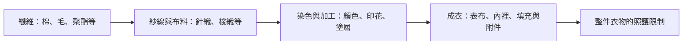

# 02 成分、洗標與整件衣物

「百分之百棉」只描述纖維，沒有描述衣服的全部。相同成分可以做成 T 恤、襯衫、牛仔褲，也可以帶著刺繡、貼膜、黏合襯或不同材質的裡布。真正要被清洗的是成衣。

## 四個層次分開看

圖 02-1：原創衣物層次圖。箭頭表示製作與組合關係，不表示知道前一層就能推算下一層的洗法。

**纖維**是材料名稱；**紗線**由纖維組成；針織以線圈形成布面，梭織則有經緯交織。染整與成衣組裝再加入其他變因。混用兩種以上纖維可以發生在紗線或布料層次，因此一個成分百分比不能描述所有結構。[UGA：Fiber Types，Fiber Blends and Combinations](https://site.extension.uga.edu/textiles/textile-basics/fiber-types/)

「緞面」描述布面與組織特徵，不等於蠶絲；「羊毛感」是外觀或觸感描述，不等於羊毛成分。遇到行銷名稱時，往成分標找正式名稱，再往洗標找操作限制。

[{ width="440" loading="lazy" }](https://commons.wikimedia.org/wiki/File:Plainweave.svg)

*圖 W01｜平紋梭織以兩組紗線交錯成布。這張圖用來看組織，不代表特定纖維成分或洗滌方式。 KDS444；Voidxor 修訂／CC BY-SA 3.0；[圖片出處](99-image-credits.md#w01)。*

[{ width="440" loading="lazy" }](https://commons.wikimedia.org/wiki/File:Knitting_stitches.png)

*圖 W02｜針織由線圈相互套接；與梭織圖對照，可分辨兩種成布方式。線圈示意不能用來判定材質或可否機洗。 Stilfehler／CC BY-SA 4.0；[圖片出處](99-image-credits.md#w02)。*

## 洗標不是越強越好的建議

GINETEX 說明，洗護符號表示不致造成不可逆損害的處理上限。水槽內的數字是洗滌溫度上限；下方橫線涉及降低機械作用。禁止水洗不能用手洗繞過。漂白、乾燥、熨燙與專業維護要分別閱讀。[GINETEX：Care symbols](https://www.ginetex.net/GB/labelling/care-symbols.asp)

本書不把符號轉成全世界共用的一套溫度表。不同地區、標準版本和新舊衣物可能有差異，尤其不能只憑記憶把熨斗上的點數換成溫度。詳見[洗護符號附錄](appendices/care-symbols.md)。

## 用一件外套練習

假設外套的表布寫棉，內裡寫聚酯，另有黏合襯與裝飾扣。你已知道兩種主要纖維，仍不知道黏合材料能否耐受長時間浸泡。台灣標示基準要求可分為表布、裡布、填充物的服飾分別標示成分；這正提醒我們不要只讀第一行。[經濟部：服飾標示基準第四點第七款](https://law.moea.gov.tw/LawContent.aspx?id=GL000482)

本書的實務判斷是：把整件洗標當起點，拆卸附件只在原廠允許時進行。找不到標籤，先按品牌型號查原廠；不要把網路上同材質的另一件外套當成這件衣服的說明書。

## 洗標沒有回答的問題

洗標不會逐一列出所有食物、筆墨和化妝品，也不能描述衣物多年後的老化狀態。因此，洗標允許日常洗滌，仍須先看污漬與破損，才進入[去污判斷](11-stain-triage.md)。

一個可用的讀標結果應像這樣：「這件可依指定程序水洗，但不漂白；乾燥另有限制，印花也要避免直接整燙。」比只說「它可以洗」多出的幾句話，正是保護衣物的資訊。
