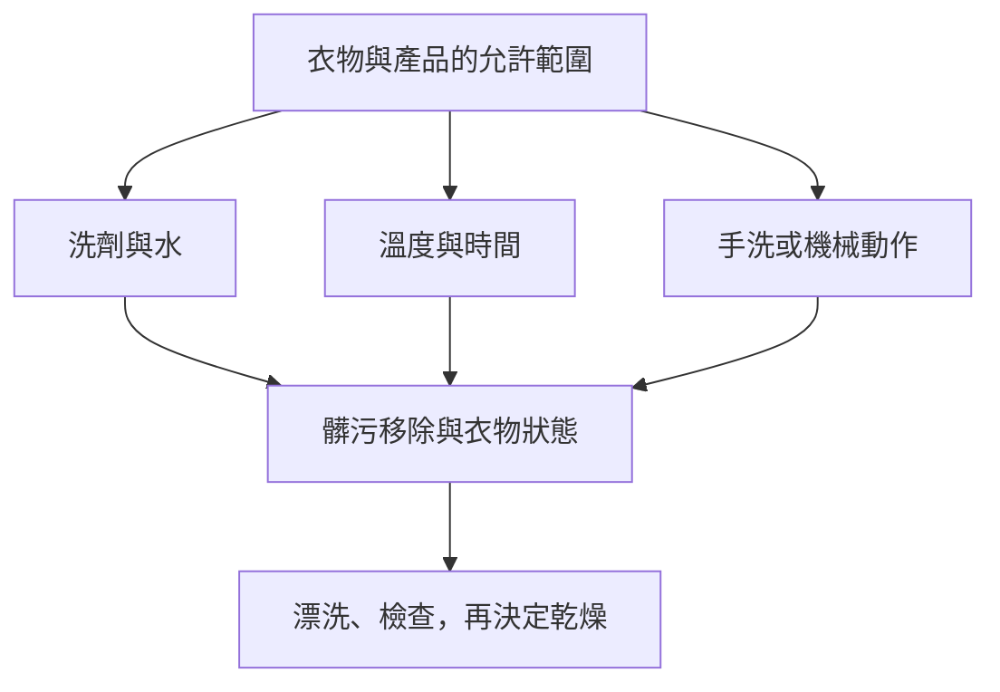

# 07 清潔如何發生：不是把力量全開

水、洗劑、機械動作、溫度與時間一起參與洗滌。把衣服泡進水裡只是開始，還需要讓髒污離開衣物，並在漂洗時帶走。ACI 用化學、機械與熱三種作用及時間來說明清潔；這是理解變因的框架，不是可以互相無限替換的公式。[ACI：How Cleaning Works](https://www.cleaninginstitute.org/understanding-products/science-soap/how-cleaning-works)

## 每一種作用都有代價

圖 07-1：原創清潔因素圖。所有操作受相容性限制；箭頭不代表加大某一項必然更好。

例如衣服洗後仍有油影，你可以檢查是否需要前處理、程序是否適合、洗劑用量是否正確。但不能同時把水溫、劑量、時間與摩擦都提高：即使這次變乾淨，也不知道哪一項有效，更不知道哪一項造成了不必要的負擔。

## 先分清「洗掉」與「看不見」

去除附著物、改變污漬顏色、加入香味，以及改變手感，是不同作用。讀產品時先找它的功能和適用條件。衣服有香味不能單獨證明清潔完成；白斑消失也可能只是整片顏色一起變淡。

酵素是針對特定物質發揮作用的成分，例如蛋白酶、澱粉酶、脂肪酶分別有不同作用對象；有酵素不是對所有污漬都同樣有效的保證。[ACI：Enzymes in Cleaners](https://www.cleaninginstitute.org/cleaning-tips/clean-home/ask-aci/ask-aci-enzymes-cleaners)

## 用觀察縮小問題

本書建議保留一張簡單記錄：這批有什麼衣物、用哪種程序、產品用量依哪個標示、污漬是否先處理，以及洗後發生什麼。一次只調整有根據的一個問題，其他條件盡量一致。

假設同一件領口有油影的襯衫，第一次直接機洗沒改善；第二次依產品標示先做領口前處理後改善。你得到的是「這件衣服、這個污漬與這個產品下，前處理有幫助」，不是「所有衣服都應浸泡」。

## 乾淨有可觀察部分，也有看不見的部分

家庭日常可以檢查污漬、殘留、異味與衣物狀態；不能只靠這些觀察宣稱消毒完成。涉及感染控制的衣物需求要另依相應指引，本書不提供醫療消毒程序。

下一章把這個框架放進[洗劑與輔助產品](08-detergents-and-products.md)的選擇；之後才把選擇組成[完整洗衣流程](09-washing-workflow.md)。
