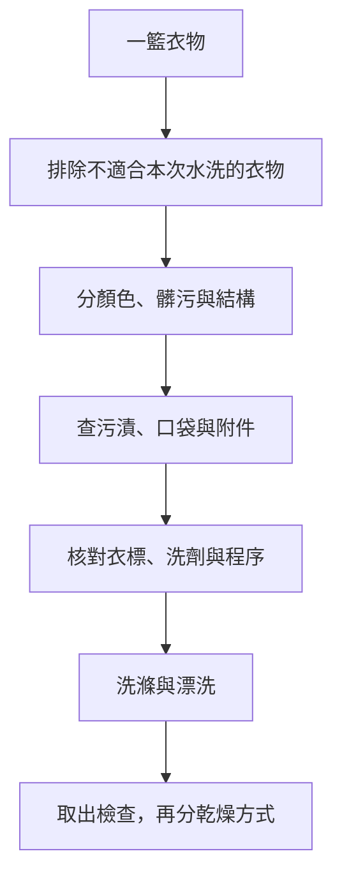

# 09 把一籃衣服變成可執行的批次

洗衣批次是一組能接受相同處理的衣物。顏色只是其中一個條件，還要包含洗標、產品、髒污程度和衣物構造。

## 分類的順序

先拿出不能走本次水洗程序的衣物，再分顏色與髒污，最後檢查容易勾掛、掉絮或變形的部件。ACI 的教學以顏色、污量和共同洗滌條件作為分類依據。[ACI：Class of Clean](https://www.cleaninginstitute.org/classofclean)

圖 09-1：原創批次流程。一次洗在一起，不代表最後也能一起烘乾。

假設籃中有白色棉上衣、深色新牛仔褲、羊毛衫和運動衣。它們不會因為都是上半身或下半身衣物就形成合理批次。先分出羊毛；深色新衣評估掉色風險；運動衣確認機能限制；其餘衣物才找共同程序。

## 下水前的實際準備

取出口袋紙巾與雜物，查看拉鍊、鉤扣、鬆脫線頭和破洞。發現破損先判斷是否需要修補。洗衣袋只能降低某些接觸與纏繞，不能隔絕染色轉移，也不能取消禁止機洗的標示。

污漬先依[第 11 章](11-stain-triage.md)辨認。不要把有未明溶劑或大量油品污染的衣物當成普通日常批次。可拆部件依原廠說明拆卸，切勿為了「更好洗」自行撕下黏合件。

## 機洗：把名稱換成實際設定

程序名稱因機型而異。「快速」「柔洗」「手洗」不是通用標準，必須查手冊中的動作、負載與溫度說明。額定容量也不代表所有程序都可放同樣重量。

投放洗劑時依產品與機器說明量取。不要把洗衣機塞滿到衣物無法活動；也不要以超量洗劑補償過載。Samsung 的文件分開說明負載、劑量與投入位置，正好示範這幾件事要同時核對。[Samsung：Detergent，Loading](https://www.samsung.com/us/support/answer/ANS10001018/)

## 手洗：動作少而有目的

只對允許手洗的衣物使用這條路線。先準備乾淨容器、相容洗劑與乾燥位置；依產品說明讓洗劑在水中分散，再放衣物。以支撐、輕壓與適當移動完成清洗，避免揉搓、拉扯和擰絞；漂洗後托起，按洗標去水與整形。GINETEX 的手洗說明同樣要求避免搓、拉與扭。[GINETEX：Hand wash](https://www.ginetex.net/GB/labelling/care-symbols.asp)

沒有全書通用的浸泡時間。產品未允許浸泡、衣物易掉色或有特殊構造時，不自行增加時間。手洗是否比較溫和，取決於你實際做的動作。

## 洗後檢查才能結束這一批

取出時確認原污漬、顏色、形狀與有無殘留。異常衣物分開，記錄本次程序。若污漬仍在，回到對應案例；若整批都不對，檢查設備與投放。通過後才按[乾燥流程](10-drying-and-pressing.md)分流。
