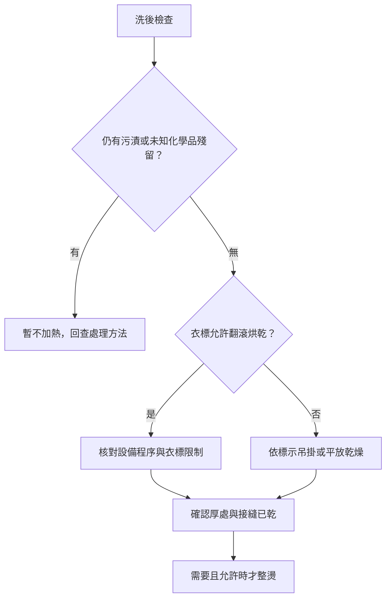

# 10 乾燥與整燙：洗完還沒有完成

洗衣機停止，代表洗滌程序結束，不代表衣物已可以收入衣櫃。乾燥需要處理水分、支撐與熱；整燙再加入壓力與可能的蒸氣。它們各有自己的洗標限制。

## 先選乾燥路線

圖 10-1：原創乾燥決策圖。沒有烘乾許可，不以短時間試烘取代查證。

平放適合需要全幅支撐的衣物；吊掛也要考慮濕衣重量和受力位置。羊毛的具體分流見[第 04 章](04-wool-and-cashmere.md)。厚外套則不能只摸表布，必須連口袋、袖口和填充區一起檢查。

## 台灣潮濕環境的實際安排

本書建議先評估可以使用的乾燥空間，再安排洗衣量。讓衣物有間距，避免厚部位互相壓住；需要時調整室內通風或使用符合場地條件的除濕設備。目標是乾透，而不是完成「已經掛了一晚」這個動作。

潮濕天氣開窗不必然比關窗除濕好，取決於室內外條件。你可以用同一位置的濕度觀察與衣物乾燥狀態來調整，但本書不訂一個適用所有住家的時數或濕度保證。

[{ width="600" loading="lazy" }](https://commons.wikimedia.org/wiki/File:White_laundry_on_a_drying_rack.jpg)

*圖 W06｜室內晾架的實景，圖中為寢具；衣物仍需依洗標選擇吊掛或平放，照片本身不代表所有材質都適用的晾法。 W.carter／CC BY-SA 4.0；[圖片出處](99-image-credits.md#w06)。*

## 烘衣安全是另一道限制

有油或可燃物殘留的衣物不能因為洗過一次就直接烘。多倫多消防安全指引提醒，被油品或易燃化學品浸污的衣物，即使洗過，烘乾時仍可能起火。本書採此保守界線，遇到大量油品或溶劑污染先尋求專業處理。[Toronto：Clothes Dryers Fire Safety](https://www.toronto.ca/community-people/public-safety-alerts/safety-tips-prevention/home-high-rise-school-workplace-safety/clothes-dryers-fire-safety/)

日常操作還需查自己設備的濾網清潔與負載規定。烘不乾時先查程序、負載及保養，不持續用最高溫補償所有問題。

## 整燙不只看主布料

先確認是否允許熨燙與蒸氣，再避開不耐受的裝飾與印花。隔布是某些允許操作中的保護措施，不能取消禁止標示。禁止熨燙也不代表可把蒸氣機長時間貼近布面。

本書的操作建議是先在不顯眼處按允許設定試做，觀察光澤、顏色、壓痕與形狀；沒有必要就不整燙。不同符號版本的數值查[附錄 A02](appendices/care-symbols.md)，不憑熨斗旋鈕上的「棉」「絲」字樣替所有混紡定溫。

完成乾燥後，若衣服仍黏、仍有異味或出現不明油影，回到[問題診斷](15-odor-yellowing-and-mildew.md)。收納是檢查通過後的下一步，不是把問題暫時藏起來。
