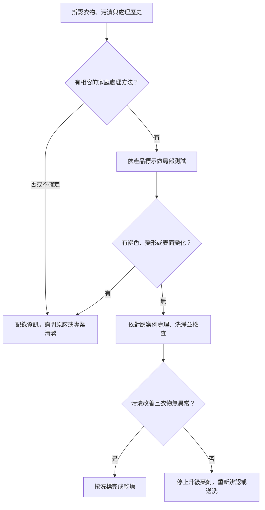

# 11 污漬判斷：先決定能不能動手

衣服剛沾到東西時，很容易把「趕快處理」理解成趕快找一種藥劑。真正有用的第一步，是把污漬和衣服分開辨認：知道沾到什麼，不代表知道布料能承受什麼；知道是棉，也不代表印花、染料和襯裡能承受同一種處理。

本章是所有去污頁的共同入口。適用於日常、小範圍的衣物髒污；不處理化學品污染、大量血液、災後污水或其他需要專門防護的情境。

## 先把四件事說清楚

| 問題 | 有用的答案 | 為什麼值得記下來 |
|---|---|---|
| 衣物允許什麼？ | 洗標、成分、印花與內裡 | 排除不能水洗或不能漂白的路線 |
| 污漬從哪裡來？ | 黑咖啡、加奶咖啡、粉底產品名稱 | 相同顏色可能含不同成分 |
| 已發生過什麼？ | 沾染時間、已洗、已烘、用過的產品 | 避免把舊漬當新漬，也避免疊加未知藥劑 |
| 現在看見什麼？ | 表面殘渣、油影、色圈、破損 | 建立處理前的比較基準 |

這張表是本書的觀察工具，不是實驗室鑑定。無法確認來源時，保留「未知」比猜成某一類更有幫助。拍下衣物全貌與局部，同時記錄洗標；不要只拍一個缺乏位置資訊的斑點。

## 局部測試的功能與限制

去污產品先在不顯眼處測試，是 UGA 衣物去污資料明列的前置步驟。先確認產品准用於該材質，再按產品指示的濃度與接觸條件測試；不能拿未稀釋的原液「測得更準」。[UGA：Blood，Apparel/Fabric 與 cautions](https://site.extension.uga.edu/textiles/care/stain-removal/remove-stains-from-blood/)

本書建議把測試當成一次小規模觀察：選擇與污漬區相同材質、顏色與加工的隱蔽位置，處理後依產品說明移除殘留，等乾後再比對。如果白色吸水布帶出衣物本身的顏色，或測試處出現色差、硬化、起毛、失去光澤，就停止。沒有異常只代表這個小區域未見問題，不保證大面積、接縫、印花邊緣或長時間浸泡都安全。找不到代表性的隱蔽位置時，不要把正面當測試區。

圖 11-1：原創判斷流程。通過測試不是保證；衣物限制與產品限制必須同時成立。

## 試走一次：可水洗棉上衣的咖啡漬

假設上衣沒有特殊塗層，洗標允許水洗，污漬確定是剛滴上的黑咖啡。這些是假設條件，讀者應逐項核對自己的衣物，而不是只對上「咖啡」兩個字。

先移開衣物，避免繼續沾染；查閱[飲料案例](stains/drinks.md)，依該頁選擇冷水與相容的衣物前處理產品。局部測試通過後才處理污漬，接著依洗標洗滌。洗後先檢查原來的位置。ACI 特別提醒，污漬仍在時不要直接送進烘衣機。[ACI：Stain Removal Guide，總則](https://www.cleaninginstitute.org/cleaning-tips/clothes/stain-removal-guide)

若色圈淡了，記錄這次的方法；若沒有改善，重新確認是否加了奶、是否早已烘過、產品是否適用，而不是把所有洗劑一起加入。若衣物本身也變淡，問題已從去污轉為可能的染色損傷，應立即停止。

## 再走一次：有內裡的蠶絲上衣、來源不明的舊漬

這件衣服的洗標禁止水洗，污漬已放了一段時間，先前是否用過去污筆也不清楚。此時沒有足夠資訊支持家庭水洗。把材質、洗標、污漬位置和可能的處理歷史交給專業清潔者，比先試幾種偏方更能保留後續選項。

「只碰一點水」仍然是局部濕處理；「只用酒精」也仍然是在使用溶劑。它們不會因為面積小就自動不受衣物限制。這是本書採取的保守操作界線，而非宣稱所有蠶絲都不能水洗。材質差異請看[第 05 章](05-silk-and-regenerated-fibers.md)。

## 每次處理都要有出口

可以繼續的理由應是：已確認方法相容、上次有改善，而且衣物沒有異常。需要停止的理由包括：布面變薄或變硬、顏色轉移、黏合部位異常、污漬範圍擴大，或已經無法說清楚用過什麼。不要用「再一次也許就好了」代替判斷。

換另一種化學處理之前，先停止並確認前一種產品的移除要求。**不要在衣物上直接混合清潔劑，尤其不要把含氯漂白劑與酸性或含氨清潔用品混合。** CDC 的禁混合指引支援這條安全界線；本書不把其表面消毒配方轉用成洗衣配方。[CDC：Cleaning and Disinfecting with Bleach](https://www.cdc.gov/hygiene/about/cleaning-and-disinfecting-with-bleach.html)

接著按[污漬索引](appendices/stain-index.md)找案例；若洗標還讀不清楚，先回到[第 02 章](02-labels-and-construction.md)。
