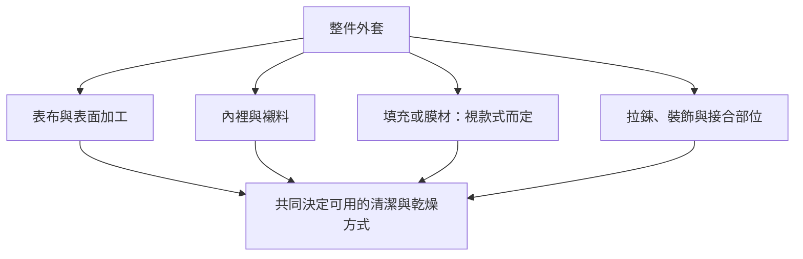

# 16 從材料走回整件衣物

到這裡，你已能讀材質、洗標、產品與污漬。真正下手時，還要把它們組成一件衣服的流程。這一章用不同構造示範：需要保護的可能是染色、彈性、填充、膜材，也可能是立體剪裁。

## 成衣的不同部分

圖 16-1：原創構造檢查圖。不是每件外套都有填充或膜材；圖中列的是需要確認的可能部件。

## 依衣物找案例

| 衣物 | 本頁重點 |
|---|---|
| [運動機能衣](garments/sportswear.md) | 清潔與功能性產品限制 |
| [牛仔衣褲](garments/denim.md) | 顏色、尺寸與穿著痕跡 |
| [羽絨外套](garments/down.md) | 填充與完整乾燥 |
| [防水外套](garments/waterproof.md) | 表面撥水和膜材不同 |
| [內衣與胸罩](garments/underwear.md) | 彈性、罩杯、鉤扣與乾燥支撐 |
| [西裝與結構外套](garments/tailoring.md) | 立體形狀與專業交接 |
| [皮革與麂皮](garments/leather.md) | 表面種類與家庭照護界線 |

這些案例不是購物推薦。品牌資料只用來示範原廠對特定衣物或技術的要求，不代表同類全部品牌都一樣。

## 把流程寫完整

本書建議每件特殊衣物保留一張短記錄：品牌型號、洗標照片、相容洗劑、清潔路線、乾燥方式與已知問題。不要只記「冷水洗」而遺漏平放乾燥，也不要只記「能烘」而沒有條件。

如果找不到某一個必要步驟的相容資料，就先補齊資訊。這比清洗到一半才發現沒有可行乾燥方式更容易安排。
