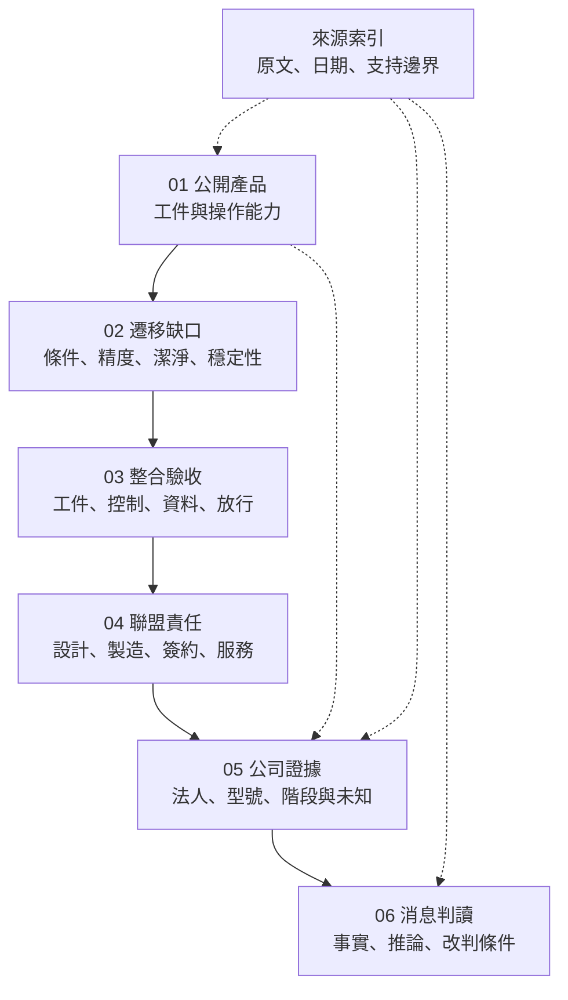

# 全書地圖：能力怎麼變成交付證據？

本書的主線不是「產品越多，所以訂單越多」，而是讓每一段推論都有輸入、輸出與停止條件。

圖中實線是完整學習順序，虛線是快速閱讀或證據支援；**不是東捷的實際生產、驗收或組織流程**。

| 章節 | 先備與輸入 | 本章新增的理解 | 輸出給下一章 |
|---|---|---|---|
| [01 能力基線](01-capability-baseline.md) | 能辨識工件、加工面與載具 | 從公司官網重建加工、檢量測與搬運能力，不預設全自製 | 可逐項對照的產品清單 |
| [02 遷移缺口](02-transfer-gap.md) | 01 的玻璃切割資料 | 規格必須與工件、測法、時間尺度一致才可比較 | 要求補齊的驗證條件 |
| [03 整合驗收](03-integration-acceptance.md) | 02 的條件與缺口 | 機台能動不等於工件、資料與狀態能正確交接 | 可分配的接口與驗收責任 |
| [04 聯盟交付](04-alliance-delivery.md) | 03 的責任問題 | 服務窗口、設計、製造、簽約與保固法人分開 | 不能靠聯盟名字補上的商務欄位 |
| [05 公司證據](05-contrel-product-evidence.md) | 01–04；快速讀者可先看表格說明 | 同一列維持同一主體、產品、條件與階段 | 可用來判讀消息的證據基線 |
| [06 新聞判讀](06-reading-news.md) | 05 的基線 | 三則事件都保留原始動詞，明列會改變推論的新證據 | 可重複使用的閱讀方法 |

## 先備只補缺口，不重讀整本書

[工件流](../../gpm/html/04-workpiece-flow.html)補加工對象；[面板製程挑戰](../../copos/html/08-panel-process-challenges.html)補翹曲與尺度問題；[設備生命週期](../../smt-bonding/html/11-equipment-lifecycle.html)補導入與復線；[產能與設備需求](../../gpm/html/14-yield-capacity-capex.html)補產能概念。這些書的公司數字與時程不自動移入本書。

[來源索引](appendix-sources.md)回答「這句話從哪裡來」；[術語表](appendix-glossary.md)回答「名詞在本書指什麼」；[待查事項](appendix-open-questions.md)回答「下一份證據應該補哪一格」。
