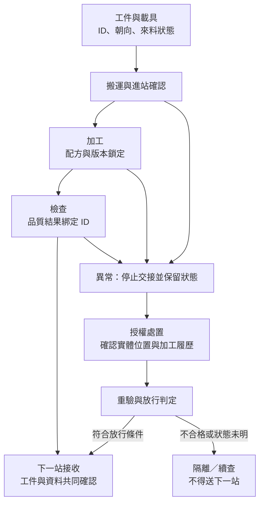

# 03　單機能動，為何整線不一定可驗收？

## 開場問題：玻璃完好，為何還不能交機？

假設一套玻璃切割設備在供應商端能切出合格邊緣，進到客戶廠卻發生：機台收到的工件編號不一致、斷線後不知道上一片是否已加工、上游送片比下游接片快。這不是再調高雷射精度就能解決的問題；**交付的是有身分、品質證據與可追溯狀態的工件，不是「機台有在動」的影片。**

本章是 **[教學推論] 的整合案例**，不描述東捷或 G2C+ 的實際產線。前兩章建立的輸入是「哪些產品與條件已公開」；本章新增「跨機台如何證明結果仍然有效」。設備導入全生命週期另見[既有書](../../smt-bonding/html/11-equipment-lifecycle.html)，此處只處理接口與驗收責任。

## 先看結構：有四種交接，不只一條輸送線

<figure class="external-image">
  
  <figcaption>圖 3-A｜工件與載具要分開辨認：這個前開式運輸盒（FOSB）讓讀者分清「盒內晶圓」與「外部載具」。它不是 FOUP，也沒有呈現 Loadport、EFEM 或對接動作；只能輔助理解載具與工件的實體差別，不能當作東捷玻璃搬運配置或 E84 符合性證據。作者：Cepheiden；<a href="https://creativecommons.org/licenses/by-sa/3.0/">CC BY-SA 3.0</a>；原圖未修改，點圖開啟 Wikimedia Commons 原始頁。</figcaption>
</figure>

| 交接層 | 傳出去的是什麼 | 接收方必須知道什麼 | 不能用來代替什麼 |
|---|---|---|---|
| 工件／載具 | 玻璃、支撐載具、加工面朝向 | 尺寸、厚度、支撐方式、可接受狀態 | 搬到定位點不代表無損傷 |
| 控制狀態 | 可送、可接、忙碌、完成、異常 | 狀態何時有效、逾時後誰持有工件 | 有訊號不代表工件真的到位 |
| 製程資料 | ID、配方版本、加工與檢測結果 | 單位、座標原點、正反面、結果與工件綁定 | 有檔案不代表對應正確工件 |
| 責任／放行 | 測試結果、未結項、簽核 | 誰承認合格、誰處置異常、適用哪些產品 | 單一窗口不代表單一法人承擔全部責任 |

本書把這份共同約定稱為 **接口控制文件（ICD）**：它至少應連起載具圖面、訊號與狀態定義、資料字典、故障情境與驗收準則。不要求各案都使用同一份文件名稱，但不能讓這些內容散落在無法對版的郵件裡。

以下為原創教學示意，箭頭表示證據與狀態交接；不是已出售的整線配置，也不是逐條 E84 實作圖。

## 輸入／操作／輸出：正常路徑與異常路徑一起交付

| 步驟 | 輸入 | 操作／判定 | 輸出與目的 |
|---|---|---|---|
| 定義接口 | 工件規格、上下游設備、現場條件 | 確認機構、控制、資料與責任版本 | 共同批准的接口基線，避免各自解讀 |
| 進站 | 工件、載具、ID、來料結果 | 確認身分與可加工狀態 | 可追溯的在製工件，不以「感測器有物」代替身分 |
| 加工 | 已批准配方與工件 | 記錄起訖、設定及異常 | 結果綁定工件、機台與配方版本 |
| 出站 | 加工結果與檢測狀態 | 接收方確認可接、資料一致 | 實體與資料共同移交 |
| 異常復歸 | 警報、最後狀態與實體位置 | 依授權程序判定未做、已做或不確定 | 恢復、重驗或隔離，不直接把不確定品當良品送出 |

**關鍵推導**：假如斷線時只記得「命令已送」，而不知道「加工已完成」，重送命令可能重複加工，不重送則可能漏加工。因此需要能追溯命令、工件與完成狀態的紀錄，以及處置不確定狀態的規則。這是接口的語意問題，不只是網路是否暢通。

SEMI E84 的公開摘要限於自動載具交接相關通訊；GEM 則處理從通訊鏈路觀察的設備行為。[T1](appendix-sources.md#T1)、[T2](appendix-sources.md#T2) 是可理解的邊界，**不是本案例已採用這些協議的宣告**。機台內部手臂搬動玻璃，也不必然就是 E84 定義的載具交接。

## 失敗會長什麼樣子：最難查的是每台都說自己正常

| 現象 | 跨接口失敗機制 | 需要的證據，不是猜測 |
|---|---|---|
| 切割前正常、出站後崩邊 | 可能是加工邊緣缺陷，也可能是出站支撐或交接碰觸 | 同一工件加工前後及交接前後的檢查、時間戳與接觸位置 |
| 同一缺陷在兩台顯示不同位置 | 原點、正反面、旋轉或單位定義不一致 | 具方向標記的參考工件與座標轉換驗證 |
| 斷線復歸後重複加工 | 主機命令與設備完成狀態未對齊 | 工件 ID、命令／完成紀錄、重送與拒絕規則 |
| 單機節拍合格但串線塞車 | 交接等待、重試或緩衝限制未納入 | 約定工件組合下的等待／加工／阻塞時間分解 |
| 重新上電後檢測判斷不同 | 配方或校正版本未被鎖定 | 版本紀錄、標準件結果與變更批准範圍 |

這些是供設計測試的可能機制，不是對東捷設備的故障指控。測試異常情境必須在批准的安全方案內進行，不能靠旁路安全互鎖模擬生產。

## 如何檢查與控制：每一個「通過」都要寫出有效範圍

FAT 指供應商端／約定場地的出貨前驗收；SAT 指安裝後在客戶現場的驗收。這是常見工程用法，**兩者的付款、所有權與放行效力仍依合約**，不能把縮寫本身當法律條款。

| 驗收層 | FAT 可安排的證據 | SAT／後續現場應補的證據 | 通過後仍不知道什麼 |
|---|---|---|---|
| 單機加工 | 指定材料、厚度、配方下的尺寸與缺陷量測 | 現場溫度、振動、公用工程下重現 | 未測材料與長期穩定性 |
| 實體交接 | 代表性載具、支撐與方向確認 | 實際上下游組態、接收限制 | 尚未測試的翹曲或載具版本 |
| 資料／狀態 | 模擬主機、資料字典、正常與異常情境 | 客戶 host／MES、權限、斷線與履歷核對 | 未測訊息與所有功能符合性 |
| 整合性能 | 可實作範圍內的預驗證，列明模擬項目 | 約定產品組合、持續時間、抽樣及品質目標 | 超出測試條件的量產表現 |
| 責任結案 | 每個未結項有負責者、期限、風險 | 客戶授權者接受、限制條件入操作文件 | 未測產品全面放行或後續服務履約 |

例如 [P1](appendix-sources.md#P1) 型錄列出的 23°C±1 與 VC-B，是場地條件線索。如果 FAT 與 SAT 場地不同，就要記錄實測條件與影響評估，不能只把舊報告換封面。這也不意味符合環境條件就必然達到型錄上的所有品質值。

一份可判定的驗收紀錄，至少回答：**測了哪台／哪版、用什麼工件、測多久與抽哪些位置、用何種量測方法、接受準則是什麼、誰負責未結項、誰有權放行**。各數值須由需求、風險及合約定義，本書不虛設一套「業界通用門檻」。

## 與東捷的連結

| 已確認的公開主張 | 合理推論 | 尚待查證 |
|---|---|---|
| 官網列有 EFEM，公開搬運與環境相關規格。[P5](appendix-sources.md#P5) | 搬運整合可成為跨站串接的能力基礎。 | 某客戶的載具、ICD、資料協議、完整測試範圍。 |
| 2026-05-28 東捷稱以自動化整合、模組化製造支援聯盟設備導入與客戶驗證。[E3](appendix-sources.md#E3) | 若能把上下游責任與例外情境一併收斂，可減少整合摩擦。 | 實際機型、分包責任、FAT／SAT、客戶與維護合約。 |
| 玻璃切割型錄列加工與廠務條件。[P1](appendix-sources.md#P1) | 已有可轉成驗收問題的規格線索。 | 哪些值適用同一配方、整線品質及量產放行。 |

「可成為」與「若能」是推論的條件，不能在轉述時刪掉。

## 理解檢查

??? question "兩台都能讀取同一個 ID，為何還不能證明追溯完整？"
    還需確認這個 ID 對應哪片工件、哪次加工、哪個配方版本，以及重工與斷線時如何更新狀態。文字一致只是必要條件之一。

??? question "FAT 通過、SAT 卻失敗，是否一定是設備品質差？"
    不能直接判定。先比對材料、場地、上下游、軟體版本及測試範圍；也可能是 FAT 用了模擬器，沒涵蓋現場交接。差異應被定位而不是互相推責。

??? question "如果支援 GEM，是否就能省掉資料字典與異常情境測試？"
    不能。標準模型不代替設備特有事件、資料單位、配方、權限與錯誤處理的共同約定，更不保證產品品質。

??? question "消息說「加速客戶驗證」，至少再取得什麼才能寫成已驗收？"
    能定位主體、機型或供應範圍、接受條件、驗收結果與日期的文件。即使已驗收，也須確認是否只限功能，不能自動推定量產放行與收入認列。

## 來源與待查

本章來源為 [P1](appendix-sources.md#P1)、[P5](appendix-sources.md#P5)、[E3](appendix-sources.md#E3)、[T1](appendix-sources.md#T1)、[T2](appendix-sources.md#T2)，版本與查閱日詳來源索引。流程與控制矩陣為教學整理；未取得東捷實際驗收文件。

接續 [04 聯盟責任](04-alliance-delivery.md)，把「需要誰負責」與「已公開誰負責」分開；待查項見 [Q3、Q4](appendix-open-questions.md)。
