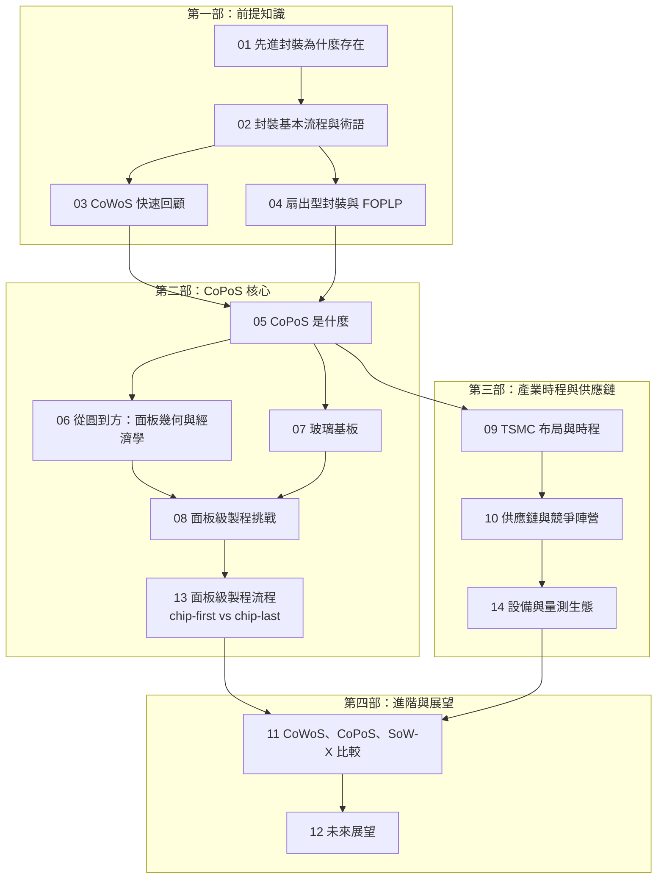

# 全書地圖

本頁是《CoPoS 面板級先進封裝筆記》的閱讀地圖：章節結構、知識依賴，以及每一章要回答的問題。

## 知識依賴總覽

由淺入深：第一部補齊前提知識（沒有半導體封裝背景也能進入），第二部進入 CoPoS 本體與面板級製程，第三部講產業現況、供應鏈與設備生態，第四部做進階比較與展望。

## 各章一句話

### 第一部：前提知識

| 章節 | 要回答的問題 |
|------|------------|
| [01 先進封裝為什麼存在](01-why-advanced-packaging.md) | 為什麼封裝需要的面積，成長得比晶片本身還快？ |
| [02 封裝基本流程與術語](02-packaging-basics.md) | die、interposer、RDL、bump、carrier 各是什麼？ |
| [03 CoWoS 快速回顧](03-cowos-recap.md) | CoWoS 現在做到哪裡？它撞到什麼牆？ |
| [04 扇出型封裝與 FOPLP](04-fan-out-and-foplp.md) | 面板級封裝不是新東西——過去為什麼做不進高階？ |

### 第二部：CoPoS 核心

| 章節 | 要回答的問題 |
|------|------------|
| [05 CoPoS 是什麼](05-copos-overview.md) | 三層結構是什麼？哪些概念從 CoWoS 平移、哪些被替換？ |
| [06 從圓到方](06-panel-geometry.md) | 「可用面積放大五倍」這個說法，準確嗎？在什麼條件下成立？ |
| [07 玻璃基板](07-glass-substrate.md) | 玻璃解決什麼、又帶來什麼新問題？（導熱是真弱點） |
| [08 面板級製程挑戰](08-panel-process-challenges.md) | 從圓到方為什麼不是「把機台放大」就好？ |
| [13 面板級製程流程](13-process-flow.md) | chip-first 與 chip-last 差在哪？die shift 怎麼補償？ |

### 第三部：產業時程與供應鏈

| 章節 | 要回答的問題 |
|------|------------|
| [09 TSMC 布局與時程](09-tsmc-roadmap.md) | 官方確認了什麼？哪些是供應鏈傳言？時程分歧有多大？ |
| [10 供應鏈與競爭陣營](10-supply-chain-competition.md) | 誰已經在量產？誰的時程在往後滑？ |
| [14 設備與量測生態](14-equipment-ecosystem.md) | 面板級需要哪些新機台？誰在做？為什麼這是台廠的機會？ |

### 第四部：進階與展望

| 章節 | 要回答的問題 |
|------|------------|
| [11 CoWoS、CoPoS、SoW-X 比較](11-copos-vs-alternatives.md) | 什麼產品該用哪一種？ |
| [12 未來展望](12-future-outlook.md) | 接下來三到五年該盯哪些訊號？ |

## 讀這本書之前，先知道三件事

在 2026 年談 CoPoS，有三個常見的誤解值得先擋掉——它們幾乎出現在每一則市場報導裡：

!!! warning "誤解一：CoPoS 會取代 CoWoS"
    **不會。** TSMC 董事長魏哲家在 2026 年 4 月法說會上明確說 CoPoS 是 CoWoS 的**補充**。TSMC 主管更表示面板封裝「短期內不會取代 CoWoS」，因為晶圓級 CoWoS 已能做到單一封裝容納 58 顆 die，這是面板技術還追不上的整合密度。

!!! warning "誤解二：CoPoS 就是玻璃基板"
    **第一代很可能不是。** 2026 年 7 月引述 TSMC 先進封裝資深研發主管的報導指出，第一代 CoPoS 很可能是「**零玻璃**」的——用有機面板核心，玻璃只當製程中的暫時載體。真正的玻璃核心基板是另一條、更慢的時程線（2030 年之後）。詳見 [07 玻璃基板](07-glass-substrate.md)。

!!! warning "誤解三：可用面積放大五倍"
    **有條件成立。** 310 × 310 mm 面板的毛面積只有 12 吋晶圓的約 1.36 倍。「數倍」的紅利只在封裝尺寸**超過約 3.5 倍光罩**時才顯著——那正好是最大的 AI 加速器。對中小型封裝，面板的優勢並不明顯。算術見 [06 從圓到方](06-panel-geometry.md)。

## 資訊可信度標示

CoPoS 量產前的資訊有大量供應鏈傳言，本書使用三級標示：

- **[官方]**：TSMC 法說會、官方新聞稿、廠商自己的發布
- **[報導]**：TrendForce、SemiEngineering、Yole 等機構分析
- **[傳聞]**：單一或匿名消息來源的供應鏈報導（台灣與韓國媒體的 CoPoS 報導多屬此類）

**本書的原則是：報導衝突時，把衝突攤開來寫，而不是挑一個。** 時程與面板尺寸的完整分歧表見 [09 TSMC 布局與時程](09-tsmc-roadmap.md)。
