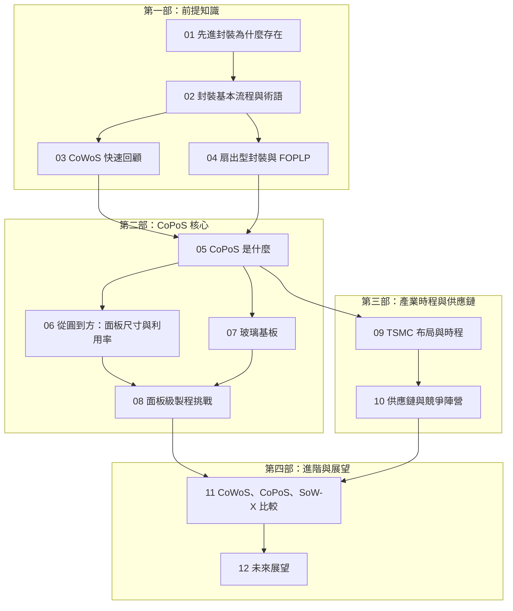

# 全書計畫地圖（Plan）

本頁是《CoPoS 面板級先進封裝筆記》的撰寫藍圖：章節結構、每頁的目標與內容要點、前提知識依賴。**補完本書的 agent 請先讀完本頁再動筆**，並遵守文末的撰寫規範。

## 知識依賴總覽

由淺入深的設計原則：第一部補齊前提知識（沒有半導體封裝背景也能進入），第二部進入 CoPoS 本體，第三部講產業現況與時程（2026 年最新資訊），第四部做進階比較與展望。

## 章節規劃

### 第一部：前提知識（寫給零封裝背景的讀者）

#### `01-why-advanced-packaging.md` — 先進封裝為什麼存在
- **目標**：讓讀者理解「製程微縮撞牆 → 封裝成為效能槓桿」的大脈絡。
- **要點**：摩爾定律放緩、光罩極限（reticle limit，約 858 mm²）、chiplet 拆分邏輯、記憶體牆與 HBM 為什麼必須靠近運算晶片。
- **注意**：本書庫已有《CoWoS 技術精讀筆記》講過類似主題，本頁只需精簡版（1,000 字內），把重點放在「封裝面積需求成長比晶片本身快」這條主線，為 CoPoS 的登場鋪路。

#### `02-packaging-basics.md` — 封裝基本流程與術語
- **目標**：建立最小術語集，讓後面章節不用反覆解釋名詞。
- **要點**：die / substrate / interposer / RDL（重佈線層）/ bump 與 micro-bump / TSV / molding；封裝載體（carrier）的概念；「2.5D vs 3D」的分類。
- **圖表建議**：一張 flowchart 呈現「晶圓 → 切割 → 接合 → 封裝 → 測試」的粗流程，並標出 CoPoS 會改變的環節。

#### `03-cowos-recap.md` — CoWoS 快速回顧
- **目標**：用一頁講清楚 CoWoS 的架構與它撞到的三面牆，這是理解「為什麼需要 CoPoS」的直接前提。
- **要點**：CoWoS-S/R/L 一段話帶過；重點放在瓶頸——(1) 12 吋圓形晶圓做矩形封裝的幾何浪費（利用率不到 70%）、(2) 中介板尺寸逼近極限（reticle 的數倍後翹曲與良率惡化）、(3) 產能吃緊與成本飆升。
- **注意**：細節請讀者去讀本書庫的 CoWoS 專書，本頁不重複展開。

#### `04-fan-out-and-foplp.md` — 扇出型封裝與 FOPLP
- **目標**：補上 CoPoS 的另一條技術血脈：面板級封裝不是 TSMC 發明的，扇出型面板級封裝（FOPLP）已存在多年。
- **要點**：fan-in vs fan-out；InFO 的角色；FOPLP 的歷史（Samsung 電機、力成、群創等）；為什麼過去 FOPLP 一直做不進高階產品（翹曲、對位精度、設備生態不成熟），而現在 AI 需求改變了成本計算。

### 第二部：CoPoS 核心

#### `05-copos-overview.md` — CoPoS 是什麼
- **目標**：全書核心頁。給出 CoPoS 的正式定義與整體架構。
- **要點**：Chip-on-Panel-on-Substrate 的三層結構（晶片 → 面板級中介層/RDL → 基板）；與 CoWoS 的直接對應關係（哪些概念平移、哪些被替換）；標準面板尺寸 310 × 310 mm，可用面積是 12 吋晶圓的五倍以上；單一封裝可容納更多 HBM 堆疊、I/O chiplet 與運算 die。
- **圖表建議**：CoWoS 與 CoPoS 的並排結構圖（graph 或 flowchart 皆可）。

#### `06-panel-geometry.md` — 從圓到方：面板尺寸與利用率
- **目標**：把「幾何」這個 CoPoS 最直觀的賣點講透。
- **要點**：矩形封裝在圓形晶圓上的排版浪費（邊緣弓形區域）；利用率從不到 70% 到 90% 以上的計算直覺；310 × 310 mm 起步，後續世代傳出 750 × 620 mm 的更大面板規劃；面積放大對單顆超大封裝成本的影響。
- **圖表建議**：可用簡單示意（圓內排矩形 vs 方板排矩形）；若 Mermaid 不易表達，用表格列不同載體尺寸的可用面積與利用率即可。

#### `07-glass-substrate.md` — 玻璃基板（Glass Core / Glass Substrate）
- **目標**：解釋 CoPoS 與玻璃基板為什麼常被綁在一起談。
- **要點**：玻璃 vs 有機基板 vs 矽中介板的材料特性（剛性、熱膨脹係數、平坦度、尺寸穩定性）；玻璃如何解決大面板翹曲；成本效益（產業報導稱可降約 30%）；TGV（玻璃穿孔）簡介；玻璃的風險——脆性、加工、檢測生態。
- **前提**：讀者已讀 `02` 的基板術語。

#### `08-panel-process-challenges.md` — 面板級製程挑戰
- **目標**：技術深水區。讓讀者理解「從圓到方」為什麼不是把機台放大就好。
- **要點**：大面板翹曲（warpage）與搬運；面板級微影的曝光場拼接與對位精度；RDL 線寬微縮在面板上的良率問題；量測與檢測（面積大五倍、缺陷密度容忍度更低）；設備生態——晶圓設備無法直接沿用，需要新的面板規格機台；良率學習曲線為什麼是量產時程的最大變數。

### 第三部：產業時程與供應鏈（2026 年視角）

#### `09-tsmc-roadmap.md` — TSMC 布局與時程
- **目標**：記錄截至 2026 年中的官方與產業時程，這是全書「最新技術」的錨點。
- **要點**：試產線設備 2026 年 2 月起陸續交機、2026 年 6 月全線完成；2026 年是設備與材料驗證年；2027 年試產（pilot production）、2028 下半年量產、2028–29 放量；魏哲家公開表示玻璃基板/CoPoS「沒有捷徑」、距離規模量產仍需二至三年；與 CoWoS 產能並行的過渡策略（CoWoS 不會立刻退場）。
- **注意**：本頁時效性最強，撰寫時請標註資訊時間點（例如「截至 2026 年中」），並在數字有更新時優先改本頁。

#### `10-supply-chain-competition.md` — 供應鏈與競爭陣營
- **目標**：把 CoPoS 放進全球競局。
- **要點**：台灣面板廠與材料/設備商藉 FOPLP 與玻璃基板切入的機會（TrendForce 2026 年 6 月報告觀點）；Samsung / 三星電機的 FOPLP 路線；Intel 的玻璃基板計畫；Absolics（SKC）等玻璃基板專業廠；OSAT（日月光、力成等）的位置；設備商（曝光、雷射鑽孔 TGV、檢測）受惠圖譜。
- **圖表建議**：一張競爭陣營對照表（公司 × 技術路線 × 進度）。

### 第四部：進階與展望

#### `11-copos-vs-alternatives.md` — CoWoS、CoPoS、SoW-X 技術比較
- **目標**：進階讀者的決策視角——什麼產品該用哪種封裝。
- **要點**：三者的面積上限、互連密度、成本結構、成熟度比較；SoW-X（System-on-Wafer）走「整片晶圓當封裝」的另一極端；CoPoS 落在中間的定位邏輯；對 AI 加速器世代（HBM4 時代）的封裝選型影響。
- **圖表建議**：比較表 + 一張定位圖（面積 × 互連密度）。

#### `12-future-outlook.md` — 未來展望
- **目標**：收斂全書，指出接下來 3–5 年值得追蹤的訊號。
- **要點**：更大面板世代（750 × 620 mm）；玻璃中介板（glass interposer）與 TGV 成熟化；面板級 hybrid bonding 的可能性；CPO（共封裝光學）與 CoPoS 的交會；追蹤清單——試產良率、首批採用的客戶產品、設備訂單動向。

### 附錄

#### `appendix-glossary.md` — 術語表
- 全書名詞中英對照與一句話定義（CoPoS、FOPLP、TGV、warpage、RDL、reticle limit⋯⋯）。

#### `appendix-references.md` — 學習資源
- 產業報告（TrendForce）、TSMC 技術論壇/法說內容、IEEE ECTC 論文方向、可信新聞源清單。標註每項資源的日期。

## 撰寫規範（給補完本書的 agent）

1. **語言**：全書繁體中文；技術名詞第一次出現時附英文原文。
2. **一頁一概念**，頁與頁之間用相對路徑交叉連結（例如 `[玻璃基板](07-glass-substrate.md)`）。
3. **Mermaid 規則（mermaid@10）**：subgraph 標籤含中文、空格、括號必須加引號；節點標籤換行用 ` ` 不用 `\n`；標籤含 `[A-Za-z0-9_]` 以外字元一律加雙引號。
4. **時效性標註**：CoPoS 量產前資訊變動快，凡引用時程、數字，需寫明「截至何時」；`09` 是時效資訊的主頁，其他頁盡量引用觀念而非數字。
5. **不重複 CoWoS 專書**：本書庫已有《CoWoS 技術精讀筆記》，CoWoS 細節點到為止。
6. **完成一頁後**：把該頁加入 `configs/copos.yml` 的 nav（檔內已留有註解掉的完整 nav，取消註解對應行即可），並執行 `uv run mkdocs build -f configs/copos.yml` 確認建置通過。
7. **來源**：以公開資訊原創整理，不逐字轉載；關鍵數字（面板尺寸、利用率、時程）已於本頁各章要點中給出基準值。
