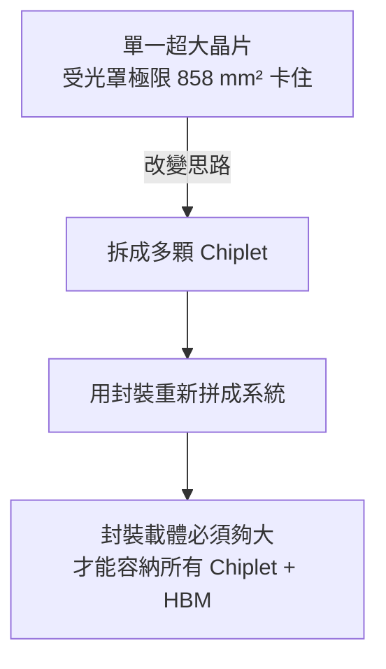

# 先進封裝為什麼存在

## 一句話的脈絡

先進封裝（advanced packaging）之所以在 2020 年代成為半導體業的主戰場，只有一條主線：**當「把電晶體做得更小」愈來愈難、愈來愈貴，效能提升的槓桿就從晶片內部（front-end）移到了晶片外部的整合方式（back-end）。** CoPoS 是這條主線推到極致後的產物——當封裝需要的面積連 12 吋晶圓都裝不下時，只好改用更大的矩形面板。

本頁只給精簡版；若想完整理解製程微縮的物理極限與 Chiplet 架構，本書庫的《CoWoS 技術精讀筆記》已有專章展開，這裡把焦點放在一件事：**封裝需要的面積，正在比晶片本身成長得更快。**

## 摩爾定律放緩

過去半世紀，效能提升靠的是製程微縮（scaling）：每隔約 18–24 個月電晶體密度翻倍，功耗與單位成本同步下降。這條路在 5nm、3nm 之下遇到根本性的牆：

- **物理牆**：閘極長度逼近數奈米時，量子穿隧（quantum tunnelling）讓漏電難以抑制。
- **成本牆**：EUV 微影設備與光罩成本呈指數上升，微縮帶來的每電晶體成本下降幾乎停止。
- **良率牆**：晶片面積愈大，落在其上的隨機缺陷愈多，良率隨面積呈指數惡化。

換句話說，「把一顆巨大的單晶片做出來」同時撞上物理、成本、良率三面牆。

## 光罩極限：一顆晶片能有多大

微影機一次曝光能印出的最大面積，稱為**光罩極限（reticle limit）**，業界標準約為 26 × 33 mm，也就是約 **858 mm²**。任何單一晶片都不可能超過這個尺寸，因為曝光機的鏡頭場（field）就這麼大。

這是一道硬牆：AI 加速器想要的運算能力，早已超過單顆 858 mm² 晶片所能提供。於是業界的解法是——不要做一顆超大晶片，而是把功能**拆成多顆小晶片（chiplet），再用封裝把它們拼回一個系統。**

## Chiplet 拆分的邏輯

把大晶片拆成 chiplet，好處不只是繞過光罩極限：

- **良率**：小晶片良率高，用多顆小的良品拼裝，比賭一顆大晶片划算。
- **異質整合（heterogeneous integration）**：運算 die 用最先進製程、I/O 與類比 die 用成熟製程，各取所需、各自最佳化成本。
- **可組合性**：同一套 chiplet 能組出不同規格的產品線。

但拆分有代價：原本晶片內部的短距互連，現在要跨越晶片之間，訊號路徑變長、頻寬與功耗變差。要讓拼回來的系統效能不打折，就需要**極高密度的封裝互連**——這正是先進封裝的核心價值。

## 記憶體牆與 HBM 為什麼要貼著算力

AI 訓練與推理的瓶頸，早已從「算得多快」轉為「餵資料多快」，這就是**記憶體牆（memory wall）**。傳統把記憶體放在主機板上、透過長導線連到處理器的做法，頻寬遠遠跟不上。

解法是 **HBM（High Bandwidth Memory，高頻寬記憶體）**：把多層 DRAM 垂直堆疊，並**盡可能貼近運算晶片**，用數千條極短的互連通道換取頻寬。要讓 HBM 貼著 GPU，就必須把兩者放進同一個封裝，並在其間鋪設高密度互連層。這也解釋了為什麼 AI 加速器的效能躍升，本質上是封裝技術的躍升。

## 主線：封裝面積的需求跑得比晶片快

把上面串起來，就得到本書的出發點：

- 運算需求要求**更多運算 chiplet**同時在一個封裝裡協作。
- 記憶體牆要求**更多 HBM 堆疊**貼著運算晶片。
- 每加一顆 chiplet、每加一疊 HBM，封裝載體就要更大。

於是封裝需要的面積，成長速度遠超過單顆晶片受光罩極限所限的 858 mm²。CoWoS 用矽中介板（silicon interposer）把面積推到光罩極限的數倍，但矽中介板是從 12 吋圓形晶圓上切下來的——**圓形晶圓能容納的矩形封裝面積終究有上限。** 當客戶想要的 HBM 數量連放大版 CoWoS 都塞不下時，就必須改用一種**更大、而且是方形**的封裝載體：面板。

這就是 CoPoS 登場的舞台。下一步，我們先把封裝的基本術語與流程建立起來，後面各章才不必反覆解釋名詞。

> 下一頁：[封裝基本流程與術語](02-packaging-basics.md)　｜　直接看主角：[CoPoS 是什麼](05-copos-overview.md)
