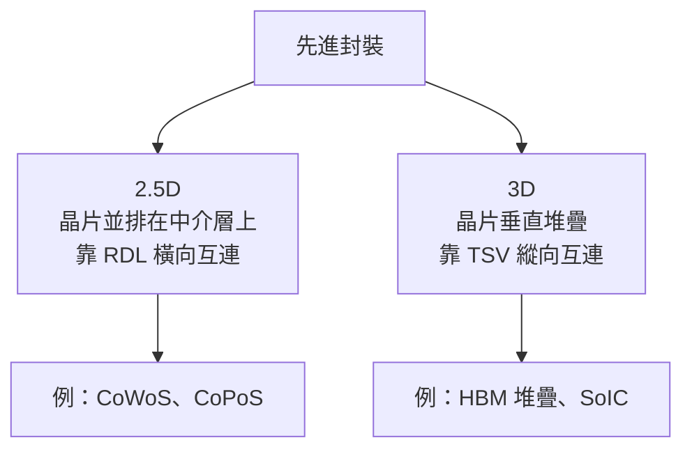
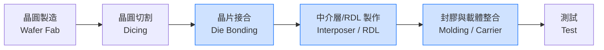

# 封裝基本流程與術語

本頁建立一組最小術語集。後面章節談 CoPoS 的三層結構、玻璃基板、面板級製程時，都會用到這裡的名詞，因此建議沒有封裝背景的讀者先讀完本頁。

## 最小術語表

| 術語 | 英文 | 一句話理解 |
|------|------|-----------|
| 晶片 | die / chip | 從晶圓切下來、含電路的裸晶。 |
| 封裝基板 | substrate | 封裝最底層的載板，類似高密度 PCB，對外提供接腳與電源。 |
| 中介層 | interposer | 夾在晶片與基板之間的「轉接板」，負責晶片彼此之間的高密度互連。 |
| 重佈線層 | RDL（Redistribution Layer） | 用薄膜製程做出的細線路層，把晶片密集的接點重新分佈到需要的位置。 |
| 凸塊 | bump | 晶片與載體之間的焊接小球，負責電氣連接。 |
| 微凸塊 | micro-bump | 尺寸只有數微米的極細凸塊，用於高密度的晶片對中介層互連。 |
| 矽穿孔 | TSV（Through-Silicon Via） | 垂直貫穿矽片的導電通道，讓訊號上下穿透。 |
| 封膠 | molding | 用環氧樹脂把晶片包覆固定、保護並提供機械支撐。 |
| 載體 | carrier | 製程中暫時或永久承載晶片的基板；可以是晶圓，也可以是面板。 |

## 封裝載體：晶圓還是面板

**載體（carrier）** 是理解 CoPoS 的關鍵詞。傳統晶圓級封裝以圓形的 12 吋晶圓當作製程載體；面板級封裝（panel-level packaging）則改用**矩形面板**當載體。載體換形狀，聽起來只是幾何差異，實際上牽動整條設備與良率鏈——這是本書後半的主題，這裡先把「載體不一定是圓的」這個觀念種下。

## Bump 的尺寸階梯

封裝互連從細到粗，大致是一道尺寸階梯，愈靠近晶片愈細、愈對外愈粗：

- **Micro-bump（數 μm）**：晶片 ↔ 中介層，密度最高。
- **C4 bump（數十 μm）**：中介層 ↔ 封裝基板。
- **BGA 焊球（數百 μm）**：封裝基板 ↔ 主機板。

記住這道階梯，後面看任何 2.5D 封裝的剖面圖都能對上位置。

## 2.5D 與 3D 的分類

先進封裝常用「整合維度」來分類，其中與 CoPoS 最相關的是 **2.5D** 與 **3D**：

- **2.5D**：多顆晶片**並排**放在同一片中介層上，透過中介層裡的 RDL 做橫向的晶片對晶片（die-to-die）互連。CoWoS 與 CoPoS 都屬於這一類——差別在於中介層是做在圓晶圓上還是方面板上。
- **3D**：晶片**垂直堆疊**，用 TSV 打通上下層。HBM 本身就是 3D 堆疊，而整個 HBM 又會以 2.5D 的方式並排在運算晶片旁。實務上 2.5D 與 3D 常常混用於同一個封裝。

## 一張圖看懂封裝流程

從晶圓到成品，封裝大致經過以下環節。**藍色標記的三個環節，正是 CoPoS 相對於 CoWoS 會改變的地方**——載體從圓晶圓換成方面板，連帶影響中介層製作、接合與後段的量測檢測：

> 說明：實務流程順序會因製程（chip-first 或 RDL-first）而不同，此處為概念示意，重點在標出 CoPoS 會動到的環節，而非嚴格的工序先後。

## 為什麼要先記住這些名詞

CoPoS 的一句話定義是「Chip-on-Panel-on-Substrate」——晶片、面板級中介層、基板三層結構。你會發現這三個字對應的正是本頁的 **die、carrier/interposer（改用面板）、substrate**。把術語建立好，下一章回顧 CoWoS 時，就能直接看出 CoPoS 平移了哪些概念、又替換了哪些。

> 下一頁：[CoWoS 快速回顧](03-cowos-recap.md)
