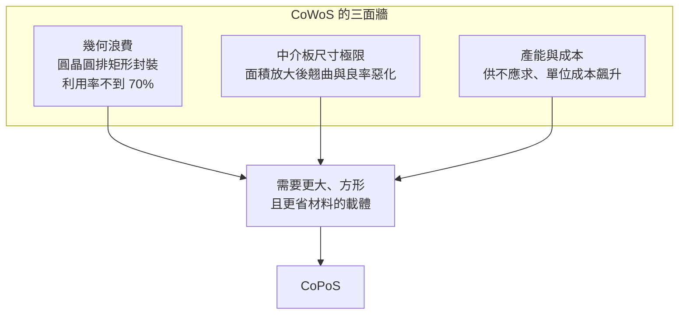

# CoWoS 快速回顧

CoPoS 不是憑空出現，它是 **CoWoS 撞牆之後的延伸**。本頁用最短的篇幅講清楚 CoWoS 的架構，以及它逼近的三面牆——這就是「為什麼需要 CoPoS」的直接前提。CoWoS 的完整技術細節，本書庫已有《CoWoS 技術精讀筆記》專書，這裡只點到為止，需要深入的讀者請移步該書。

## 一段話講完架構

**CoWoS = Chip-on-Wafer-on-Substrate**，名字就是製程：先把運算晶片與 HBM 覆晶接合到**矽中介板晶圓（silicon interposer wafer）**上（Chip-on-Wafer），再把切下來的中介板單元接到有機封裝基板上（Wafer-on-Substrate）。中介板負責晶片之間的高密度橫向互連，是整個 2.5D 架構的核心。

CoWoS 有三個變體，一句話帶過即可：

| 變體 | 中介層 | 定位 |
|------|--------|------|
| **CoWoS-S** | 矽中介板 | 旗艦密度，AI 加速器主力 |
| **CoWoS-R** | 有機 RDL | 成本優化 |
| **CoWoS-L** | 局部矽橋嵌入有機板 | 兼顧密度與成本 |

要注意的一點：無論哪個變體，CoWoS 的**製程載體都是圓形的 12 吋晶圓**。這正是它撞牆的根源。

## 三面牆

CoWoS 面積愈做愈大（業界已朝光罩極限的 9.5 倍、甚至更大推進），但它同時撞上三道彼此糾纏的牆。

### 牆一：圓形晶圓做矩形封裝的幾何浪費

封裝是矩形的，晶圓是圓形的。在一片 12 吋圓晶圓上排列矩形的大型封裝，邊緣會留下大量無法使用的弓形殘料。封裝愈大、單片能排的顆數愈少，邊緣浪費的占比就愈高，整體材料利用率往往**不到 70%**。對動輒數萬美元的中介板晶圓來說，這是純粹的成本流失。這條幾何主線，正是 CoPoS「從圓到方」最直觀的賣點，後面會有專章展開（見[從圓到方：面板尺寸與利用率](06-panel-geometry.md)）。

### 牆二：中介板尺寸逼近極限

單一微影曝光受**光罩極限（reticle limit，約 858 mm²）**所限，超大中介板必須靠多次曝光拼接（stitching）才能做出來。中介板做得愈大，跨越整片的**翹曲（warpage）**愈嚴重，拼接對位精度愈難維持，良率隨面積快速下滑。矽中介板放大到光罩數倍之後，良率與成本的惡化曲線變得非常陡。

### 牆三：產能吃緊與成本飆升

AI 需求爆發，CoWoS 產能長期供不應求，成為 AI 加速器出貨的實質瓶頸。中介板晶圓昂貴、產出顆數又被幾何浪費壓低，單顆超大封裝的成本節節上升。產能與成本，是把 CoWoS 推向面板級方案最現實的推力。

## 從 CoWoS 到 CoPoS

把三面牆合起來看，答案指向同一個方向：**換一個更大、方形、材料利用率更高的載體。** 這就是 CoPoS——把 CoWoS 的 2.5D 架構，從圓形的 12 吋晶圓，搬到 310 × 310 mm 的矩形面板上。哪些概念直接平移、哪些被替換，是下一部的主題。

在進入 CoPoS 本體之前，還有一條技術血脈要補：面板級封裝並非 TSMC 首創，扇出型面板級封裝（FOPLP）已存在多年。下一頁補上這條脈絡。

> 上一頁：[封裝基本流程與術語](02-packaging-basics.md)　｜　下一頁：[扇出型封裝與 FOPLP](04-fan-out-and-foplp.md)
