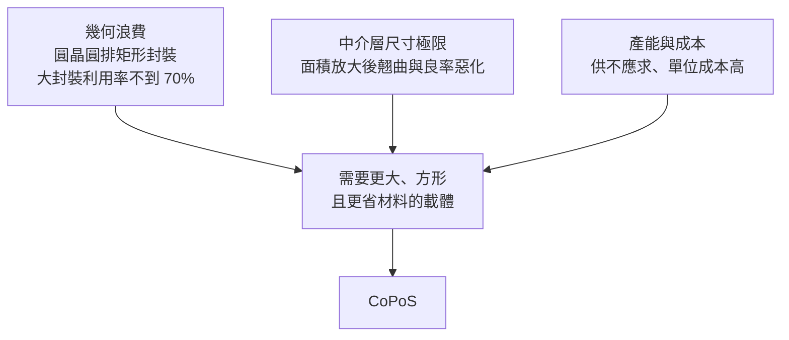

# CoWoS 快速回顧

CoPoS 不是憑空出現，它是 **CoWoS 逼近極限之後的延伸**。本頁用最短的篇幅講清楚 CoWoS 的架構、它現在做到哪裡，以及它撞到的牆——這就是「為什麼需要 CoPoS」的直接前提。

CoWoS 的完整技術細節，本書庫已有《CoWoS 技術精讀筆記》專書，這裡只點到為止。

## 一段話講完架構

**CoWoS = Chip-on-Wafer-on-Substrate**，名字就是製程：先把運算晶片與 HBM 覆晶接合到**矽中介板晶圓**上（Chip-on-Wafer），再把切下來的中介板單元接到有機封裝基板上（Wafer-on-Substrate）。中介層負責晶片之間的高密度橫向互連。

三個變體：

| 變體 | 中介層 | 定位 |
|------|--------|------|
| **CoWoS-S** | 全矽中介板 | 中等面積主力；實務上限約 3.3 倍光罩（約 2,700 mm²） |
| **CoWoS-R** | 全有機 RDL | 成本優化，無 TSV |
| **CoWoS-L** | **局部矽橋嵌入有機 RDL** | **2026 年旗艦主力**，唯一能繼續放大的路線 |

無論哪個變體，CoWoS 的**製程載體都是圓形的 12 吋晶圓**——這正是 CoPoS 要改變的地方。

## CoWoS 現在做到哪裡（2026 年）

這一節很重要，因為很多資料還停在 2024 年的認知。

| 項目 | 2026 年現況 | 等級 |
|------|-----------|------|
| 量產旗艦 | **5.5 倍光罩的 CoWoS-L** | [官方] |
| 良率 | **超過 98%，部分產線達 99%** | [官方／報導] |
| HBM 支援 | 最高 12 顆堆疊 | [官方] |
| 封裝基板 | 大於 100 × 100 mm | [官方] |
| 單封裝 die 數 | **已可容納 58 顆 die** | [報導] |
| 產能 | 約 75,000–80,000 片/月，2026 年底目標 120,000–140,000 | [報導，推估] |

而官方路線圖還在往上加：

- **2027**：9.5 倍光罩，基板 120 × 150 mm
- **2028**：14 倍光罩，約 10 顆大型運算 die + 20 顆 HBM
- **2029**：14 倍光罩以上，最高 24 顆 HBM5E

> **這改變了 CoPoS 的敘事。** 2025 年時普遍認為 CoWoS 快到頂了；2026 年的官方路線圖顯示它還能撐到 2029 年以後。這正是台積電說「CoPoS 是補充而非取代」的實質根據。

**特別注意「98% 良率」與「58 顆 die」這兩個數字**——它們是 CoPoS 必須追趕的基準線，而面板級目前連一顆 AI 等級的產品都還沒量產過。

## 三面牆

即使路線圖還能往上走，CoWoS 確實面對三道彼此糾纏的牆。

```mermaid
flowchart TD
    W1["幾何浪費<br/>圓晶圓排矩形封裝<br/>大封裝利用率不到 70%"]
    W2["中介層尺寸極限<br/>面積放大後翹曲與良率惡化"]
    W3["產能與成本<br/>供不應求、單位成本高"]
    W1 & W2 & W3 --> R["需要更大、方形<br/>且更省材料的載體"]
    R --> C["CoPoS"]
```

### 牆一：圓形晶圓做矩形封裝的幾何浪費

封裝是矩形的，晶圓是圓的。在一片 12 吋圓晶圓上排列大型矩形封裝，邊緣會留下大量無法使用的弓形殘料。

具體到什麼程度？一片 300 mm 晶圓總面積約 70,700 mm²，但若每顆封裝需要 800 mm²，**實際只排得下約 64 顆**——遠低於天真估算的 88 顆 [報導]。**四分之一以上的面積因為幾何而消失。**

封裝愈大，這個損失佔比愈高，材料利用率往往**不到 70%**。詳見 [06 從圓到方](06-panel-geometry.md)。

### 牆二：中介層尺寸與良率

單一微影曝光受**光罩極限（約 858 mm²）** 所限，超大中介層必須靠多次曝光拼接才能做出來。中介層愈大，翹曲愈嚴重、拼接對位愈難維持，良率隨面積快速下滑。

不過要公平地說：**CoWoS-L 的局部矽橋策略大幅緩解了這道牆**——它只需要幾片小矽橋是良品，而非整片大面積矽都完美。這正是 5.5 倍光罩還能有 98% 良率的原因。

### 牆三：產能與成本

AI 需求爆發，CoWoS 產能長期供不應求，交期約 52–78 週 [報導]。中介層晶圓昂貴、產出顆數又被幾何浪費壓低。

不過這道牆也在鬆動：供需缺口據估由 2026 年初約 20% 收斂至年底約 10% [報導]。而且瓶頸已經擴散——台積電自己把 **HBM 與 ABF 基板**點名為未來的兩大瓶頸，CoWoS 不再是唯一的卡點。

## 從 CoWoS 到 CoPoS：一個更精確的說法

把三面牆合起來，方向指向：**換一個更大、方形、材料利用率更高的載體。**

但要精確一點：CoPoS 並不是「因為 CoWoS 做不下去了」，而是**在封裝尺寸超過某個門檻之後，圓形載體的經濟性開始輸給方形載體**。這個門檻大約在 **3.5 倍光罩**（見 [06 從圓到方](06-panel-geometry.md)）。

門檻以下——也就是**絕大多數產品**——CoWoS 仍然是更好的選擇。

在進入 CoPoS 本體之前，還有一條技術血脈要補：面板級封裝並非台積電首創，扇出型面板級封裝（FOPLP）已存在多年。

> 上一頁：[封裝基本流程與術語](02-packaging-basics.md)　｜　下一頁：[扇出型封裝與 FOPLP](04-fan-out-and-foplp.md)
