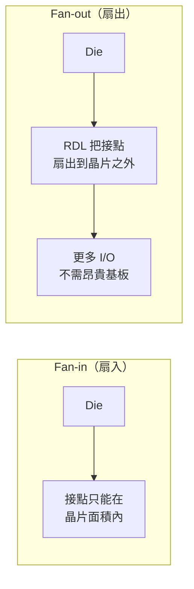

# 扇出型封裝與 FOPLP

CoPoS 有兩條技術血脈。一條來自 [CoWoS](03-cowos-recap.md) 的 2.5D 中介層架構；另一條，就是本頁要補的**面板級封裝**。很多人以為「用面板做封裝」是 TSMC 的新發明，其實**扇出型面板級封裝（FOPLP，Fan-Out Panel-Level Packaging）**已存在多年。理解 FOPLP 過去為什麼一直做不進高階產品、現在又為什麼被重新拿出來，是理解 CoPoS 定位的關鍵。

## Fan-in 與 Fan-out

先分清楚兩個基本概念：

- **扇入型（fan-in）**：封裝的對外接點全部落在**晶片本身的面積之內**。晶片有多大、封裝就多大，接腳數受限於晶片邊長。
- **扇出型（fan-out）**：把晶片重新嵌進一塊比它大的**重構載體（reconstituted carrier）**裡，再用 [RDL](02-packaging-basics.md) 把接點「扇出」到晶片以外的區域。

扇出的價值在於：不需要昂貴的載板，就能提供比晶片本身更多的 I/O，還能做得更薄。這讓它在行動裝置晶片上大受歡迎。

## InFO：扇出型走進高階的起點

**InFO（Integrated Fan-Out）** 是 TSMC 的扇出型封裝品牌，最著名的應用是自 2016 年起用於 Apple 的行動處理器。InFO 證明了扇出型封裝可以進入最高階、最大量的消費性產品，也讓 TSMC 累積了扇出型 RDL 的量產經驗。

值得注意的是：早期的 InFO 是做在**圓形晶圓**上的扇出型晶圓級封裝（FOWLP，Fan-Out Wafer-Level Packaging）。把同樣的扇出思路搬到**矩形面板**上，就是 FOPLP。可以說，CoPoS 是「InFO 的扇出經驗」與「面板級的大尺寸載體」兩者的合流。

## FOPLP 的歷史：不是新東西

面板級扇出並非新概念，過去十年已有多方投入：

- **三星電機（Samsung Electro-Mechanics, SEMCO）** 是 FOPLP 最積極的推手，投入數億美元，並率先量產——例如把應用處理器單元用於自家 Galaxy Watch。2019 年三星電子更把 PLP 業務收購整併，將面板級封裝視為與 TSMC InFO 正面競爭的戰略武器。
- **台灣的力成（PTI）等封測廠**與**群創等面板廠**，也都在面板級封裝與其設備、材料上有過布局；台灣面板業的既有產線與玻璃加工經驗，正是後來被重新看好的基礎。

換句話說，「用面板做封裝」的產業嘗試已累積多年，設備與材料的雛形都存在。

## 為什麼過去做不進高階產品

既然 FOPLP 早就存在，為什麼過去只能做手錶處理器、電源管理這類**中低階、少層數**的產品，遲遲進不了 AI 加速器這種高階應用？三個技術門檻：

1. **翹曲（warpage）**：面板面積比晶圓大好幾倍，不同材料的熱膨脹係數（CTE）不匹配，在製程升降溫時整片面板容易彎翹，直接傷害後續的曝光與對位。面積愈大、翹曲愈難控。
2. **對位精度**：高階產品需要微米級的 RDL 線寬，而面板愈大，跨越整片維持曝光對位精度就愈困難。低階產品線寬粗、容忍度高，才能先量產。
3. **設備生態不成熟**：晶圓廠的曝光、鍍銅、量測、檢測設備是為圓晶圓打造的，無法直接搬到大面板上。缺乏成熟的面板規格高精度設備，是高階 FOPLP 長期卡關的根本原因。

這三道門檻，其實與 CoPoS 面板級製程要克服的挑戰是同一組（詳見[面板級製程挑戰](08-panel-process-challenges.md)）。

## 為什麼是現在

技術門檻沒有消失，改變的是**成本的算計方式**。AI 加速器對封裝面積的需求爆炸性成長，而 [CoWoS 撞上的三面牆](03-cowos-recap.md)——幾何浪費、中介板尺寸極限、產能與成本——讓「投資克服面板級門檻」第一次在經濟上划算：

- 面板的高材料利用率與大面積，攤平了設備投資。
- AI 產品的高單價，能吸收面板級製程初期較低良率的成本。
- 玻璃基板等新材料（見[玻璃基板](07-glass-substrate.md)）為大面板的翹曲問題提供了新解方。

於是多年來一直是「配角」的面板級封裝，被 AI 需求推上了高階舞台。TSMC 的 CoPoS，正是把面板級封裝與 2.5D 中介層架構結合、瞄準最高階 AI 封裝的那一步。下一部，我們正式進入 CoPoS 本體。

> 上一頁：[CoWoS 快速回顧](03-cowos-recap.md)　｜　下一頁：[CoPoS 是什麼](05-copos-overview.md)
