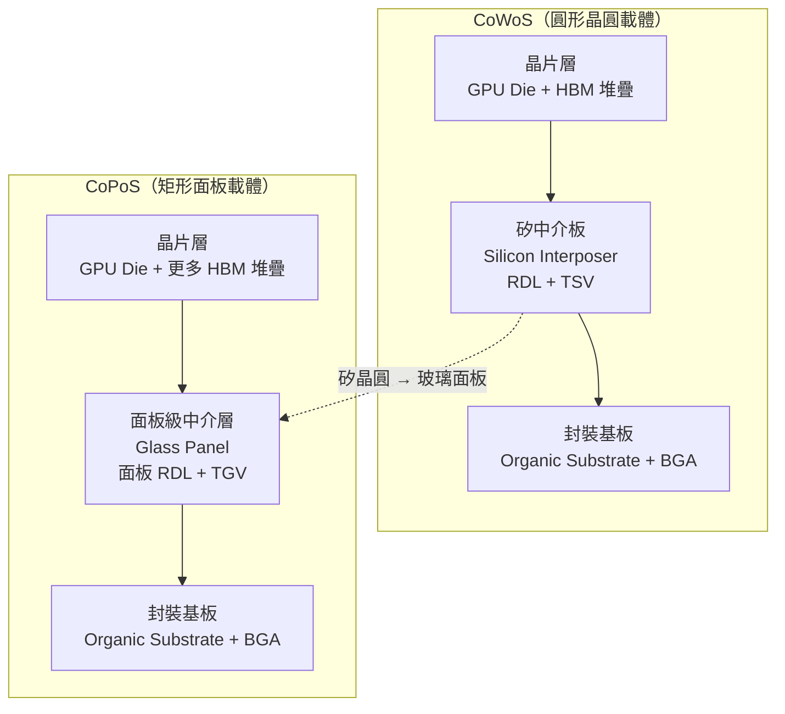

# CoPoS 是什麼

本頁是全書的核心。把前四章的前提知識收攏起來，給出 **CoPoS（Chip-on-Panel-on-Substrate，晶片—面板—基板封裝）** 的正式定義、三層結構，以及它與 [CoWoS 快速回顧](03-cowos-recap.md) 的直接對應關係。讀完本頁，後面談幾何、玻璃、製程與時程的章節都只是把這裡的骨架長出血肉。

## 一句話定義

CoPoS 是台積電（TSMC）把先進封裝的**載體（carrier）從圓形的 12 吋晶圓，換成矩形面板（panel）** 的下一代 2.5D 封裝平台。晶片仍然像 CoWoS 那樣覆晶接合到中介層上、再接到封裝基板，但「中介層」與整個製程流程改在標準 310 × 310 mm 的方形面板上進行。名稱裡的三個字，正好對應三層結構：

- **Chip（晶片）**：運算 die（GPU、AI 加速器）、HBM 記憶體堆疊、I/O chiplet。
- **Panel（面板）**：面板級的中介層／重佈線層（Redistribution Layer, RDL），常以玻璃作為核心材料，取代 CoWoS 的矽中介板（silicon interposer）。
- **Substrate（基板）**：對外的封裝基板，提供電源分配與 BGA 接腳，概念與 CoWoS 相同。

## 從 CoWoS 平移過來的心智模型

理解 CoPoS 最快的路徑，是看它「換掉了什麼、保留了什麼」。CoWoS 的全名是 Chip-on-Wafer-on-Substrate，中間那個 **Wafer** 正是被 CoPoS 的 **Panel** 取代的部分。其餘的封裝哲學——用高密度 RDL 做 die 到 die 的橫向互連、用穿孔做縱向訊號穿透、最後落到有機基板——幾乎原封不動地平移。

| 概念 | CoWoS | CoPoS | 變化 |
|------|-------|-------|------|
| 載體形狀 | 圓形晶圓（直徑 300 mm） | 方形面板（310 × 310 mm 起步） | **根本改變** |
| 中介層材料 | 矽（silicon） | 玻璃（glass）為主，或有機 RDL | 替換 |
| 縱向穿孔 | TSV（矽穿孔） | TGV（玻璃穿孔，Through-Glass Via） | 替換 |
| 橫向互連 | RDL 覆晶接合 | 面板級 RDL 覆晶接合 | 平移 |
| 封裝基板 | 有機基板 + BGA | 有機基板 + BGA | 平移 |
| 面積上限 | 受光罩極限與晶圓幾何雙重壓縮 | 面板大幅放寬 | **根本改變** |

換句話說，CoPoS 不是憑空發明的新封裝，而是 **CoWoS 的封裝概念 × 面板級封裝（FOPLP）的載體形狀** 的結合。它的另一條血脈來自 [扇出型封裝與 FOPLP](04-fan-out-and-foplp.md)：面板級製造本身在顯示與扇出封裝業已行之有年，CoPoS 是把它拉進高階 AI 封裝的臨門一腳。

## 三層結構圖：CoWoS 與 CoPoS 並排

兩者疊構層次一模一樣，差別集中在中間那層：**載體從圓形矽晶圓，換成方形玻璃面板**。這一個改變，牽動了本書後面所有的討論。

## 為什麼這個改變重要

### 1. 面積：可用面積放大五倍以上

一片 12 吋晶圓的圓形毛面積約 70,700 mm²，而 310 × 310 mm 面板的毛面積約 96,100 mm²。單看毛面積只差約 1.4 倍，但關鍵在於——當封裝越做越大（AI 加速器的超大封裝已逼近光罩極限的數倍），**把大矩形硬塞進圓形晶圓的浪費會急遽放大**。據產業報導，改用矩形面板後，可容納超大封裝的**可用面積達到 12 吋晶圓的五倍以上**。這條「可用面積」的算術直覺，[從圓到方：面板尺寸與利用率](06-panel-geometry.md) 會拆開來講。

### 2. 利用率：從不到 70% 到 90% 以上

圓形晶圓切矩形封裝，邊緣一圈弓形區域幾乎全是廢料，材料利用率往往不到 70%。方形面板讓排版逼近滿版，**利用率提升到 90% 以上**。利用率直接反映在每顆超大封裝的成本上。

### 3. 容量：單一封裝塞得下更多東西

面積放大的直接紅利，是單一封裝能容納**更多 HBM 堆疊、更多 I/O chiplet 與更大的運算 die 組合**。在 HBM4 世代、客戶不斷要求「一顆封裝塞更多記憶體」的壓力下，這正是 CoWoS 矽中介板再也放不大時，CoPoS 登場的根本理由。

## CoPoS 不是免費的午餐

把圓換成方、把矽換成玻璃，代價是一整套新的工程難題：大面板的翹曲（warpage）與搬運、面板級微影的曝光場拼接、面積放大五倍後更嚴苛的缺陷密度容忍度、以及晶圓設備無法直接沿用的設備生態問題。這些是 [面板級製程挑戰](08-panel-process-challenges.md) 的主題；而玻璃基板為什麼成為解方，則見 [玻璃基板](07-glass-substrate.md)。

至於這一切「什麼時候會發生」——試產線、量產時程、供應鏈布局——請看 [TSMC 布局與時程](09-tsmc-roadmap.md)。

> 相關頁面：[從圓到方：面板尺寸與利用率](06-panel-geometry.md) ｜ [玻璃基板](07-glass-substrate.md) ｜ [面板級製程挑戰](08-panel-process-challenges.md) ｜ [CoWoS、CoPoS、SoW-X 比較](11-copos-vs-alternatives.md)
