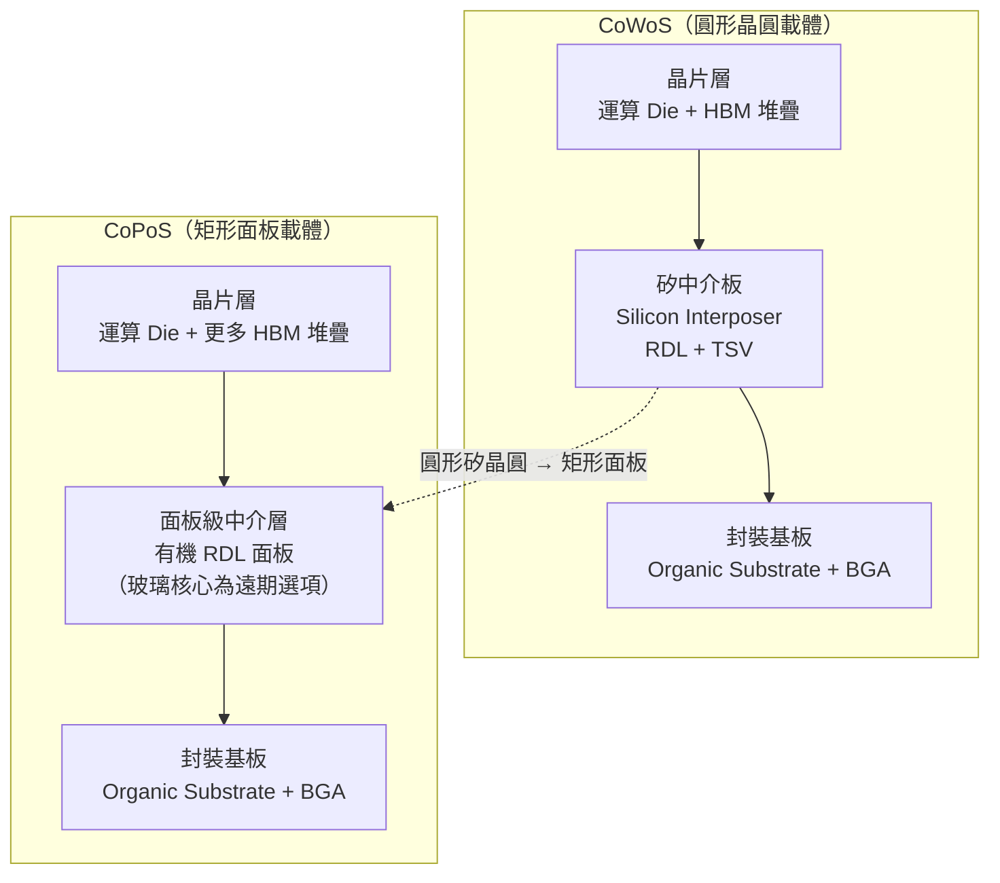
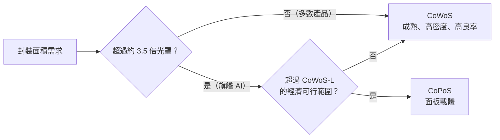

# CoPoS 是什麼

本頁是全書的核心。把前四章的前提知識收攏起來，給出 **CoPoS（Chip-on-Panel-on-Substrate，晶片—面板—基板封裝）** 的定義、三層結構，以及它與 [CoWoS](03-cowos-recap.md) 的關係。

## 一句話定義

CoPoS 是台積電把先進封裝的**載體（carrier）從圓形的 12 吋晶圓，換成矩形面板（panel）** 的下一代 2.5D 封裝平台。晶片仍然像 CoWoS 那樣覆晶接合到中介層上、再接到封裝基板，但「中介層」與相關製程改在 **310 × 310 mm** 的方形面板上進行。

名稱裡的三個字，正好對應三層結構：

- **Chip（晶片）**：運算 die、HBM 記憶體堆疊、I/O chiplet。
- **Panel（面板）**：面板級的中介層／重佈線層（RDL），取代 CoWoS 的矽中介板。
- **Substrate（基板）**：對外的封裝基板，提供電源分配與 BGA 接腳，概念與 CoWoS 相同。

## 官方確認了什麼、沒確認什麼

這一點必須講在最前面，因為 CoPoS 的公開資訊中，**官方確認的部分其實很少**。

**[官方] 台積電董事長魏哲家於 2026 年 4 月 16 日第一季法說會確認：**

- 台積電已建置 CoPoS 面板級封裝的**試產線**
- CoPoS 針對「已超出現行 reticle-based CoWoS 極限」的 AI 晶片
- 承認**翹曲與熱管理**是真實挑戰（他的說法是「愈難愈好」）
- 將與 OSAT 夥伴合作擴充產能
- **CoPoS 是 CoWoS 的「補充」，不是取代**
- 量產「還要幾年」（未給具體年份）

**其餘幾乎全部是供應鏈報導**：310 × 310 mm 的面板規格、AP7 嘉義的試產線地點、2028 或 2029 的量產年份、NVIDIA 是首位客戶——這些都沒有官方確認，且各家說法互有出入。完整的分歧表見 [09 TSMC 布局與時程](09-tsmc-roadmap.md)。

## 從 CoWoS 平移過來的心智模型

理解 CoPoS 最快的路徑，是看它「換掉了什麼、保留了什麼」。CoWoS 的全名是 Chip-on-**Wafer**-on-Substrate，中間那個 Wafer 正是被 CoPoS 的 **Panel** 取代的部分。

| 概念 | CoWoS | CoPoS | 變化 |
|------|-------|-------|------|
| 載體形狀 | 圓形晶圓（直徑 300 mm） | 方形面板（310 × 310 mm 起步） | **根本改變** |
| 中介層材料 | 矽 | **有機 RDL 起步**，玻璃核心是更遠期的獨立路線 | 替換 |
| 縱向穿孔 | TSV（矽穿孔） | 有機面板不需 TSV；玻璃路線用 TGV | 依材料而定 |
| 橫向互連 | RDL 覆晶接合 | 面板級 RDL 覆晶接合 | 平移 |
| 封裝基板 | 有機基板 + BGA | 有機基板 + BGA | 平移 |
| 面積上限 | 受光罩極限與晶圓幾何雙重壓縮 | 面板大幅放寬 | **根本改變** |

換句話說，CoPoS 不是憑空發明的新封裝，而是 **CoWoS 的封裝概念 × 面板級封裝（FOPLP）的載體形狀**。它的另一條血脈來自 [扇出型封裝與 FOPLP](04-fan-out-and-foplp.md)。

技術上，CoPoS 最精確的描述是：**把 CoWoS-L / CoWoS-R 的中介層／RDL 步驟，從晶圓搬到面板上做**——而不是一套全新的封裝哲學 [報導]。

> 不過這個框架也有爭議。有供應鏈評論主張「CoPoS 不是單純延伸 CoWoS 製程，而是**重建一條新的封裝產線**」[傳聞]。兩種說法的差別在於：**設計概念**上它確實是 CoWoS 的延伸，但**產線與設備**上它幾乎要從頭來過。這也是為什麼它為過去被排除在 CoWoS 供應鏈之外的設備商打開了機會（見 [14 設備與量測生態](14-equipment-ecosystem.md)）。

## 三層結構圖：CoWoS 與 CoPoS 並排

```mermaid
flowchart TB
    subgraph "CoWoS（圓形晶圓載體）"
        CW_C["晶片層<br/>運算 Die + HBM 堆疊"]
        CW_I["矽中介板<br/>Silicon Interposer<br/>RDL + TSV"]
        CW_S["封裝基板<br/>Organic Substrate + BGA"]
        CW_C --> CW_I --> CW_S
    end
    subgraph "CoPoS（矩形面板載體）"
        CP_C["晶片層<br/>運算 Die + 更多 HBM 堆疊"]
        CP_I["面板級中介層<br/>有機 RDL 面板<br/>（玻璃核心為遠期選項）"]
        CP_S["封裝基板<br/>Organic Substrate + BGA"]
        CP_C --> CP_I --> CP_S
    end
    CW_I -. "圓形矽晶圓 → 矩形面板" .-> CP_I
```

兩者疊構層次一模一樣，差別集中在中間那層。這一個改變，牽動了本書後面所有的討論。

## 為什麼這個改變重要

### 1. 面積：但要注意前提

一片 12 吋晶圓的毛面積約 70,700 mm²，310 × 310 mm 面板約 96,100 mm²——**毛面積只差約 1.36 倍**。

真正的槓桿在於**排版效率隨封裝尺寸放大而拉開差距**。但這裡有一個關鍵前提：**紅利只在封裝尺寸超過約 3.5 倍光罩時才顯著** [報導]。對中小型封裝，面板的優勢並不明顯。

完整的算術與那個「五倍」到底怎麼來的，見 [06 從圓到方](06-panel-geometry.md)。

### 2. 利用率：從不到 70% 到 90% 以上

圓形晶圓切大型矩形封裝，邊緣一圈幾乎全是廢料，材料利用率往往不到 70%。方形面板讓排版逼近滿版，理論利用率提升到 90% 以上。

### 3. 容量：單一封裝塞得下更多東西

面積放大的直接紅利，是單一封裝能容納**更多 HBM 堆疊、更多 I/O chiplet 與更大的運算 die 組合**。在 HBM4 世代、客戶不斷要求「一顆封裝塞更多記憶體」的壓力下，這正是 CoPoS 登場的根本理由。

## CoPoS 不會取代 CoWoS

這是全書必須反覆強調的一點，因為市場敘事經常搞反。

台積電主管明確表示，面板封裝「**短期內不會取代 CoWoS**」，理由很具體：**晶圓級 CoWoS 已經能做到單一封裝容納 58 顆 die** [報導]——這是面板技術目前還追不上的整合密度。

《天下雜誌》（2026 年 4 月）對分工的總結也很清楚：CoWoS 在可預見的未來仍是「AI 晶片封裝的骨幹」，因為它的製程成熟度高；CoPoS 則定位在「更大的晶片」與超出單一光罩／晶圓經濟性的封裝——短期內是**利基應用**，而非全面的平台切換 [報導]。

```mermaid
flowchart LR
    A["封裝面積需求"] --> B{"超過約 3.5 倍光罩？"}
    B -->|"否（多數產品）"| C["CoWoS<br/>成熟、高密度、高良率"]
    B -->|"是（旗艦 AI）"| D{"超過 CoWoS-L<br/>的經濟可行範圍？"}
    D -->|"否"| C
    D -->|"是"| E["CoPoS<br/>面板載體"]
```

## CoPoS 不是免費的午餐

把圓換成方，代價是一整套新的工程難題：

- 大面板的**翹曲**與搬運（面積放大約五倍，翹曲問題約放大五倍）
- 面板級微影的**曝光場拼接**與對位精度
- 分子級的 **die shift（晶片偏移）** 補償
- 面積放大後更嚴苛的**缺陷密度容忍度**
- 晶圓設備**無法直接沿用**的設備生態問題
- 大面積矩形面板的**電鍍均勻性**——業界尚無成熟製程

這些是 [08 面板級製程挑戰](08-panel-process-challenges.md) 與 [13 面板級製程流程](13-process-flow.md) 的主題。

> 下一頁：[從圓到方：面板幾何與經濟學](06-panel-geometry.md)　｜　相關頁面：[玻璃基板](07-glass-substrate.md) ｜ [TSMC 布局與時程](09-tsmc-roadmap.md) ｜ [CoWoS、CoPoS、SoW-X 比較](11-copos-vs-alternatives.md)
