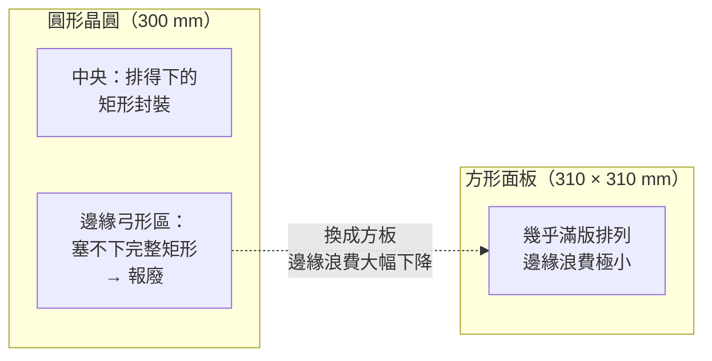

# 從圓到方：面板尺寸與利用率

CoPoS 最直觀、也最容易被記住的賣點只有一句話：**把圓形的晶圓換成方形的面板**。這頁把這個「幾何」賣點講透——為什麼圓形載體對大封裝這麼不划算、方形面板憑什麼把利用率從不到 70% 拉到 90% 以上，以及面積放大對超大封裝成本的影響。

## 圓形晶圓的原罪：矩形封裝排在圓上

半導體晶圓是圓的（12 吋 = 直徑 300 mm），但幾乎所有封裝產品都是矩形的。把矩形一顆一顆排進圓形晶圓時，**邊緣一圈弓形（bow-shaped）區域塞不下完整的矩形**，只能報廢。這在做小晶片時損失還算可控，但先進封裝的問題在於：AI 加速器的封裝面積越做越大。

當單顆封裝逼近甚至超過光罩極限（reticle limit，約 858 mm²）的數倍時，一片晶圓只排得下寥寥幾顆超大封裝。此時，晶圓邊緣「差一點就能再排一顆」的浪費會被急遽放大——**封裝越大，圓形載體的邊緣浪費占比越高**。這正是 [CoWoS 快速回顧](03-cowos-recap.md) 裡提到的三面牆之一：矽中介板在圓形晶圓上的幾何浪費，讓利用率長期卡在 70% 以下。

## 方形面板為什麼贏：把邊角要回來

方形面板的排版可以逼近棋盤式滿版，四個角落與四條邊幾乎都能利用。這帶來兩個層次的好處，必須分開看：

### 毛面積：面板比晶圓大不了太多

- 12 吋晶圓毛面積 ≈ π × 150² ≈ **70,700 mm²**
- 310 × 310 mm 面板毛面積 = **96,100 mm²**

單看毛面積，面板只比晶圓大約 **1.4 倍**。如果 CoPoS 的好處只有這 1.4 倍，那不足以驅動一次典範轉移。

### 可用面積：對大封裝，差距放大到五倍以上

真正的槓桿在於**排版效率隨封裝尺寸放大而拉開差距**。做小封裝時，圓形晶圓的利用率還過得去；但做超大封裝時，圓形晶圓能容納的完整封裝數銳減，而方形面板幾乎不受影響。據產業報導，換算到 CoPoS 目標的超大封裝，**面板的可用面積可達 12 吋晶圓的五倍以上**。

這個「五倍」不是毛面積比，而是「能塞下多少顆目標尺寸的超大封裝」的等效比較——圓形晶圓在大封裝上損失慘重，方板則接近理論上限。

## 用一張表看利用率與載體世代

下表以「材料利用率」與「毛面積」對照不同載體。利用率定義為「排得下的有效封裝面積 ÷ 載體毛面積」，數字為概念性示意，用來建立直覺而非精確工程值：

| 載體 | 尺寸 | 毛面積（約） | 大封裝材料利用率 | 定位 |
|------|------|-------------|-----------------|------|
| 12 吋晶圓 | 直徑 300 mm | 70,700 mm² | **< 70%** | CoWoS 現況 |
| CoPoS 一代面板 | 310 × 310 mm | 96,100 mm² | **> 90%** | 試產／首波量產 |
| 中間世代面板 | 515 × 510 mm | 262,650 mm² | > 90% | 規劃中 |
| 更大世代面板 | 750 × 620 mm | 465,000 mm² | > 90% | 長期路線圖 |

> 面板世代尺寸為截至 2026 年中的產業報導規劃值，實際量產規格以官方公布為準。時程細節見 [TSMC 布局與時程](09-tsmc-roadmap.md)。

利用率從「不到 70%」跳到「90% 以上」，意思是每一片載體的材料與製程投入，能多產出約三成的有效封裝面積。對動輒占整顆 AI 加速器成本可觀比例的先進封裝而言，這是實打實的降本。

## 面積放大如何改寫成本結構

面板尺寸不只影響利用率，更決定「單一封裝能做多大」的天花板。這對超大封裝成本有兩個影響：

1. **單顆超大封裝的可行性**：CoWoS 的矽中介板受晶圓尺寸與光罩極限雙重壓縮，越大越難做、良率越差。面板把載體放大，讓「一顆封裝塞下更多 HBM 與 chiplet」從工程上變得可行——這正是 [CoPoS 是什麼](05-copos-overview.md) 裡強調的容量紅利。

2. **攤提效率**：面板一次處理的面積更大，設備的每小時產出（以有效封裝面積計）上升，固定成本被攤得更薄。搭配玻璃基板本身的材料降本，據產業報導整體封裝成本有望降低約 **30%**（玻璃基板的成本效益見 [玻璃基板](07-glass-substrate.md)）。

## 但「換成方的」沒有那麼簡單

必須提醒：把利用率算得漂亮，前提是面板級製程能做到與晶圓相當的良率。面板越大，翹曲、對位、缺陷密度容忍度的挑戰越大——這些會把理論利用率打折扣。幾何上的五倍紅利要真正兌現，得先跨過 [面板級製程挑戰](08-panel-process-challenges.md) 這一關。這也是為什麼 CoPoS 從 310 × 310 mm 起步，而非一步跳到 750 × 620 mm：**先在較小面板上把良率學會，再逐代放大**。

> 相關頁面：[CoPoS 是什麼](05-copos-overview.md) ｜ [玻璃基板](07-glass-substrate.md) ｜ [面板級製程挑戰](08-panel-process-challenges.md)
