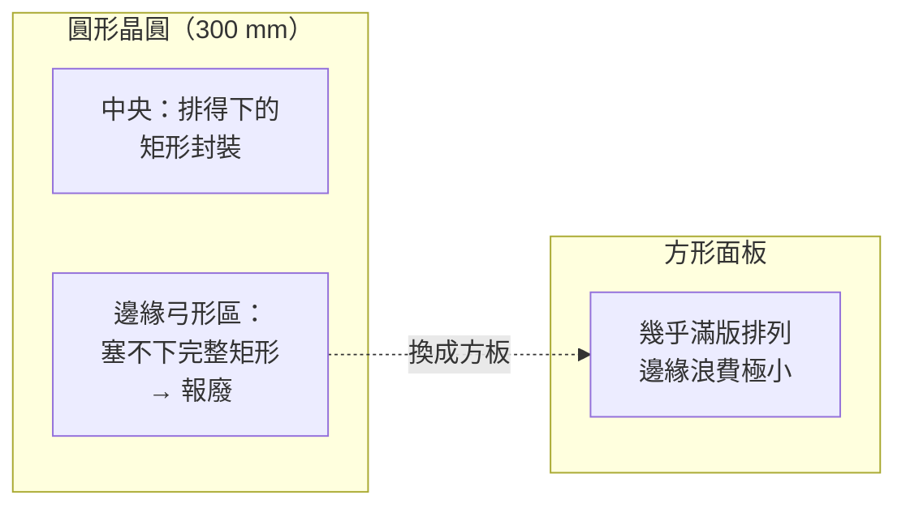

# 從圓到方：面板幾何與經濟學

CoPoS 最常被引用的賣點是一句話：「可用面積是 12 吋晶圓的五倍以上、利用率從不到 70% 提升到 90% 以上。」

這句話**大致成立，但有重要的前提**。這一章把幾何算清楚，包括那個前提是什麼。

## 圓形晶圓的原罪

半導體晶圓是圓的（12 吋 = 直徑 300 mm），但幾乎所有封裝產品都是矩形的。把矩形排進圓形時，**邊緣一圈弓形區域塞不下完整的矩形**，只能報廢。

做小晶片時損失還算可控。問題在於 AI 加速器的封裝面積愈做愈大——當單顆封裝逼近甚至超過光罩極限（約 858 mm²）的數倍時，一片晶圓只排得下寥寥幾顆，**邊緣「差一點就能再排一顆」的浪費被急遽放大**。

```mermaid
flowchart LR
    subgraph "圓形晶圓（300 mm）"
        R1["中央：排得下的<br/>矩形封裝"]
        R2["邊緣弓形區：<br/>塞不下完整矩形<br/>→ 報廢"]
    end
    subgraph "方形面板"
        P1["幾乎滿版排列<br/>邊緣浪費極小"]
    end
    R2 -. "換成方板" .-> P1
```

一個具體的數字能說明問題有多嚴重：一片 300 mm 晶圓總面積約 70,700 mm²，但如果每顆封裝要 800 mm²，**實際只排得下約 64 顆**——遠低於 70,700 ÷ 800 ≈ 88 的天真估算 [報導]。**四分之一以上的面積因為幾何而消失。**

## 面積算術：先把毛面積算清楚

| 載體 | 尺寸 | 毛面積 | 相對 12 吋晶圓 |
|------|------|-------|--------------|
| 12 吋晶圓 | 直徑 300 mm | **約 70,700 mm²** | 1.0× |
| CoPoS 一代面板 | 310 × 310 mm | 96,100 mm² | **1.36×** |
| 中間世代 | 515 × 510 mm | 262,650 mm² | 3.7× |
| 其他業者格式 | 600 × 600 mm | 360,000 mm² | 5.1× |
| Amkor 格式 | 650 × 650 mm | 422,500 mm² | 6.0× |
| SpaceX 目標格式 | 700 × 700 mm | 490,000 mm² | 6.9× |

> 面板世代尺寸為截至 2026 年中的產業報導值，且**其中多數不是 TSMC 的規劃，而是其他業者的選擇**（600×600 是 Nepes、650×650 是 Amkor、700×700 是 SpaceX 指定）。TSMC CoPoS 一代確認為 310 × 310 mm。

### 這裡有一個必須說清楚的落差

**310 × 310 mm 面板的毛面積只有晶圓的 1.36 倍，不是五倍。**

那「五倍」從哪來？它指的是**排得下多少顆目標尺寸的超大封裝**的等效比較，而不是毛面積比。而這個等效比只有在**封裝夠大**的時候才拉得開。

## 關鍵前提：紅利集中在 3.5 倍光罩以上

這是本章最重要的一句話，也是市場報導最常略過的一句：

> **面板相對晶圓的利用率優勢，在小尺寸（中介板等級）封裝上並不明顯；只有當封裝尺寸超過約 3.5 倍光罩時，利用率才開始急遽拉開** [報導]。

原因是幾何的：封裝愈小，圓形晶圓的邊緣浪費佔比就愈低（小方塊比較塞得進弓形區）；封裝愈大，邊緣就愈塞不進東西。

這個門檻的意義非常實際：

- **3.5 倍光罩以下**：CoWoS 仍然划算，換面板得不到什麼
- **3.5 倍光罩以上**：面板的紅利開始顯著——而這正好是 CoWoS-L 目前 5.5 倍、路線圖指向 14 倍的旗艦 AI 加速器區間

換句話說，**CoPoS 從來不是為了「所有封裝」而生的，它是為了最大的那一批封裝而生的**。這也解釋了為什麼 TSMC 說它是 CoWoS 的補充而非取代——大部分封裝根本不在這個門檻之上。

### 一個小封裝的反例

ACM Research 給過一個具體對比：一片 300 mm 晶圓能處理約 **2,500 顆** 6 × 6 mm 的封裝，而 600 × 600 mm 面板能容納約 **12,000 顆**——約 4.8 倍 [報導]。

注意這裡的 4.8 倍，很接近兩者的毛面積比（5.1 倍）。**對小封裝，面板的優勢幾乎就等於毛面積優勢，沒有額外的幾何紅利。** 真正的槓桿要到大封裝才出現。

## 利用率的數字該怎麼讀

常見的「利用率從不到 70% 到 90% 以上」是一個合理的量級描述，但要注意兩件事：

1. **它是針對大封裝說的。** 對小封裝，圓形晶圓的利用率本來就不差。
2. **90% 是理論排版利用率，不是良率。** 面板級製程的實際良率是另一回事——[面板級製程挑戰](08-panel-process-challenges.md)談的每一項難題，都會把理論利用率打折扣。

| 載體 | 大封裝材料利用率 | 定位 |
|------|-----------------|------|
| 12 吋晶圓 | **< 70%** | CoWoS 現況 |
| 310 × 310 mm 面板 | **> 90%**（理論排版值） | CoPoS 一代 |

## 成本：三條線疊起來

面板的成本優勢來自三條線，而它們的確定性差很多：

| 來源 | 機制 | 確定性 |
|------|------|-------|
| **排版利用率** | 少浪費三成材料與製程投入 | **高**——純幾何，算得出來 |
| **設備攤提** | 單次處理面積更大，每小時有效產出上升 | **中**——取決於面板機台的實際 throughput |
| **材料替換** | 玻璃／有機取代昂貴的矽中介板 | **低**——報導稱可降約 30%，但屬量產成熟後的推估 |

那個「降本 30%」的數字在市場報導中流傳很廣，但它是**前瞻性宣稱、且綁在玻璃核心路線上**，而第一代 CoPoS 很可能根本不用玻璃（見 [07 玻璃基板](07-glass-substrate.md)）。早期試產階段因良率與設備折舊，實際成本會**高得多**，而不是低 30%。

## 為什麼從 310 起步，而不是一步到 600

TSMC 據報**曾試過 515 × 515 mm，後來才收斂到 310 × 310 mm**，理由是控制翹曲風險 [報導]。

這個「往回退一步」的決定，本身就是最好的技術註解：**面板愈大，同樣的翹曲角度換算到邊緣的位移量就愈大**。面積放大五倍，翹曲問題大約放大五倍 [報導]。

於是路線很清楚：**先在較小的面板上把良率學會，再逐代放大**。理論上的幾何紅利是確定的；能不能兌現、什麼時候兌現，取決於良率學習曲線爬得多快。

> 有趣的是：台灣面板廠在**成熟製程**的 FOPLP 上，已經量產到 620 × 750 mm 的尺寸 [報導]。這說明「做大面板」本身不難，難的是**在大面板上做細線寬與高良率**——這才是 CoPoS 真正的門檻。

> 下一頁：[玻璃基板](07-glass-substrate.md)　｜　相關頁面：[CoPoS 是什麼](05-copos-overview.md) ｜ [面板級製程挑戰](08-panel-process-challenges.md)
