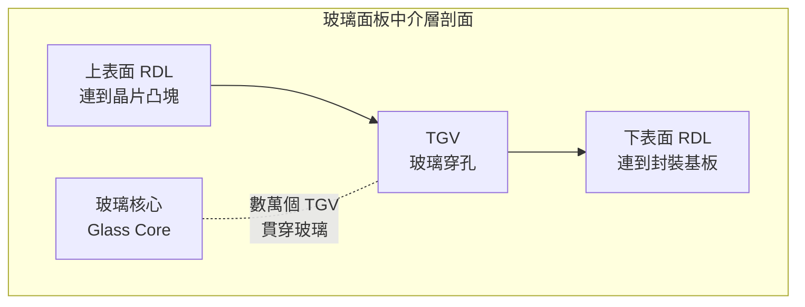

# 玻璃基板（Glass Core / Glass Substrate）

談 CoPoS 幾乎不可能不談玻璃。這兩者常被綁在一起，不是巧合——**把載體從圓形晶圓放大成方形面板，馬上會撞到一個材料問題：什麼東西夠平、夠硬、夠穩定，能撐住這麼大一片還不變形？** 玻璃（glass）正是目前最被看好的答案。本頁假設你已讀過 [封裝基本流程與術語](02-packaging-basics.md) 裡的基板與中介層概念。

## 三種載體材料的對照

先把玻璃放進脈絡。先進封裝的中介層／基板材料主要有三類，各有明顯的長短：

| 特性 | 矽中介板 Silicon | 有機基板 Organic | 玻璃基板 Glass |
|------|---------------------|---------------------|-------------------|
| 剛性（抗變形） | 高 | 低 | **高** |
| 平坦度 | 優 | 中 | **優** |
| 熱膨脹係數（CTE）調控 | 固定（矽） | 較難匹配 | **可調，可貼近矽/晶片** |
| 尺寸穩定性 | 優 | 受濕度與溫度影響 | **優** |
| 大面板可行性 | 受晶圓尺寸限制 | 大面板易翹曲 | **適合大面板** |
| 成本 | 高（需晶圓廠） | 低 | 中（但據報導較矽方案降本） |
| 主要弱點 | 貴、面積受限 | 翹曲、密度低 | **脆性、加工與檢測生態未成熟** |

一句話：**玻璃想同時拿下矽的「剛硬平穩」與有機基板的「便宜、能做大」**，代價是脆性與尚未成熟的產業生態。

## 玻璃如何解決大面板翹曲

[面板級製程挑戰](08-panel-process-challenges.md) 會詳談翹曲（warpage）這個面板級的頭號敵人，這裡先講材料層面：面板越大、疊構層數越多，各層材料熱膨脹係數（Coefficient of Thermal Expansion, CTE）不匹配造成的翹曲越嚴重。翹曲一大，微影對位、覆晶接合、後段搬運全部連鎖出問題。

玻璃的兩個特性正好對症：

1. **高剛性（Young's modulus 高）**：玻璃比有機材料硬得多，同樣尺寸的面板，玻璃在製程熱循環中變形量小得多，能把翹曲壓在可控範圍。台積電公布的驗證數據顯示，導入玻璃載板後封裝翹曲改善約 16%（截至 2026 年中的公開驗證資料）。

2. **CTE 可調且貼近矽**：玻璃的成分可調配，讓它的熱膨脹係數逼近矽晶片，減少「晶片與載體膨脹不同步」造成的應力。這對放在上面的 HBM 與運算 die 的接合可靠度很關鍵。

## 成本效益：據報導可降本約 30%

玻璃基板被產業看好的另一大理由是成本。這裡的降本來自兩條線的疊加：

- **材料與利用率**：玻璃本身可用大片、低成本製造，搭配 [從圓到方：面板尺寸與利用率](06-panel-geometry.md) 講的面板高利用率，單位面積成本下降。
- **取代昂貴的矽中介板**：矽中介板需要晶圓廠級的製程，成本高昂；玻璃面板不必走完整的晶圓廠流程。

綜合下來，據多家產業報導，玻璃核心基板（glass core substrate）方案有望讓封裝成本降低約 **30%**（部分報導在大規模量產後給出 30%–40% 的區間）。需提醒：這是量產成熟後的推估值，早期試產階段因良率與設備折舊，實際成本會高得多。時效性數字請以 [TSMC 布局與時程](09-tsmc-roadmap.md) 為準。

## TGV：玻璃基板的核心技術與難點

玻璃有一個先天矛盾：**它是絕緣體**。要讓訊號與電源縱向穿過玻璃載體，必須在玻璃上打出成千上萬個垂直導電通道——這就是 **TGV（玻璃穿孔，Through-Glass Via）**，功能上對應矽中介板的 TSV（矽穿孔）。

TGV 的挑戰在於：

- **鑽孔**：在脆性玻璃上打出又細又深、孔壁光滑的垂直孔，常用雷射誘導＋蝕刻等技術，孔形與良率是關鍵。
- **金屬化**：在絕緣玻璃孔壁鍍上導體並填實，要避免空洞與裂紋。
- **密度與可靠度**：孔數動輒數萬，任一孔失效都可能報廢整片，對缺陷密度容忍度極低。

TGV 也是玻璃「中介板」（glass interposer）與更遠期路線的技術基礎，這條延伸線見 [未來展望](12-future-outlook.md)。

## 玻璃的風險：脆性、加工與檢測生態

玻璃的優點清單很誘人，但它有一個繞不開的弱點——**脆**。這衍生出三類風險：

1. **脆性與破裂**：搬運、鑽孔、切割、熱循環中，玻璃容易產生微裂紋並擴展成整片破裂，尤其大面板邊角應力集中處。
2. **加工生態不成熟**：玻璃專用的鑽孔、鍍膜、貼合設備與製程參數，尚在建立中，不像矽晶圓有數十年的成熟供應鏈。
3. **檢測難題**：透明、脆性材料的缺陷檢測（尤其 TGV 內部與微裂紋）需要新的量測方法，這與 [面板級製程挑戰](08-panel-process-challenges.md) 提到的面板檢測難題疊加。

正因如此，即便玻璃前景看好，台積電高層也公開表示玻璃基板／CoPoS「沒有捷徑」，距離規模量產仍需時間——玻璃核心基板的商業化量產，多數報導估在 2030 年後。這一點在 [TSMC 布局與時程](09-tsmc-roadmap.md) 有更完整的時間軸。

> 下一頁：[面板級製程挑戰](08-panel-process-challenges.md)　｜　相關頁面：[封裝基本流程與術語](02-packaging-basics.md) ｜ [從圓到方：面板尺寸與利用率](06-panel-geometry.md) ｜ [供應鏈與競爭陣營](10-supply-chain-competition.md)
