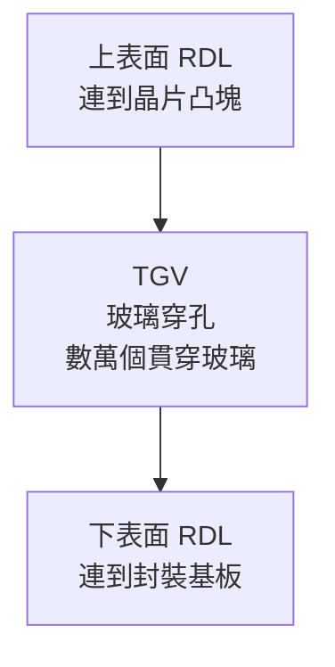

# 玻璃基板（Glass Core / Glass Substrate）

談 CoPoS 幾乎不可能不談玻璃。但這兩者的關係，比市場敘事講的要複雜得多。

!!! danger "先講最重要的一件事"
    **第一代 CoPoS 很可能不用玻璃。**

    2026 年 7 月，《天下雜誌》引述一位熟悉台積電先進封裝的資深研發主管指出：第一代 CoPoS 很可能是「**零玻璃**」的——採用**有機面板核心**，玻璃只作為製程中的**暫時載體**（temporary carrier），而非永久的結構或中介層材料。理由很直接：「玻璃太難處理了。」[傳聞，但屬可信度較高的供應鏈報導]

    這篇報導明確在反駁一個曾推動相關個股上漲的市場敘事。台積電真正的**玻璃核心基板**計畫（與 Ibiden、群創合作，玻璃核心夾在兩層 ABF 之間的三層設計），目標是 **2030 年之後** [報導]。

    所以這一章要分開讀兩件事：**CoPoS 的面板載體**（近期，很可能是有機的），與**玻璃核心基板**（更遠期的獨立路線）。

## 為什麼玻璃仍然值得談

即使第一代用不上，玻璃仍是先進封裝載體的長期候選，因為它處在矽與有機基板之間的一個獨特位置：**想同時拿下矽的「剛硬平穩」與有機基板的「便宜、能做大」。**

## 三種載體材料的實際對照

| 特性 | 矽中介板 | 有機基板（ABF） | 玻璃核心 |
|------|---------|---------------|---------|
| **熱膨脹係數 CTE**（ppm/K） | 約 3.2（與晶片完美匹配） | 約 13–17（差 3–4 倍） | **約 3–10，可透過成分調配** |
| **導熱係數**（W/m·K） | **約 150（優秀）** | 約 0.2–0.3 | **約 1（差）** |
| **尺寸穩定性／翹曲** | 優（但受晶圓尺寸限制） | 超過約 55 mm 封裝尺寸後急遽劣化 | **100 mm 封裝下翹曲 < 20 μm** |
| **介電損耗** tan δ | 低（但矽是半導體，有基板耦合損耗） | 較高 | **約 0.001–0.003（低，高頻優勢）** |
| **細線寬 RDL 能力** | **最佳（次微米，晶圓廠級微影）** | 成熟但約 2 μm 級 | 發展中，各家規格未標準化 |
| **格式可擴展性** | 僅晶圓（300 mm，超過光罩需拼接） | 面板級，可到 600×600 mm 級 | **面板級，且剛性好、可做薄（約 100 μm）** |
| **處理良率** | 薄晶圓處理有自身問題 | 成熟，> 90% | **脆性——面板處理良率約 70–85%** |
| **成熟度（2026）** | 量產多年 | 量產數十年 | **試產／驗證階段** |

## 玻璃的真正賣點，不是散熱

這是一個非常常見的誤解，值得單獨拉出來講。

**玻璃的導熱係數約 1 W/m·K，是矽（約 150）的百分之一量級。** 在一顆上千瓦的 AI 封裝上，這是一個實實在在、尚未解決的工程負債，而不是小問題。

玻璃真正的優勢是另外三項：

1. **CTE 可調且能貼近矽**——減少「晶片與載體膨脹不同步」的應力，這對可靠度是關鍵。
2. **大尺寸下的平坦度與尺寸穩定性**——有機基板超過約 55 mm 就開始劣化，玻璃在 100 mm 級封裝上仍能把翹曲壓在 20 μm 以內。
3. **低介電損耗**——高頻訊號的損耗低，對射頻與光通訊應用是真優勢。

台積電公布的驗證數據也印證這個方向：導入玻璃載板後**封裝翹曲改善約 16%**（另含 CTE 降 19%、彈性模數增 31%）[報導]。注意這些全都是**機械與尺寸**的指標，沒有一項是散熱。

> **結論**：採用玻璃的理由是 CTE 控制、平坦度、低損耗與面板級經濟性；**不是散熱**。任何把玻璃講成散熱解方的說法，都值得懷疑。

## TGV：玻璃基板的核心技術與難點

玻璃有一個先天矛盾：**它是絕緣體**。要讓訊號與電源縱向穿過玻璃載體，必須打出成千上萬個垂直導電通道——**TGV（Through-Glass Via，玻璃穿孔）**，功能上對應矽中介板的 TSV。

```mermaid
flowchart TB
    TOP["上表面 RDL<br/>連到晶片凸塊"]
    TGV1["TGV<br/>玻璃穿孔<br/>數萬個貫穿玻璃"]
    BOT["下表面 RDL<br/>連到封裝基板"]
    TOP --> TGV1 --> BOT
```

主流的成孔方法是 **LIDE（雷射誘導深蝕刻，Laser-Induced Deep Etching）**——先用雷射在玻璃內部改質，再以蝕刻把改質區溶掉。商業上這項技術以 LPKF 為主導 [報導]。

TGV 的四個真實難點：

- **雷射能量一致性**：能量稍有波動，孔形就不一致
- **玻璃破裂**：脆性材料在雷射與蝕刻應力下容易產生微裂紋
- **金屬化**：在絕緣孔壁鍍上導體並填實，高深寬比的銅填充容易產生空洞
- **對位精度**：需要 **10 μm 以下**的對準精度 [報導]

這四項正是台積電把玻璃核心基板放到 2030 年之後的原因 [報導]。

## 全球玻璃陣營：一張「時程都在往後滑」的表

截至 2026 年，玻璃基板的產業現實是——**幾乎每一家的時程都在延後**。

| 玩家 | 進度 | 趨勢 |
|------|------|------|
| **Intel** | 2026 年 1 月於 NEPCON Japan 展示 **EMIB + 玻璃核心**實體樣品：「10-2-10」厚玻璃核心疊構（兩層 800 μm 玻璃、共 20 層 RDL、2 個嵌入式 EMIB 橋），78 × 77 mm，約 1,716 mm² 矽面積，**無微裂紋** [報導]。仍維持 2023 年「本十年下半」的說法，**無產品承諾** | 持平 |
| **Absolics（SKC）** | 喬治亞州 Covington 廠，獲 CHIPS 法案 7,500 萬–1 億美元資助 [官方]。2026 年出貨量產級樣品給 AMD、據報也給 AWS，目標 2026 年底量產 | **報導指其量產日期「一再延後」** |
| **Samsung 電機（SEMCO）** | 與住友化學子公司東友精細化工合資成立 **GlaSSEM**（2026 年 7 月）。原訂 2027 下半年營運，**數週內改口 2028**；更有報導稱因某通訊晶片客戶的可靠度驗證未通過，量產推遲至 **2028 年之後** | **明顯延後** |
| **LG Innotek** | 龜尾廠試產線 | **商業化推遲至 2030 年** |
| **TSMC** | 與 Ibiden、群創合作的三層玻璃核心設計 | **2030 年之後** |
| **玻璃基材供應** | Corning、AGC、Schott、日本電氣硝子（NEG） | 上游材料端相對就緒 |

**這張表本身就是最重要的訊息**：當每一家獨立玩家的時程都在往同一個方向滑，通常代表問題出在技術本身，而不是個別公司的執行。

## TSMC 的立場：明確的懷疑論者

在這場玻璃熱潮中，台積電的態度值得注意——**它是最保守的那一家**。

董事長魏哲家在 2026 年第二季法說會上說：

> 「量產還需要兩到三年，而且**沒有捷徑**。」[官方]

台積電自己的玻璃方案也不是「全押玻璃」，而是保守的混合設計：玻璃核心夾在兩層 ABF 之間。加上第一代 CoPoS 可能根本不用玻璃，可以合理推斷：**台積電把玻璃當成一個需要驗證的選項，而不是既定的路線。**

## 順帶澄清：CPO 與玻璃沒有已證實的關聯

一個流傳很廣、但**查證不到證據**的說法是「共封裝光學（CPO）交換器使用玻璃基板」。

截至 2026 年 9 月，**找不到任何已出貨的 Broadcom 或 NVIDIA CPO 交換器採用玻璃基板的確認**。台積電自己的 CPO 平台 **COUPE** 是基於 SoIC 與矽光子技術，**與玻璃核心是不同的東西** [報導]。

玻璃的低介電損耗確實讓它在光通訊應用上有理論優勢，但「理論上適合」與「已經在用」是兩件事。

## 玻璃的三類風險

1. **脆性與破裂**：搬運、鑽孔、切割、熱循環中容易產生微裂紋並擴展，尤其大面板的邊角應力集中處。這直接反映在 70–85% 的處理良率上（有機基板 > 90%）。
2. **導熱**：如前所述，約 1 W/m·K 是真弱點，在高功率封裝上尚無公認解方。
3. **生態不成熟**：玻璃專用的鑽孔、鍍膜、貼合設備與檢測方法仍在建立中，不像矽晶圓有數十年的成熟供應鏈。透明、脆性材料的缺陷檢測（尤其 TGV 內部與微裂紋）需要全新的量測方法。

> 下一頁：[面板級製程挑戰](08-panel-process-challenges.md)　｜　相關頁面：[從圓到方](06-panel-geometry.md) ｜ [供應鏈與競爭陣營](10-supply-chain-competition.md) ｜ [TSMC 布局與時程](09-tsmc-roadmap.md)
