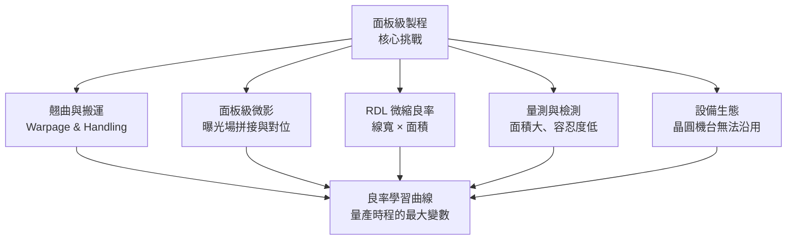

# 面板級製程挑戰

前面幾章把 CoPoS 的好處講得很動人：可用面積放大五倍以上、利用率衝上 90%、玻璃基板降本約三成。這頁是技術深水區，要回答一個殘酷的問題——**既然圓換方這麼好，為什麼不早就做？** 答案是：從圓到方，遠遠不是「把晶圓機台等比放大」就能達成。面板級製程有一整排新難題，每一項都可能把理論紅利打回原形。這也是為什麼 CoPoS 從 310 × 310 mm 起步、逐代放大，而非一步到位。

## 難題全景

## 1. 翹曲與搬運：面板越大越難「拿平」

翹曲（warpage）是面板級封裝的頭號敵人。疊構中各層材料熱膨脹係數（CTE）不匹配，在製程反覆的加熱冷卻中產生應力，讓整片面板彎曲。**面板越大，同樣的翹曲角度換算到邊緣的位移量越大**——這是幾何放大的殘酷之處。

翹曲一大，連鎖反應接踵而來：微影對位對不準、覆晶接合時凸塊接觸不良、真空吸附搬運時面板變形甚至破裂。這也是玻璃基板被引進的直接原因——玻璃的高剛性能把翹曲壓下來（見 [玻璃基板](07-glass-substrate.md)）。但玻璃又帶來脆性，搬運一片大而脆的面板，本身就是新的工程課題：吸附力分佈、支撐點設計、邊角保護，全要重新做。

## 2. 面板級微影：曝光場拼接與對位精度

先進封裝的 RDL 要用微影（lithography）定義。難點在於：**微影曝光機的單次曝光場（exposure field）遠小於一整片 310 × 310 mm 面板**。要在整片面板上做出連續的線路，必須把多個曝光場「拼接（stitching）」起來。

拼接帶來兩個精度問題：

- **拼接對位**：相鄰曝光場的接縫必須精準對齊，否則跨接縫的線路會斷或短路。面板一翹，對位誤差再放大。
- **全域對位（overlay）**：面板上不同位置因翹曲與熱效應產生位移，層與層之間的對位（overlay）要在整片大面積上都守住規格，比在小晶圓上難得多。

晶圓級微影累積數十年的對位技術，無法直接照搬到又大又可能翹曲的面板上，這是面板級設備要重新攻克的核心。

## 3. RDL 微縮良率：線寬越細、面積越大，越難全對

CoPoS 要進高階 AI 封裝，RDL 線寬必須夠細才能提供足夠的 die-to-die 互連密度。問題是良率同時被兩個方向夾擊：

- **線寬越細**：任何一點微塵、缺陷或對位偏差，都更容易造成斷線或短路。
- **面積越大**：同樣的缺陷密度（defects per unit area）之下，面積大五倍，一片面板上「至少中一個致命缺陷」的機率大幅上升。

這是良率的乘法效應：**細線寬 × 大面積 = 對缺陷極度敏感**。要在整片面板上維持高良率，等於要求缺陷密度比晶圓時代還低。這也是為什麼 CoPoS 的良率學習被視為量產時程的最大變數。

## 4. 量測與檢測：面積大五倍，容忍度更低

面板做好了還得檢查。檢測（inspection & metrology）的難處是雙重的：

1. **面積大**：要掃描的面積是晶圓的五倍以上，若沿用晶圓級的逐點檢測速度，吞吐量會崩潰，必須有面板規格的高速檢測設備。
2. **容忍度低**：超大封裝單價高、單片面板承載的價值大，一片報廢的損失遠高於晶圓時代的單顆晶片，因此對漏檢的容忍度更低。

再疊加玻璃的透明與脆性（TGV 內部缺陷、微裂紋難以檢出），面板級檢測本身就是一個尚待成熟的新領域。

## 5. 設備生態：晶圓機台無法直接沿用

前面每一項難題的背後，是同一個結構性事實——**晶圓設備沒辦法直接搬去做面板**。曝光機、鍍膜機、鑽孔（TGV）設備、貼合機、檢測機、搬運自動化，全都要針對矩形大面板重新設計規格。這意味著：

- 一整條新的設備供應鏈要被建立與驗證（2026 年正是設備與材料的驗證年）。
- 台灣面板廠與設備商反而因為有 FOPLP 與顯示面板的既有基礎，取得切入機會——這是 [供應鏈與競爭陣營](10-supply-chain-competition.md) 的重點。
- 設備交機、除錯、製程調校本身就要花掉可觀時間，直接決定量產時程。

## 為什麼良率學習曲線是時程的最大變數

把上面五項收攏起來：翹曲、拼接對位、RDL 微縮、檢測、設備，每一項單獨都難，而它們**彼此耦合**——翹曲惡化對位，對位偏差拉低 RDL 良率，缺陷又更難檢出。這種耦合讓良率的爬升不是線性的，而是需要反覆試錯、逐項打通的**學習曲線（yield learning curve）**。

這正是為什麼 CoPoS 的路線是「先在 310 × 310 mm 把良率學會，再逐代放大到 515 × 510、750 × 620 mm」，也是為什麼台積電高層強調「沒有捷徑」、規模量產仍需二至三年。理論上的幾何紅利是確定的；能不能兌現、什麼時候兌現，取決於這條良率學習曲線爬得多快。實際時程與里程碑，見 [TSMC 布局與時程](09-tsmc-roadmap.md)。

> 相關頁面：[從圓到方：面板尺寸與利用率](06-panel-geometry.md) ｜ [玻璃基板](07-glass-substrate.md) ｜ [TSMC 布局與時程](09-tsmc-roadmap.md) ｜ [供應鏈與競爭陣營](10-supply-chain-competition.md)
