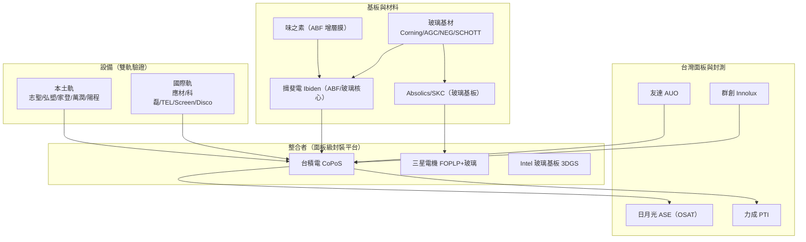

# 供應鏈與競爭陣營

> **資訊時點**：本頁時程與進度為**截至 2026 年中**的公開資訊整理。個別公司進度變動快，數字請對照 [09 TSMC 布局與時程](09-tsmc-roadmap.md) 的時間軸閱讀。

CoPoS 不是台積電一家的獨角戲。把鏡頭拉遠，會看到一場橫跨台、韓、美、日的**面板級封裝（panel-level packaging）＋玻璃基板（glass substrate）**卡位戰。有趣的是，面板級封裝並非台積電發明——扇出型面板級封裝（FOPLP，Fan-Out Panel-Level Packaging）在成熟節點產品上已量產多年（脈絡見 [04 扇出型封裝與 FOPLP](04-fan-out-and-foplp.md)）。AI 需求改變了成本計算，才把這條老技術推上高階舞台。本頁把玩家分陣營、上對照表。

## 主戰場：台積電龍潭的「雙軌驗證」

理解競爭格局，先看台積電自己怎麼設局。截至 2026 年 6 月，TrendForce 報導台積電在龍潭試產線採取**雙軌驗證**（dual-track evaluation）：

- **國際軌**：由國際設備大廠（如應材 Applied Materials、科磊 KLA、東京威力科創 TEL、Screen、Disco 等）主導，製程成熟、生態完整。
- **本土軌**：採用台灣本土設備商方案，主打交期短、成本低、在地支援快。

兩軌在**製程穩定度、交期、成本效率、在地支援**上正面對決。這對台灣供應鏈是難得的切入窗口——過去高階封裝設備幾乎被國際大廠壟斷，CoPoS 的面板規格是一次「重新洗牌」的機會。TrendForce 於 2026 年 6 月的報告明確點出：**台灣面板廠與本土材料／設備商，具備藉 FOPLP 與玻璃基板切入的先行者優勢**（first-mover advantage）——部分業者已在 PMIC、RF 等成熟品用 FOPLP 量產，封裝尺寸甚至做到 750 × 620 mm。

## 台灣陣營：面板廠 + OSAT + 設備材料

台灣的優勢在於「面板製造經驗」與「封測群聚」的結合：

- **面板廠轉封裝**：群創（Innolux）已與台積電及日本基板大廠揖斐電（Ibiden）合作推進 CoPoS 玻璃基板驗證，聚焦高密度 RDL 與 TGV（Through-Glass Via，玻璃穿孔）；友達（AUO）亦布局面板級封裝。面板廠握有大尺寸基板的搬運、曝光、對位 know-how，正好對上 CoPoS 的痛點。
- **OSAT（委外封測）**：日月光投控（ASE）在封測龍頭地位穩固，可望承接台積電訂單外溢；力成（PTI）等已有部分 FOPLP 產線量產中。
- **設備商**：溼製程的辛耘、弘塑；自動化與搬運的家登、盟立、萬潤；熱製程／烘烤的志聖（GPTC）、印能；塗佈的陽程；光學檢測（AOI）的相關業者——都是雙軌驗證中「本土軌」的候選名單。
- **基板材料驗證細節**：據報導，目前玻璃基板測試載體切自 250 × 250 mm 整片，ABF（Ajinomoto Build-up Film，味之素增層膜）採 GL107 等級，測試層數達 24–28 層，對應 2027–2028 年 AI 晶片的主流規格。

## 韓國陣營：Samsung 系 + Absolics（SKC）

韓國走的是**玻璃基板 + FOPLP 雙押**：

- **三星電機（Samsung Electro-Mechanics, SEMCO）**：在世宗（Sejong）廠營運玻璃基板試產線，量產目標鎖定 **2027 年之後**；同時推進 FOPLP。
- **Absolics（SKC 子公司）**：玻璃基板專業廠，已在美國喬治亞州（Georgia）完成高量產設施，目標在 **2026 年底前**拿下 AMD、Amazon 等客製 AI 硬體訂單。母公司 SKC 於 2026 年 3 月宣布，將 1 兆韓元增資中的逾半數（逾 6,000 億韓元）投入 Absolics 加速玻璃基板。
- 韓國同時在**玻璃基板標準**上挑戰 Intel，Absolics 與三星加速商業化。

## 美國陣營：Intel 的玻璃基板長線

Intel 押注**玻璃基板標準化**，時間軸更長：

- Intel 投入逾 10 億美元加速玻璃基板量產，瞄準 **2030 年標準化**；推進 3DGS 方案。
- Intel 與 3DGS 規劃投資約 33 億美元，在印度奧迪夏（Odisha）建基板廠，工期五到六年。
- 產業敘事上，Intel 與 Samsung 被視為「把有機基板換成玻璃」的兩大推手——玻璃可讓訊號傳輸功耗降約 50%，對 AI 訓練的能耗至關重要。

## 日本與材料端：隱形關鍵

- **揖斐電（Ibiden）**：日本 ABF 載板龍頭，與台積電、群創合作開發玻璃核心載板，是 CoPoS 基板端的關鍵夥伴。
- **味之素（Ajinomoto）**：ABF 增層膜的實質獨占供應商，面板級製程仍繞不開它。
- **玻璃基材**：康寧（Corning）、AGC、日本電氣硝子（NEG）、SCHOTT 等玻璃廠，是 TGV 與玻璃核心的上游。
- **面板設備**：德國 SCHMID 等業者於 2026 年 5 月透露正配合台積電推進 310 × 310 mm 面板級封裝、玻璃整合評估中。

## 競爭陣營對照表（公司 × 技術路線 × 進度）

> 進度為**截至 2026 年中**的公開資訊；「路線」指該公司在面板級／玻璃基板的主要打法。

| 陣營 | 代表公司 | 技術路線 | 進度（截至 2026 年中） |
|------|----------|----------|------------------------|
| 台灣 | 台積電 TSMC | CoPoS（面板級 + 玻璃核心） | 龍潭試產線 2026 上半年建置完成；量產目標 2028 H2 |
| 台灣 | 群創 Innolux | 面板廠轉封裝、玻璃基板、Chip-Last | 與 TSMC、Ibiden 合作驗證中 |
| 台灣 | 友達 AUO | FOPLP、面板級封裝 | 布局中 |
| 台灣 | 日月光 ASE | OSAT，承接訂單外溢 | 封測龍頭，量產能量現成 |
| 台灣 | 力成 PTI | FOPLP | 部分成熟品產線已量產 |
| 韓國 | 三星電機 SEMCO | 玻璃基板 + FOPLP | 世宗試產線；量產目標 2027 之後 |
| 韓國 | Absolics（SKC） | 玻璃基板專業廠 | 喬治亞廠完工；2026 底搶 AMD／Amazon 訂單 |
| 美國 | Intel | 玻璃基板（3DGS）、標準化 | 目標 2030 標準化；印度建廠五到六年 |
| 日本 | 揖斐電 Ibiden | ABF 載板、玻璃核心載板 | 與 TSMC／群創共同開發 |
| 日本 | 味之素 Ajinomoto | ABF 增層膜（材料） | 實質獨占，面板級持續供應 |

## 陣營與供應鏈全景

## 怎麼讀這場競局

- **台積電打「整合＋在地供應鏈」**：靠雙軌驗證培養本土設備材料，降低對國際大廠的依賴，也給台廠一次上位機會。
- **韓國押「玻璃基板專業化」**：Samsung 系 + Absolics 想在玻璃這條上游卡標準、搶客戶。
- **Intel 打「長線標準」**：時間軸拉到 2030，賭的是標準話語權而非近期量產。
- **日本掌上游材料咽喉**：Ibiden 與 Ajinomoto 不管誰贏，都要用它們的料。

一句話總結供應鏈的機會：**面板級封裝的價值正從「整合者」往「設備、基板、材料」擴散**——這也是 2026 年台灣供應鏈概念股熱度的根源。但別忘了 [09](09-tsmc-roadmap.md) 的時程風險：若 CoPoS 量產延到 2029–2030，押早期爆發的供應商將面臨落空風險，反而是 CoWoS／SoIC 續攤的受惠者能見度更長。

技術路線的正面比較（CoWoS、CoPoS、SoW-X），見 [11 CoWoS、CoPoS、SoW-X 比較](11-copos-vs-alternatives.md)；值得長期追蹤的訊號清單，見 [12 未來展望](12-future-outlook.md)。

---

## 參考來源（標註日期）

- TrendForce 新聞稿，〈TSMC Accelerates CoPoS Development; Taiwan Panel Makers and Local Materials and Equipment Suppliers Leverage FOPLP for Glass Core Substrate Opportunity〉，2026-06-17。
- TrendForce，〈TSMC Reportedly Runs Dual-Track Evaluation on CoPoS Pilot Line, Sparking Global, Local Vendor Competition〉，2026-06-16。
- TrendForce，〈SKC Reportedly Channels Over Half of ₩1T Capital Increase Into Absolics〉，2026-03-03。
- TrendForce，〈Intel Advances Glass Substrate Push with 3DGS, US$3.3 Billion India Plant〉，2026-06-01。
- TrendForce，〈Korea Challenges Intel on Glass Substrate Standards as Absolics, Samsung Accelerate Commercialization〉，2026-04-15。
- TrendForce，〈SCHMID Flags TSMC Panel-Level Packaging Push: 310×310mm Progress, Glass Integration Under Review〉，2026-05-19。
- 鉅亨網／今周刊／經濟日報，台積電 CoPoS 供應鏈受惠名單與群創、Ibiden 合作報導，2026-04 至 2026-06。
- FinancialContent，〈Glass Substrates: Intel and Samsung Pivot to Next-Gen AI Packaging〉，2026-02。

> 公司進度變動快。若讀者所在時點已晚於 2026 年中，請以最新 TrendForce 報告與各公司法說內容校正本頁進度欄。
