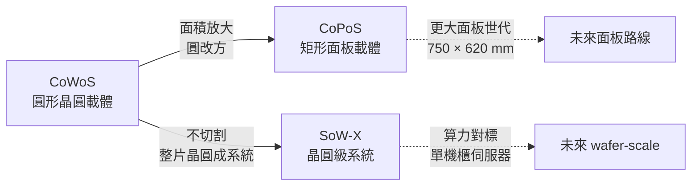
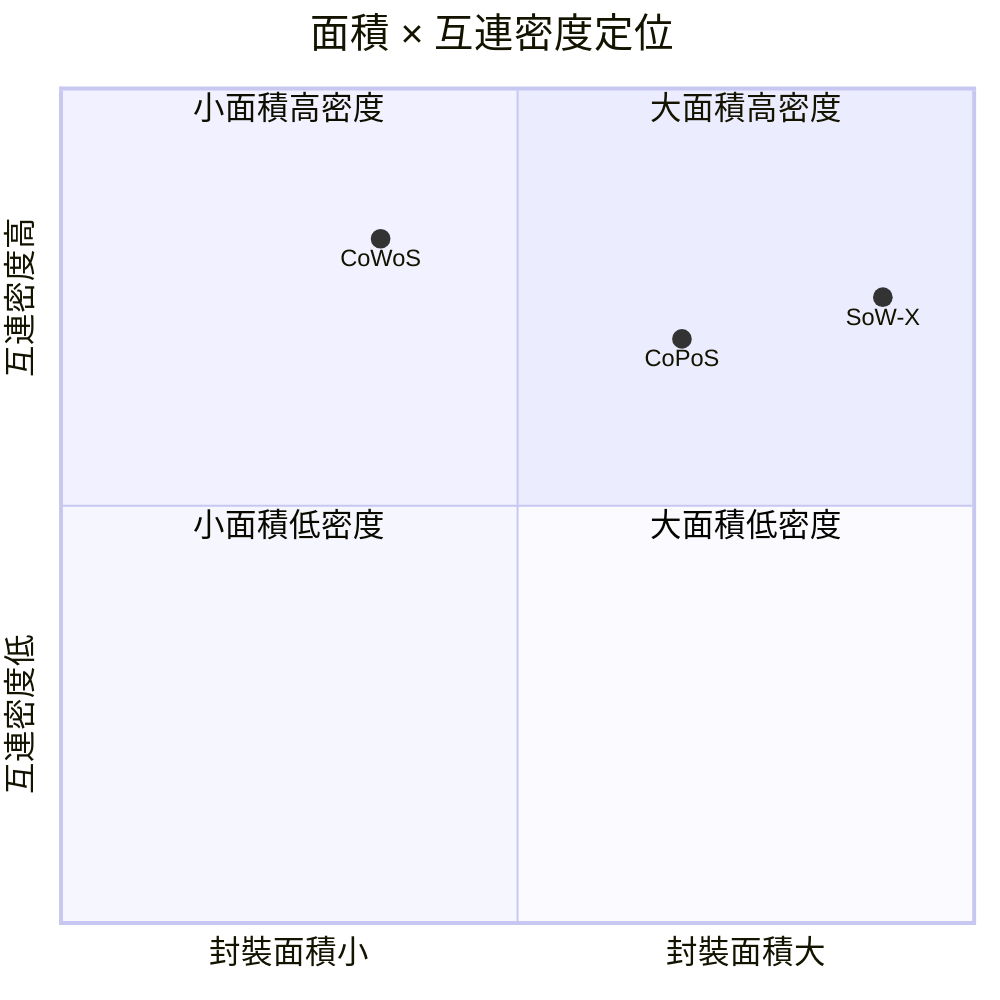

# CoWoS、CoPoS、SoW-X 技術比較

進階讀者最關心的問題往往不是「CoPoS 是什麼」，而是「**我的產品到底該選哪一種封裝**」。本頁把台積電（TSMC）現階段三條主要的超大封裝路線——CoWoS（Chip-on-Wafer-on-Substrate）、CoPoS（Chip-on-Panel-on-Substrate）、SoW-X（System-on-Wafer-X）——放在同一張桌子上比較，並給出一張「面積 × 互連密度」的定位圖，幫助你在 HBM4（第四代高頻寬記憶體，High Bandwidth Memory）世代做封裝選型。

!!! info "時效性提醒"
    本頁的時程與規格數字以觀念比較為主，具體里程碑請以[TSMC 布局與時程](09-tsmc-roadmap.md)為準（該頁標註「截至何時」）。三條路線都在快速演進，數字會變，但**定位邏輯**相對穩定。

## 三條路線的一句話定位

- **CoWoS**——今天的主力。以圓形晶圓（wafer）作為封裝載體，用矽中介板（silicon interposer）承載晶片與 HBM。成熟、量產中，但受限於[光罩極限（reticle limit）](01-why-advanced-packaging.md)與圓形晶圓的[幾何浪費](06-panel-geometry.md)。
- **CoPoS**——明天的主力。把圓形晶圓換成 310 × 310 mm 的矩形[面板（panel）](05-copos-overview.md)，可用面積放大五倍以上、材料利用率突破 90%。定位在 CoWoS 與 SoW-X 之間，是「把封裝做大」最務實的中間路線。
- **SoW-X**——另一個極端。走「**整片晶圓當一個封裝**」的 wafer-scale 路線，不再切割，把運算 die、SoIC、HBM 全部整合在單一晶圓級系統上，目標是逼近一整台伺服器的算力。

## 核心比較表

下表以「面積上限、互連密度、成本結構、成熟度」四個維度並排三條路線。數字為公開資訊整理的量級基準，用來理解相對關係，而非精確規格。

| 維度 | CoWoS | CoPoS | SoW-X |
|------|-------|-------|-------|
| **封裝載體** | 12 吋圓形晶圓 | 310 × 310 mm 矩形面板（後續世代傳出 750 × 620 mm） | 整片 12 吋晶圓（不切割） |
| **面積上限** | 受中介板尺寸與 reticle 倍數限制；業界推進至約 9.5 倍 reticle（TSMC 以約 830 mm² reticle 計，中介板約 7,885 mm²），基板約 120 × 150 mm | 可用面積達 12 吋晶圓的五倍以上；單一超大封裝空間最寬裕 | 以整片晶圓為系統邊界，面積最大但形態最特殊 |
| **互連密度** | 最高。矽中介板可做最細線寬 RDL 與 micro-bump，適合超高頻寬需求 | 高，但面板級 [RDL（重佈線層，Redistribution Layer）](02-packaging-basics.md)線寬微縮在大面板上的良率是關鍵變數；玻璃基板有助對位精度 | 高且連續，晶圓級互連可跨 die 無縫延伸，但設計與良率複雜度最高 |
| **HBM 容納量** | 受面積限制，單封裝 HBM 數量趨於飽和 | 面積放大後可塞入更多 HBM 堆疊與 I/O chiplet | 最多，可整合十餘顆以上 HBM 與多運算 die |
| **成本結構** | 圓形晶圓幾何浪費（利用率不到 70%）推高單位成本；產能吃緊 | 面積利用率 90%+，玻璃基板路線據產業報導可降約 30% 成本；但設備與良率學習期先付出前期成本 | 單片價值極高、良率風險集中；一片報廢損失巨大，成本模型最激進 |
| **成熟度（截至 2026 年中）** | 量產多年，最成熟 | 試產線 2026 年中完成，規劃 2027 試產、2028 下半年量產 | 規劃 2027 進入量產，wafer-scale 生態仍在建立 |
| **典型定位** | 現役 AI 加速器主流 | 下一代大封裝主力，HBM4 世代承接者 | 極致算力密度的旗艦系統 |

!!! note "為什麼 CoPoS 落在中間"
    CoWoS 受制於「圓」的幾何與 reticle 倍數；SoW-X 用「不切割」換取極致整合，卻把良率風險集中在單片晶圓上。CoPoS 則用「換成方板」這個相對漸進的改變，在**面積、成本與可製造性**之間取得平衡——不必推翻既有的 chiplet + HBM 設計思路，就能把封裝放大一個量級。這也是台積電同時保留三條路線、而非單押一條的原因。

## 定位圖：面積 × 互連密度

把三者放在「封裝面積」與「互連密度」兩軸上，可以看出它們並非彼此取代，而是覆蓋不同的產品需求象限。

解讀：

- **CoWoS** 位於「面積中偏小、密度最高」——它靠矽中介板把互連做到極致，但面積受限。
- **CoPoS** 向右移動——面積顯著放大，密度仍高，是面積擴張與密度兼顧的務實選擇。
- **SoW-X** 落在最右——面積最大，但代價是最高的良率與設計複雜度。

## 對 HBM4 世代的封裝選型影響

進入 HBM4 時代，單顆加速器要餵飽的記憶體頻寬與容量再上一階，封裝面積需求成長速度超過晶片本身。選型的實務判斷可以簡化為三問：

1. **需要多少 HBM／面積？** 若既有 CoWoS 面積已能滿足，沒有理由提前承擔新製程風險；一旦 HBM 數量撞到面積天花板，CoPoS 的五倍可用面積就成為剛需。
2. **能承受多大的良率與成本風險？** SoW-X 的單片高價值意味著良率波動的財務衝擊最大，適合少量、極致算力的旗艦產品；CoPoS 的風險介於兩者之間。
3. **產品的量產時間點落在哪一年？** CoWoS 現在就有；CoPoS 要等到 2028 下半年放量；SoW-X 規劃 2027 量產但生態最新。時程本身就是選型約束。

換句話說：**CoWoS 是現在、CoPoS 是主力接班人、SoW-X 是旗艦特化路線**。三者並存數年，而非一刀切換。這個過渡策略的細節見[TSMC 布局與時程](09-tsmc-roadmap.md)與[供應鏈與競爭陣營](10-supply-chain-competition.md)。

## 延伸閱讀

- 面板為何能放大面積：[從圓到方：面板尺寸與利用率](06-panel-geometry.md)
- 為什麼玻璃基板常與 CoPoS 綁在一起：[玻璃基板](07-glass-substrate.md)
- 面板放大後的真正難點：[面板級製程挑戰](08-panel-process-challenges.md)
- 接下來 3–5 年的追蹤訊號：[未來展望](12-future-outlook.md)
