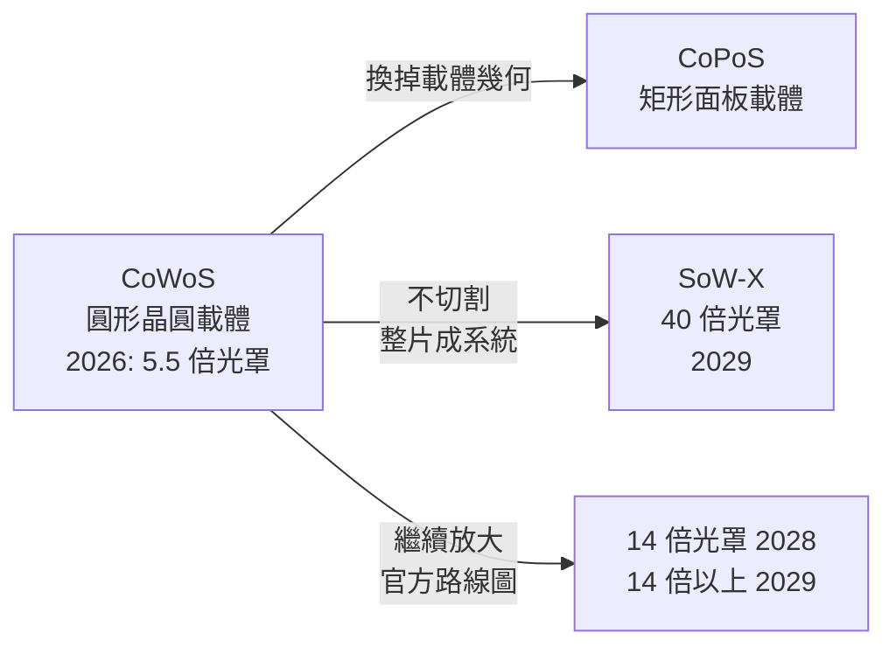
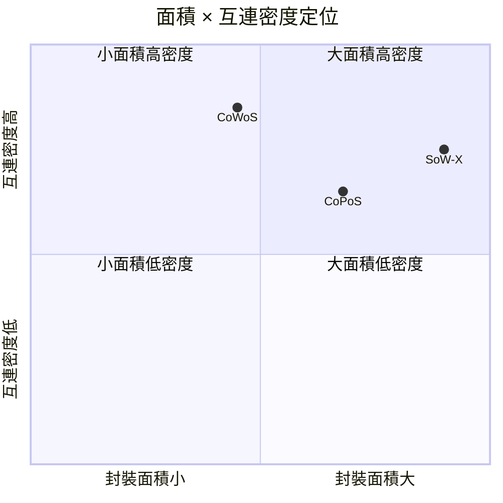

# CoWoS、CoPoS、SoW-X 技術比較

進階讀者最關心的問題往往不是「CoPoS 是什麼」，而是「**我的產品該選哪一種封裝**」。本頁把台積電三條主要的超大封裝路線放在同一張桌子上比較。

!!! info "時效性提醒"
    本頁時程與規格以 **2026 年 9 月**為準，具體里程碑請以 [09 TSMC 布局與時程](09-tsmc-roadmap.md) 為準。三條路線都在演進，**數字會變，但定位邏輯相對穩定**。

## 三條路線的一句話定位

- **CoWoS**——今天與可預見未來的主力。以圓形晶圓為載體，用矽中介板或局部矽橋承載晶片與 HBM。成熟、量產中，**而且路線圖在 2026 年又往上加了兩層**。
- **CoPoS**——把圓形晶圓換成 310 × 310 mm 的矩形面板。定位在「CoWoS 已經塞不下」的那一小群產品，是**補充**而非取代。
- **SoW-X**——另一個極端。走「整片晶圓當一個封裝」的 wafer-scale 路線，不再切割。**目標已從 2027 推遲到 2029。**

```mermaid
flowchart LR
    A["CoWoS<br/>圓形晶圓載體<br/>2026: 5.5 倍光罩"] -->|"換掉載體幾何"| B["CoPoS<br/>矩形面板載體"]
    A -->|"不切割<br/>整片成系統"| C["SoW-X<br/>40 倍光罩<br/>2029"]
    A -->|"繼續放大<br/>官方路線圖"| D["14 倍光罩 2028<br/>14 倍以上 2029"]
```

## 一個必須先講的更新

很多 2025 年的資料把 CoPoS 描述成「CoWoS 撞牆之後的必然接班人」。**2026 年的官方路線圖讓這個敘事需要修正。**

台積電在 2026 年北美技術論壇上把 CoWoS 的路線圖**又往上加了兩層**：

| 年份 | CoWoS 規模 | 配置 |
|------|-----------|------|
| 2026（量產中） | **5.5 倍光罩** | 12 顆 HBM，基板 >100×100 mm，**良率 >98%** |
| 2027 | 9.5 倍光罩 | 12 顆以上 HBM，基板 120 × 150 mm |
| **2028（新增）** | **14 倍光罩** | 約 10 顆大型運算 die + 20 顆 HBM |
| **2029（新增）** | **14 倍光罩以上** | 最高 24 顆 HBM5E |

**換句話說，CoWoS 的天花板比 2025 年時所以為的高得多。** 而 CoPoS 最樂觀的量產時點是 2028 下半年——那時 CoWoS 已經在做 14 倍光罩了。

這正是台積電說「CoPoS 是補充」的實質含義，也是主管說「面板封裝短期內不會取代 CoWoS」（因為晶圓級 CoWoS 已能容納 **58 顆 die**）的根據。

## 核心比較表

| 維度 | CoWoS | CoPoS | SoW-X |
|------|-------|-------|-------|
| **封裝載體** | 12 吋圓形晶圓 | 310 × 310 mm 矩形面板 | 整片 12 吋晶圓（不切割） |
| **面積上限** | 2026 年 5.5 倍光罩量產；路線圖至 14 倍以上（2029） | 面板毛面積為晶圓 1.36 倍；**紅利集中在 3.5 倍光罩以上的封裝** | 40 倍光罩，最高 64 顆 HBM |
| **互連密度** | **最高**。矽中介板／矽橋可做最細線寬 | 高，但面板級細線寬（目標 2/2 μm）在大面積上的良率是關鍵變數 | 高且連續，晶圓級互連可跨 die 無縫延伸 |
| **HBM 容納量** | 2026 年 12 顆；2029 年路線圖 24 顆 | 面積放大後理論上可更多 | 最高 64 顆（若用 64 GB 堆疊，等於單一系統 4 TB） |
| **成本結構** | 幾何浪費推高單位成本，但良率已達 98%+ | 利用率 90%+；但設備與良率學習期先付出前期成本 | 單片價值極高、良率風險集中，一片報廢損失巨大 |
| **成熟度（2026）** | **量產多年，最成熟，良率 >98%** | 試產線驗證中；量產 2028 下半年–2030（各家說法不一） | 規劃 2029 量產，生態仍在建立 |
| **典型定位** | **現役與下一代 AI 加速器的絕對主流** | 超出 CoWoS 經濟性的極大型封裝（近期為利基） | 極致算力密度的旗艦系統 |

!!! note "為什麼 CoPoS 落在中間"
    CoWoS 受制於「圓」的幾何；SoW-X 用「不切割」換取極致整合，卻把良率風險集中在單片晶圓上。CoPoS 用「換成方板」這個相對漸進的改變，在**面積、成本與可製造性**之間取得平衡——不必推翻既有的 chiplet + HBM 設計思路。

    但要注意：**這三條路線並非等權重。** 就 2026–2029 的實際出貨量而言，CoWoS 會是壓倒性的主流，CoPoS 與 SoW-X 都是特化路線。

## 定位圖：面積 × 互連密度

```mermaid
quadrantChart
    title 面積 × 互連密度定位
    x-axis "封裝面積小" --> "封裝面積大"
    y-axis "互連密度低" --> "互連密度高"
    quadrant-1 "大面積高密度"
    quadrant-2 "小面積高密度"
    quadrant-3 "小面積低密度"
    quadrant-4 "大面積低密度"
    CoWoS: [0.45, 0.85]
    CoPoS: [0.68, 0.65]
    SoW-X: [0.9, 0.75]
```

解讀：

- **CoWoS** 密度最高，且面積隨路線圖持續右移——它不是一個靜止的參考點。
- **CoPoS** 面積更大，但**面板級細線寬的良率讓它的密度目前低於 CoWoS**。這是它現階段最實在的技術差距。
- **SoW-X** 面積最大，代價是最高的良率與設計複雜度。

## 選型的三個實務問題

進入 HBM4 世代，封裝選型的實務判斷可以簡化為三問：

### 1. 你的封裝有多大？

- **3.5 倍光罩以下**：直接用 CoWoS。面板給不了你什麼——[幾何紅利在這個尺寸下並不顯著](06-panel-geometry.md)。
- **3.5 到 14 倍光罩**：CoWoS 的路線圖已經涵蓋這個範圍，且良率已驗證。除非有其他理由，沒必要承擔新製程風險。
- **超過 CoWoS 能經濟地做到的範圍**：這才是 CoPoS 的舞台。

### 2. 你能承受多大的良率與時程風險？

CoWoS 的 5.5 倍光罩產品良率已達 **98% 以上**——這是一個經過驗證的數字。CoPoS 的面板級良率**目前沒有任何公開數據**，因為還沒有 AI 等級的產品量產過。

SoW-X 的單片高價值意味著良率波動的財務衝擊最大，適合少量、極致算力的旗艦產品。

### 3. 你的量產時間點落在哪一年？

- **CoWoS**：現在就有，且路線圖延伸到 2029
- **CoPoS**：2028 下半年到 2030，區間很寬
- **SoW-X**：2029（已從 2027 推遲）

**時程本身就是最硬的選型約束。** 如果你的產品要在 2027 出貨，CoPoS 根本不在選項裡。

## 一句話總結

**CoWoS 是現在，而且比想像中能撐更久；CoPoS 是特定尺寸區間的補充，不是全面接班人；SoW-X 是旗艦特化路線，而且已經延後。**

三者並存數年，按封裝面積與整合密度分工，而不是一刀切換。

## 延伸閱讀

- 面板為何能放大面積、以及那個 3.5 倍光罩的前提：[06 從圓到方](06-panel-geometry.md)
- 為什麼第一代 CoPoS 可能不用玻璃：[07 玻璃基板](07-glass-substrate.md)
- 面板放大後的真正難點：[08 面板級製程挑戰](08-panel-process-challenges.md)、[13 面板級製程流程](13-process-flow.md)
- 接下來 3–5 年的追蹤訊號：[12 未來展望](12-future-outlook.md)
