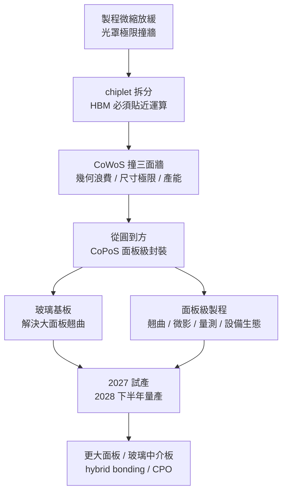

# 未來展望

本頁收斂全書，把前面各章的線索收攏成一句主線，並給出接下來 **3–5 年**（約 2026–2030）值得持續追蹤的訊號清單。CoPoS（Chip-on-Panel-on-Substrate）量產前的資訊變動快，與其記憶零散數字，不如建立一套「該盯哪些指標」的觀測框架。

## 全書收斂：一條主線

把全書濃縮成一句話：**當製程微縮撞牆、AI 加速器的封裝面積需求成長得比晶片本身還快，把封裝載體從「圓的晶圓」換成「方的面板」，就成為把封裝再放大一個量級的最務實路徑。**

這條主線串起了各部：

CoPoS 不是 CoWoS 的簡單放大版，而是一次牽動玻璃基板、面板級 RDL（重佈線層，Redistribution Layer）、設備與材料供應鏈的典範轉移。理解它，就是理解 2030 年前 AI 硬體封裝的主戰場。

## 四個值得關注的技術方向

### 1. 更大面板世代（750 × 620 mm）

310 × 310 mm 只是起步。產業已傳出後續世代規劃推進到 **750 × 620 mm** 的更大面板，可用面積再放大一個量級。面板越大，單顆超大封裝的攤提成本越低，但[翹曲（warpage）](08-panel-process-challenges.md)、搬運與量測的難度也同步升高——面板世代能否順利放大，本身就是最值得追蹤的技術指標。

### 2. 玻璃中介板與 TGV 成熟化

目前談 CoPoS 多聚焦[玻璃基板（glass substrate）](07-glass-substrate.md)作為封裝載體。下一步是**玻璃中介板（glass interposer）**——用玻璃取代部分矽中介板的角色，配合 TGV（玻璃穿孔，Through-Glass Via）做垂直互連。玻璃的平坦與尺寸穩定性有利於大面板的細線寬對位，若 TGV 的可靠度（銅填充、熱循環耐受）在量產尺度站穩，將進一步壓低成本並提升密度。

### 3. 面板級混合鍵合（hybrid bonding）的可能性

互連密度的下一個台階是 **hybrid bonding（混合鍵合）**——以銅對銅直接鍵合取代 micro-bump，把互連間距推向次微米級。目前 hybrid bonding 主要在晶圓級驗證，能否搬到面板尺度、在大面積上維持對位精度與潔淨度，是決定 CoPoS 密度上限的關鍵變數。

### 4. CPO（共封裝光學）與 CoPoS 的交會

AI 叢集的瓶頸正從「晶片內」外移到「晶片間與機櫃間」的資料傳輸。**CPO（共封裝光學，Co-Packaged Optics）**把光引擎搬到封裝內，緊貼運算晶片。CoPoS 的大面板面積正好給 CPO 更寬裕的擺放空間，兩者的交會可能是下一代 AI 網路封裝的核心形態——這也是為什麼「大面積 + 高密度」的封裝載體會被同時多方押注。

## 3–5 年追蹤訊號清單

與其追逐每則新聞，不如盯住以下幾類**先行指標**。任何一項出現明確變化，往往比法說會的口號更能反映 CoPoS 的真實進度。

| 訊號類別 | 具體要盯什麼 | 為什麼重要 |
|---------|------------|-----------|
| **試產良率** | 試產線的良率學習曲線是否如期爬升；大面板翹曲與缺陷密度是否收斂 | 良率是量產時程的最大變數，決定 2028 下半年量產能否兌現 |
| **首批採用客戶產品** | 哪一家客戶、哪一顆 AI 加速器率先採用 CoPoS 出貨 | 第一個量產產品是技術「可製造」的最硬證據 |
| **設備訂單動向** | 面板級曝光機、雷射鑽孔（TGV）、面板檢測設備的訂單與交機節奏 | 設備生態成形速度直接約束產能爬升；訂單是領先產出的前置訊號 |
| **玻璃基板供給** | Absolics（SKC）、Intel 等玻璃基板／玻璃中介板的量產與良率進展 | 玻璃供給是 CoPoS 成本優勢能否落地的瓶頸之一 |
| **面板世代放大** | 是否有 750 × 620 mm 更大面板的設備與試線消息 | 面板放大是成本再下探的下一級台階 |
| **競爭陣營節奏** | Samsung 的 FOPLP 路線、Intel 玻璃基板計畫的里程碑 | 反映面板級封裝是否成為全產業共識而非單一玩家豪賭 |

!!! tip "怎麼用這張清單"
    把它當成「儀表板」而非「待辦清單」。當多個指標同向轉好（例如良率爬升 + 首個客戶產品曝光 + 設備訂單放量），代表 CoPoS 從「規劃」進入「兌現」；若試產良率長期卡關、設備訂單延後，則量產時程可能後移。時效性最強的具體數字，請以[TSMC 布局與時程](09-tsmc-roadmap.md)為準。

## 結語

CoPoS 的故事本質上是一個關於「幾何」的故事——把圓改成方，聽起來簡單，卻牽動了從材料、設備到供應鏈的整個生態。台積電董事長魏哲家說玻璃基板與 CoPoS「沒有捷徑」，距離規模量產仍需二至三年。這正是本書的價值所在：在技術落地前，先建立一套能看懂後續每一則進展的心智模型。

順著這條主線讀下去，當 2028 年第一顆 CoPoS 封裝的 AI 加速器出貨時，你不會覺得意外——因為你早已知道該盯哪些訊號。

## 延伸閱讀

- 三條路線如何分工：[CoWoS、CoPoS、SoW-X 技術比較](11-copos-vs-alternatives.md)
- 名詞速查：[術語表](appendix-glossary.md)
- 想追原始出處：[學習資源](appendix-references.md)
