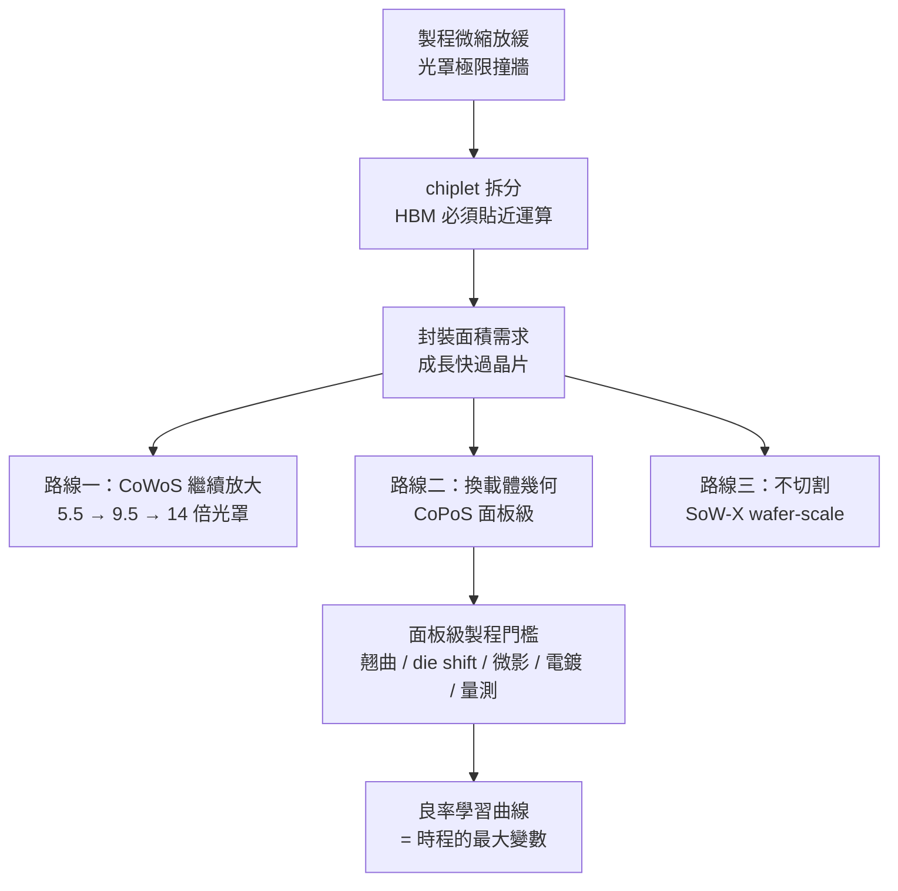

# 未來展望

本頁收斂全書，並給出接下來 **3–5 年**（約 2026–2030）值得追蹤的訊號清單。CoPoS 量產前資訊變動快，與其記憶零散數字，不如建立一套「該盯哪些指標」的觀測框架。

## 全書收斂：一條主線，加一個修正

把全書濃縮成一句話：

> **當製程微縮撞牆、AI 加速器的封裝面積需求成長得比晶片本身還快，把封裝載體從「圓的晶圓」換成「方的面板」，是把封裝再放大一個量級的一條務實路徑。**

但 2026 年的資訊要求我們加一個修正：

> **這條路徑比 2025 年時所以為的更窄、也更慢。CoWoS 的路線圖在同一年往上加了兩層，而第一代 CoPoS 很可能連玻璃都不用。**

```mermaid
flowchart TD
    A["製程微縮放緩<br/>光罩極限撞牆"] --> B["chiplet 拆分<br/>HBM 必須貼近運算"]
    B --> C["封裝面積需求<br/>成長快過晶片"]
    C --> D1["路線一：CoWoS 繼續放大<br/>5.5 → 9.5 → 14 倍光罩"]
    C --> D2["路線二：換載體幾何<br/>CoPoS 面板級"]
    C --> D3["路線三：不切割<br/>SoW-X wafer-scale"]
    D2 --> E["面板級製程門檻<br/>翹曲 / die shift / 微影 / 電鍍 / 量測"]
    E --> F["良率學習曲線<br/>= 時程的最大變數"]
```

## 四個值得關注的技術方向

### 1. 更大面板世代

310 × 310 mm 只是起步，後續世代規劃指向 515 × 510 mm 等更大格式。但要注意：**台積電曾試過 515 × 515 mm 又退回 310 × 310 mm** 來控制翹曲風險 [報導]。

面板放大不是必然的——它取決於翹曲、搬運與量測能否同步跟上。**「是否有更大面板的設備訂單」本身就是最好的技術進度指標。**

也別把其他業者的格式當成台積電的路線圖：600 × 600 是 Nepes、650 × 650 是 Amkor、700 × 700 是 SpaceX 的選擇。

### 2. 玻璃：從「解方」回到「選項」

2025 年的敘事把玻璃當成 CoPoS 的必然搭配。2026 年的證據要保守得多：

- 第一代 CoPoS 很可能是**有機核心**，玻璃只當暫時載體 [報導]
- **每一家玻璃基板玩家的時程都在延後**（三星電機、LG Innotek、Absolics）
- 玻璃的**導熱係數約 1 W/m·K**，在高功率封裝上是尚未解決的真弱點
- 台積電自己的玻璃核心基板目標是 **2030 年之後**

玻璃仍然值得追蹤——它的 CTE 可調性、平坦度與低介電損耗是真優勢。但它現在應該被理解為**一個需要驗證的長期選項**，而不是近期的既定路線。詳見 [07 玻璃基板](07-glass-substrate.md)。

### 3. 面板級混合鍵合：還很遠

互連密度的下一個台階是**混合鍵合（hybrid bonding）**——以銅對銅直接鍵合取代 micro-bump。

但要有現實感：混合鍵合目前**連在晶圓級都還在推進中**（台積電 SoIC 2025 年達 6 μm 間距、2029 年目標 4.5 μm）。它要求原子級的表面平坦度與極致的潔淨度——把這些要求搬到一片 310 mm 見方、可能還有翹曲的面板上，難度是另一個量級。

**這是一個值得追蹤、但不該期待在本十年內落地的方向。**

### 4. CPO 與大面積載體的交會

AI 叢集的瓶頸正從「晶片內」外移到「晶片間與機櫃間」。**CPO（共封裝光學）** 把光引擎搬進封裝，緊貼運算晶片。大面板的面積正好給 CPO 更寬裕的擺放空間。

但同樣要澄清一個流傳很廣的說法：截至 2026 年 9 月，**找不到已出貨的 CPO 交換器採用玻璃基板的證據**。台積電自己的 CPO 平台 COUPE 基於 SoIC 與矽光子，與玻璃核心是不同的東西。

「玻璃適合光通訊」是合理的技術推論，不是已確認的產業事實。

## 3–5 年追蹤訊號清單

與其追逐每則新聞，不如盯住以下**先行指標**。任何一項出現明確變化，都比法說會的口號更能反映真實進度。

| 訊號 | 具體要盯什麼 | 為什麼重要 |
|------|------------|-----------|
| **試產良率** | 試產線良率學習曲線是否如期爬升；翹曲與缺陷密度是否收斂 | 良率是量產時程的最大變數。台積電自己說「還需約一年才能穩定」 |
| **第一個 AI 級面板產品** | 哪一家客戶、哪一顆加速器率先用面板封裝出貨 | **目前全球沒有任何 AI 加速器級面板產品量產**——第一個出現時，才是真正的轉折點 |
| **細線寬的實績** | 是否有業者在大面板上實際達到 2/2 μm 線寬線距的量產良率 | 這是「做大面板」與「做高階封裝」之間那道真正的門檻 |
| **設備訂單動向** | 面板級曝光機、電鍍、檢測設備的訂單與交機節奏 | 訂單是產出的領先指標，且無法造假 |
| **日月光與力成的 2027 進度** | 兩家都宣布 2027 上半年投產 | **它們可能比台積電早**——是面板級封裝可行性的第一個實證 |
| **玻璃陣營是否止跌** | 三星電機、Absolics、LG Innotek 的時程是繼續延後還是穩住 | 集體延後是目前最強的技術難度訊號 |
| **CoWoS 路線圖是否再延伸** | 每年 4 月台積電北美技術論壇 | CoWoS 每往上加一層，CoPoS 的必要性就往後推一點 |
| **ADK 與面板尺寸標準化** | 是否出現業界共通的組裝設計套件與尺寸標準 | 生態成熟度的結構性指標；目前「講了十五年還是沒有」 |

!!! tip "怎麼用這張清單"
    把它當成**儀表板**而非待辦清單。當多個指標同向轉好（良率爬升 + 第一個客戶產品曝光 + 設備訂單放量），代表 CoPoS 從「規劃」進入「兌現」；若試產良率長期卡關、設備訂單延後，則量產時程會後移。

## 三個需要保持清醒的判斷

讀完全書，有三個結論值得單獨標出來，因為它們與主流市場敘事不同：

1. **CoPoS 不是 CoWoS 的接班人，是它的補充。** 台積電自己這樣說，而且 CoWoS 的路線圖延伸到 2029 年的 14 倍光罩以上。
2. **CoPoS 不等於玻璃基板。** 這是兩條不同節奏的路線，第一代很可能完全不交會。
3. **面板級封裝的市場規模目前仍小。** 廣義 PLP 市場預估 2030 年約 6.5 億美元——高關注度不等於高營收。真正的規模成長，要等 AI 加速器級的產品真的落到面板上。

## 結語

CoPoS 的故事本質上是一個關於「幾何」的故事——把圓改成方，聽起來簡單，卻牽動了從材料、設備到供應鏈的整個生態。

而它也是一個關於**期待管理**的故事。2025 年的市場敘事把它講成一次即將到來的典範轉移；2026 年的證據顯示它更像是一條窄而慢的路，服務一小群最極端的產品。

台積電董事長魏哲家說：玻璃基板與 CoPoS「**沒有捷徑**」。

這正是本書的價值所在：在技術落地前，先建立一套能看懂後續每一則進展的心智模型——包括分辨哪些是官方確認、哪些是供應鏈傳言，以及哪些數字有前提。

## 延伸閱讀

- 三條路線如何分工：[11 CoWoS、CoPoS、SoW-X 比較](11-copos-vs-alternatives.md)
- 名詞速查：[術語表](appendix-glossary.md)
- 想追原始出處：[學習資源](appendix-references.md)
