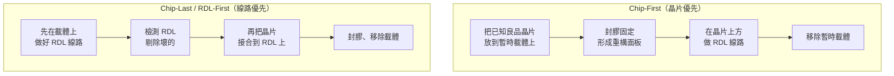
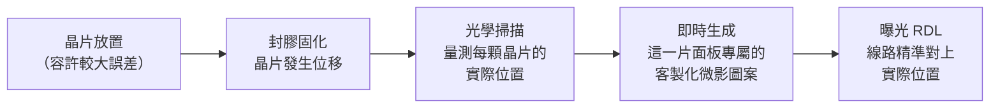

# 面板級製程流程：chip-first、chip-last 與 die shift

[08 面板級製程挑戰](08-panel-process-challenges.md) 列出了面板級封裝的五類難題。這一章挑其中最核心、也最少被中文資料講清楚的一組深入：**製程流程的選擇，以及那個決定成敗的工程問題——晶片偏移（die shift）。**

理解這一章，才能真正理解為什麼「把機台放大」不等於「做得出來」。

## 兩種流程：先放晶片，還是先做線路

面板級封裝有兩條根本不同的製程路線，差別在於**晶片與 RDL 的先後順序**。

### Chip-First：目前的量產主流

先把晶片放上載體、封膠固定成「重構面板（reconstituted panel）」，再在上面做 RDL。

**優點**：流程較短、成本較低，是目前簡單封裝的量產主流。

**致命缺點**：晶片在封膠與熱循環過程中會**移動**。而 RDL 是在晶片移動之後才做的——如果不知道晶片跑到哪裡去了，線路就接不上。這就是 die shift 問題。

### Chip-Last / RDL-First：高階產品的方向

先做好 RDL，**檢測完確認是良品**，才把晶片接合上去。

**優點**：
- RDL 可以先測試，壞的直接丟掉，不會浪費昂貴的晶片
- 沒有「RDL 追著晶片跑」的問題，對位基準是固定的
- 對高密度、多晶片的 SiP 設計更友善

**缺點**：流程長、成本高，且需要極高精度的接合設備。

**產業現況**：chip-first 主導目前的量產（多為簡單封裝）；**chip-last 則是高密度多晶片設計——也就是 CoPoS 這一類產品——的目標路線** [報導]。這在業界仍是一場尚未結束的辯論。

### 為什麼這個選擇對 CoPoS 特別重要

回到[良率的算術](08-panel-process-challenges.md)。CoPoS 的目標產品是**單顆價值極高的旗艦 AI 封裝**——一顆封裝裡有價值數千美元的運算 die 與十幾顆 HBM。

在這種價值結構下，chip-first 的風險難以承受：**你把所有昂貴的晶片放上去之後，才知道 RDL 做得好不好。** 一片面板的 RDL 出問題，賠掉的是整面板的晶片。

Chip-last 的邏輯正好相反：**先確認便宜的部分是良品，再投入昂貴的部分。** 這與 本書庫《CoWoS 技術精讀筆記》談的 KGD 原則是同一套思路——**愈早發現缺陷，損失愈小**。

## Die Shift：面板級封裝的核心工程問題

### 問題是什麼

在 chip-first 流程中，晶片被放到載體上之後，還要經過封膠、固化、多次升降溫。在這些過程中：

- 封膠材料收縮，把晶片往中心拉
- 各層 CTE 不匹配，造成面板整體變形
- 面板愈大，同樣的百分比變形換算到邊緣的**絕對位移量就愈大**

結果是：**晶片的實際位置，與設計時規劃的位置對不上。** 而 RDL 的線寬只有數微米——位移幾十微米就足以讓所有線路接錯。

這正是面板級封裝長年做不進高階產品的根本原因之一。晶圓級的位移量還在可容忍範圍；**面板放大到晶圓的三到五倍，位移量也跟著放大。**

### 解法一：更精準地放（成本很高）

最直覺的解法是用超高精度的黏晶機把晶片放得極準。問題是這類設備極貴、且速度慢——而面板上有成千上萬顆晶片要放。

有一個數字很能說明這條路的代價：在傳統作法下，**高精度黏晶設備佔整個面板級製程成本的 18% 以上** [報導]。

### 解法二：Adaptive Patterning——不對抗位移，而是適應它

真正改變局面的思路來自 Deca Technologies 的 **Adaptive Patterning（自適應圖案化）**，作法非常聰明：

核心觀念是：**與其強迫晶片待在設計位置，不如量出它們實際在哪裡，然後把線路畫過去。**

這需要兩個條件：
1. 高速的光學量測，能在合理時間內掃完整片面板上每一顆晶片
2. **無光罩的微影**（直接成像，direct imaging），因為每一片面板的圖案都不一樣——用實體光罩根本做不到

效果非常顯著：採用 Adaptive Patterning 後，高精度黏晶設備的成本佔比**從 18% 以上降到約 6%** [報導]。因為你不再需要「放得極準」，只需要「量得極準」。

Deca 的這項技術被廣泛視為讓面板級 RDL 在細間距下可行的關鍵 IP，並已透過與 RRP Electronics、IBM（魁北克 Bromont 廠）的合作對外部署；Nepes 也採用其技術 [報導]。

> **這是一個很好的工程思維範例**：當一個誤差源無法消除時，第三條路是「精確地量測它，然後補償」。這與時脈電路用 CDR 補償相位漂移、與相機用防手震補償抖動，是同一種思路。

## 微影：曝光機還是直接成像

面板級微影有一個根本的兩難，而 die shift 的解法又讓它更複雜。

| 方案 | 原理 | 優點 | 缺點 |
|------|------|------|------|
| **步進曝光機（stepper）** | 用實體光罩逐格曝光 | 解析度高，可做到細線寬 | 曝光場遠小於面板，需要**多次拼接（stitching）**；且無法做 Adaptive Patterning |
| **直接成像（LDI／direct imaging）** | 無光罩，用數位光源直接寫圖 | **每片圖案可不同 → 支援 Adaptive Patterning**；無拼接接縫問題 | 解析度與吞吐量通常不如 stepper |

這個選擇與流程選擇是綁在一起的：

- **走 chip-first + Adaptive Patterning** → 必須用直接成像
- **走 chip-last** → 晶片位置由 RDL 決定，可以用 stepper 追求更細的線寬

RDL 線寬線距的規格範圍很寬：**消費性產品約 10/10 μm，最先進的 HPC 應用要到 2/2 μm** [報導]。日月光的 310 × 310 mm 產線就明確標示 FOCoS 支援 2/2 μm、FOCoS-Bridge 支援 8/8 μm [官方]。

**2/2 μm 是一個很嚴苛的門檻**——在一片 310 mm 見方的面板上，全域維持這個線寬的良率，正是 CoPoS 良率學習曲線要爬的那座山。

## 拼接（stitching）的代價

若採用 stepper，單次曝光場遠小於整片面板，必須把多個曝光場拼起來。這帶來兩個精度問題：

- **拼接對位**：相鄰曝光場的接縫必須精準對齊，否則跨接縫的線路會斷或短路。面板一翹，誤差再放大。
- **全域對位（overlay）**：面板不同位置因翹曲與熱效應產生位移，層與層之間的對位要在整片大面積上都守住規格。

這與 CoWoS 的光罩拼接是同一類問題，但**面板的尺度大了好幾倍**。

## 兩個仍然沒有標準答案的環節

誠實地說，面板級製程有兩塊業界至今沒有成熟解法：

### 1. 電鍍均勻性

RDL 的銅線要靠電鍍長出來，而**電鍍反應槽的幾何是為圓形晶圓設計的**——電場分布、流體動力學全都假設旋轉對稱。換到方形面板，四個角落與中心的鍍層厚度很難一致。

SemiEngineering 直言這是一個「**沒有已驗證製程**」的領域 [報導]。

設備商的回應是重新設計機台：ACM Research 的水平式電鍍設備明確規格支援 510×515 mm 與 600×600 mm 面板，**並可容忍面板上達 7 mm 的翹曲** [報導]。「容忍 7 mm 翹曲」這個規格本身，就說明了面板翹曲的實際量級有多大。

### 2. 缺少組裝設計套件（ADK）

IC 設計有 PDK（製程設計套件），設計者照著規則畫就能保證做得出來。**面板級封裝沒有等價的 ADK。**

一位 EDA 主管的說法很直白：「ADK 講了十五年了，還是沒有。」[報導]

這意味著設計與製程之間缺少標準化的界面，每一個專案都要重新協商規則。**面板尺寸本身也還沒標準化**（310、510、600、650、700 各家不同），讓設備與設計規則的發展更加分散。

## 邊緣與搬運：常被忽略的一塊

最後一個實務問題：**面板的邊緣**。

隆起的邊緣（bevel）或邊緣污染會造成微影、鍍膜與接合的問題，而且**本身就會產生額外的應力，反過來加劇翹曲** [報導]。

於是出現了一整類專為面板設計的新設備：雙面斜邊蝕刻機（處理邊緣）、真空助焊劑清洗機（清除細間距凸塊周圍難以觸及的助焊劑殘留）等 [報導]。

搬運一片大而薄（若用玻璃還很脆）的面板，也需要重新設計：吸附力分布、支撐點位置、邊角保護——這些在晶圓時代有數十年的成熟方案，在面板時代要從頭做。

## 本頁重點

1. **chip-first 是現在的量產主流，chip-last 是 CoPoS 這類高價封裝的目標路線**——因為它讓你先確認便宜的部分再投入昂貴的部分。
2. **die shift 是面板級封裝的核心工程問題**，而最好的解法不是「放得更準」，而是 **Adaptive Patterning：量出實際位置再客製化圖案**。
3. **微影方案與流程選擇是綁定的**：Adaptive Patterning 必須用無光罩的直接成像。
4. **電鍍均勻性與 ADK 標準化，是業界目前公認尚未解決的兩塊。**

> 相關頁面：[面板級製程挑戰](08-panel-process-challenges.md) ｜ [設備與量測生態](14-equipment-ecosystem.md) ｜ [從圓到方](06-panel-geometry.md)
