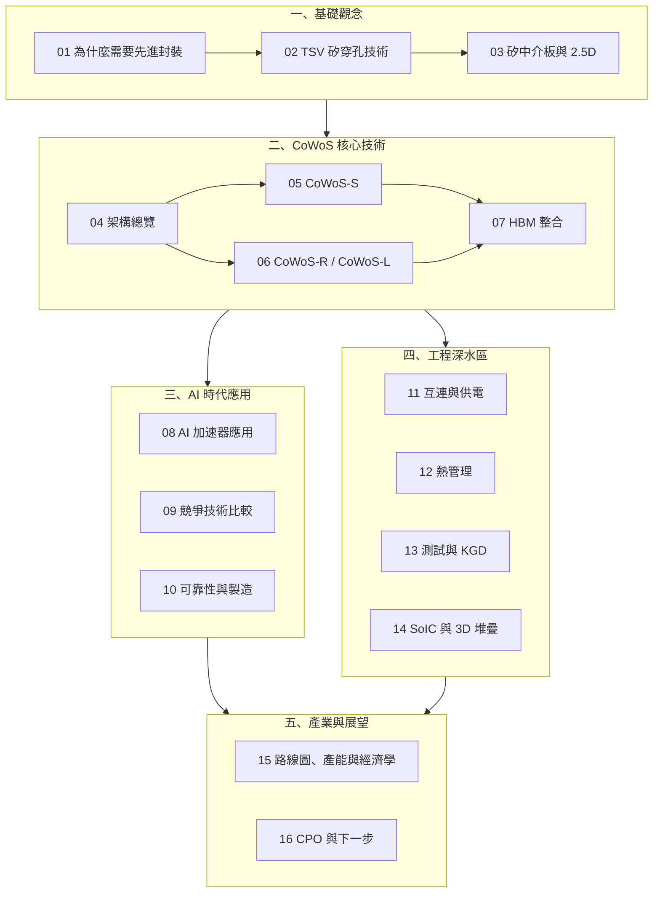

# 全書地圖

## 各章節一句話摘要

### 一、基礎觀念

| 章節 | 核心問題 |
|------|---------|
| [為什麼需要先進封裝](01-why-advanced-packaging.md) | 製程微縮放緩後，封裝如何成為新的效能引擎？ |
| [TSV 基礎](02-tsv-basics.md) | 矽穿孔怎麼做？三種形成方式有何差異？ |
| [矽中介板與 2.5D](03-silicon-interposer-2d5.md) | 中介板解決什麼問題？為何比有機基板好？ |

### 二、CoWoS 核心技術

| 章節 | 核心問題 |
|------|---------|
| [CoWoS 架構總覽](04-cowos-overview.md) | CoW + WoS 兩步驟流程是什麼？ |
| [CoWoS-S](05-cowos-s.md) | 全矽中介板的規格與它的面積天花板在哪？ |
| [CoWoS-R 與 CoWoS-L](06-cowos-r-l.md) | 為什麼「局部矽」反而能做得比「全矽」更大？ |
| [HBM 整合](07-hbm-integration.md) | HBM 為何非要 CoWoS 不可？HBM4 改變了什麼？ |

### 三、AI 時代應用

| 章節 | 核心問題 |
|------|---------|
| [AI 加速器應用](08-cowos-ai-hpc.md) | Blackwell、Rubin、MI400 裡的封裝長什麼樣子？ |
| [競爭技術比較](09-competing-technologies.md) | Intel、Samsung、OSAT 的對應方案進度如何？ |
| [可靠性與製造](10-reliability-manufacturing.md) | 良率、熱應力、翹曲——量產的三大挑戰 |

### 四、工程深水區

| 章節 | 核心問題 |
|------|---------|
| [互連與供電](11-die-to-die-and-power.md) | 跨中介板一個 bit 要多少能量？1000 A 怎麼送進去？ |
| [熱管理](12-thermal-management.md) | 1000 W 的熱從哪裡走？為什麼 HBM 比運算 die 更早撞牆？ |
| [測試與 KGD](13-test-and-kgd.md) | 為什麼 chiplet 的良率是乘法？怎麼止損？ |
| [SoIC 與 3D 堆疊](14-soic-3d-stacking.md) | 拿掉凸塊之後，密度能提升幾個數量級？ |

### 五、產業與展望

| 章節 | 核心問題 |
|------|---------|
| [路線圖、產能與經濟學](15-capacity-and-economics.md) | 面積路線圖到哪？產能多少？良率的錢怎麼算？ |
| [CPO 與下一步](16-cpo-and-next-steps.md) | 當瓶頸移到封裝之間、或載體不夠大時，往哪走？ |

## 四條可以串起全書的主線

如果覺得章節太多，可以用這四條線來組織理解：

1. **面積線**：光罩極限 → 光罩拼接 → 全矽的天花板 → 局部矽橋 → 面板／wafer-scale
   （01 → 05 → 06 → 15 → 16）
2. **密度線**：有機基板 → 矽中介板 RDL → micro-bump → 混合鍵合
   （03 → 07 → 11 → 14）
3. **良率線**：面積 vs 缺陷密度 → KGD 與冗餘 → LSI 橋為何改善良率 → 產能經濟學
   （10 → 13 → 06 → 15）
4. **能量線**：搬資料的能量階梯 → HBM 為何省電 → 熱從哪裡走 → 光取代電
   （11 → 07 → 12 → 16）
