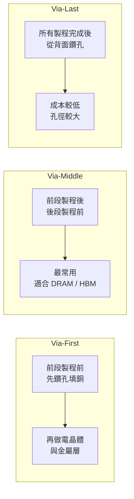
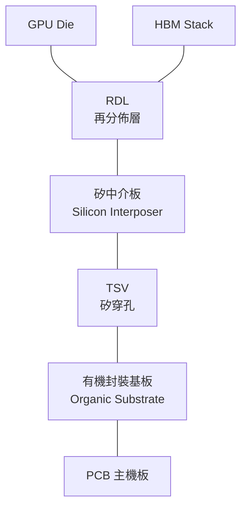

# TSV：矽穿孔技術基礎

TSV（Through-Silicon Via，矽穿孔）是 2.5D 與 3D 封裝的核心互連技術。它在矽基板上垂直鑽孔並填入導體（通常是銅），讓訊號可以穿過整片矽晶片而不必繞道邊緣。

## 為什麼需要 TSV

傳統晶片的訊號只能從邊緣引線（Wire Bond）或底部焊球（Flip Chip）引出。TSV 讓訊號能從晶片「正上方穿到正下方」，帶來三個優勢：

1. **極短互連距離**：比 Wire Bond 縮短 10–100 倍
2. **高密度 I/O**：每平方毫米可放數千個 TSV
3. **低電感 / 低功耗**：短線路意味更低的寄生電感

## 三種 TSV 形成方式

| 方式 | 時機 | 孔徑 | 主要應用 |
|------|------|------|---------|
| Via-First | 前段製程前 | 最小 | 邏輯晶片（較少用） |
| Via-Middle | 前段後、後段前 | 中等 | HBM、3D NAND |
| Via-Last | 全部製程後（背面開孔） | 最大 | CIS 影像感測器、部分 3D 堆疊 |

## CoWoS 中的 TSV 角色

CoWoS 的矽中介板（Silicon Interposer）不含主動電路（沒有前段製程），因此它的 TSV 流程接近 **via-first／via-middle**：先在空白矽晶圓蝕孔填銅（此時為盲孔），再做正面 RDL，等晶片接合後才從背面薄化把 TSV 露出。TSV 的功能純粹是垂直導通——讓封裝基板（Substrate）上的電源與訊號穿透中介板，到達放在中介板正面的 GPU Die 與 HBM。

## TSV 的製造挑戰

- **深寬比（Aspect Ratio）**：孔深 / 孔徑，通常 10:1 以上，填銅困難
- **殘留應力**：銅與矽膨脹係數不同（17 vs 2.6 ppm/°C），溫度循環下產生應力
- **Keep-Out Zone（KOZ）**：TSV 周圍的電晶體受應力影響，需保留空白區

> 下一頁：[矽中介板與 2.5D 整合](03-silicon-interposer-2d5.md)
