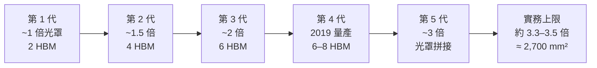

# CoWoS-S：矽中介板版本

CoWoS-S 是 CoWoS 家族中技術最成熟的版本，也是 NVIDIA H100／H200、AMD MI300X–MI355X 等加速器採用的方案。「S」代表 Silicon（全矽中介板）。

Blackwell 世代之後，最大面積的旗艦封裝已經改用 [CoWoS-L](06-cowos-r-l.md)——但這**不代表 CoWoS-S 退場**。本頁最後會說明兩者現在的實際分工。

## 技術演進：面積如何一路擴張

TSMC 持續擴大中介板面積以支援更多 HBM 堆疊。以「光罩倍數」而非絕對面積來理解，會比較不容易被過時的數字誤導——**單一光罩曝光場約 26 × 33 mm，即約 858 mm²**，這是所有面積數字的基本單位。

面積擴大的關鍵是**光罩拼接（mask stitching）**：單一光罩最大約 858 mm²，超過就必須用多次曝光拼接，而拼接處的對準精度是核心挑戰。

### CoWoS-S 的天花板

實務上 CoWoS-S 的中介板尺寸上限約在 **3.3 倍光罩、約 2,700 mm²**；部分報導稱 TSMC 為 AMD MI300 推進到約 3.5 倍 [報導]。

超過這個範圍，全矽方案就開始不划算——[良率隨面積指數下降](15-capacity-and-economics.md)，而拼接次數增加又額外引入損失。這正是 CoWoS-L 存在的理由。

## 核心技術規格

### RDL 層數與線寬
- 典型 RDL：4–6 層金屬
- 最細線寬：約 **0.4 μm**（局部互連層）
- 全局路由層：約 2 μm

### 凸塊尺寸階梯
- **Micro bump**：die 到中介板，間距約 40–55 μm（HBM 到中介板）
- **C4 bump**：中介板到封裝基板，間距約 130–150 μm
- **BGA 焊球**：封裝基板到主機板，間距數百 μm

這道階梯是先進封裝的基本骨架——每往外一層，間距就粗一個量級。

### TSV 規格
- 直徑：約 10 μm
- 深度：約 100 μm（深寬比約 10:1）
- 間距：約 40–50 μm

## CoWoS-S 的應用產品

| 產品 | 運算 die | HBM | 中介板規模 |
|------|---------|-----|-----------|
| NVIDIA H100 SXM | GH100（TSMC 4N，814 mm²） | 6 位置／5 顆啟用 HBM3 | 約 2,100 mm²（估計） |
| NVIDIA H200 SXM | 同 GH100 | 6× HBM3e，141 GB | 約 2,100 mm²（估計） |
| AMD MI300X | 8× XCD + 4× IOD（SoIC 堆疊） | 8× HBM3，192 GB | 約 3.5 倍光罩 [報導] |
| AMD MI355X | N3P + N6 混合節點 | 8× HBM3e，288 GB | — |
| Microsoft Maia 100 | 約 820 mm² | 4× HBM2e，64 GB | — |

> 「約 2,100 mm²」這類 H100 中介板面積數字廣為流傳，但**都是第三方估計值**，TSMC 與 NVIDIA 從未公布官方面積。引用時請註明是估計。

## 效能優勢

相比傳統封裝：

- **Die-to-Die 頻寬**：GPU↔HBM 可達 TB/s 等級（短距離、低阻抗、上千條平行線）
- **能效**：HBM 介面的每 bit 傳輸功耗遠低於 GDDR，量級差距見 [Die-to-Die 互連與供電](11-die-to-die-and-power.md)
- **延遲**：路徑短、無需 SerDes 的序列化／解序列化

## CoWoS-S 現在的位置：分工，不是淘汰

2024 年底一度流傳「TSMC 正在淘汰 CoWoS-S」的說法，**但它沒有成真**。

截至 2025 年底的報導顯示：**CoWoS-S 與 CoWoS-L 皆全數訂滿**，TSMC 甚至調配設備**增加 CoWoS-S 的產出** [報導]。

正確的理解是：

| | CoWoS-S | CoWoS-L |
|---|---|---|
| 定位 | 中等面積的主力 | 最大面積的旗艦 |
| 面積範圍 | 約 3.3 倍光罩以下 | 5.5 倍量產中，路線圖至 14 倍以上 |
| 典型客戶 | 上一代 GPU、雲端自研 ASIC、成本敏感產品 | Blackwell、Rubin、MI400 |
| 成熟度 | 最成熟，良率模型最清楚 | 2024 起量產 |

**大多數 AI 晶片並不是旗艦**。雲端業者的自研 ASIC、推論專用加速器、上一代產品的持續出貨，構成了 CoWoS-S 穩固的需求基本盤。旗艦搶頭條，但中段市場才是量。

> 相關：[CoWoS-R 與 CoWoS-L](06-cowos-r-l.md) ｜ [HBM 整合](07-hbm-integration.md) ｜ [AI 加速器應用](08-cowos-ai-hpc.md) ｜ [封裝路線圖與產能](15-capacity-and-economics.md)
