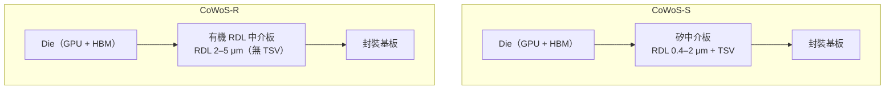
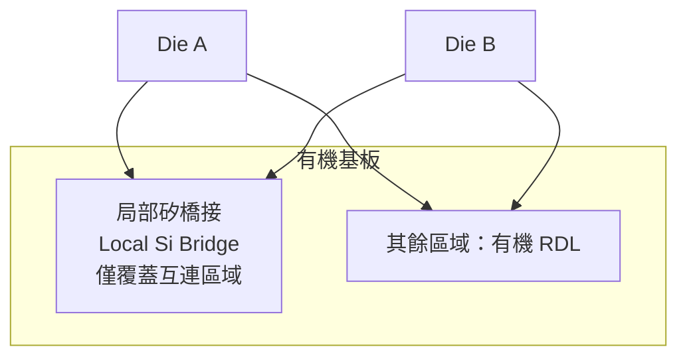
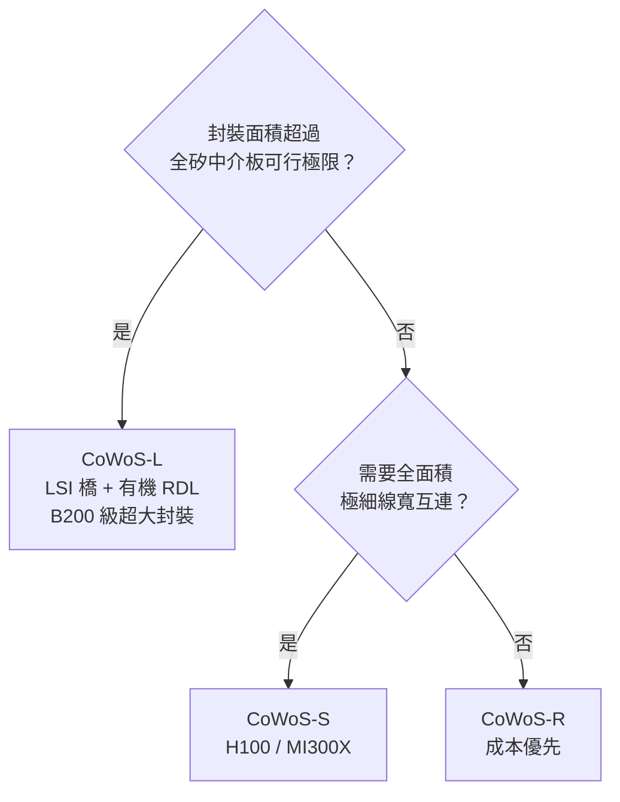

# CoWoS-R 與 CoWoS-L：有機與局部矽版本

CoWoS-S 效能卓越但成本高昂，且全矽中介板的面積放大受良率與晶圓幾何限制。CoWoS-R 瞄準成本敏感市場；CoWoS-L 起初被視為折衷方案，如今已成為**超大面積旗艦的主力**——NVIDIA Blackwell（B100/B200）即採用 CoWoS-L。

## CoWoS-R（RDL Interposer）

「R」代表 RDL-only，使用**有機再分佈層**取代矽中介板：

- **材料**：有機基板 + 精細 RDL（無矽基板）
- **線寬**：2–5 μm（比 CoWoS-S 的 0.4–2 μm 大）
- **成本**：比 CoWoS-S 低 30–50%（無需晶圓廠製造中介板）
- **限制**：互連密度較低，不適合需要極高頻寬的 HBM 配置

## CoWoS-L（Local Silicon Interposer）

「L」代表 Local Silicon，是**混合方案**：

- 在有機基板中嵌入**局部矽橋接片（Local Silicon Interposer）**
- 矽橋接片只覆蓋 Die-to-Die 的互連區域，不需要全面積矽中介板
- 兼顧高密度 Die-to-Die 互連（矽橋接）與低成本基板（有機）

這個概念類似 Intel 的 EMIB（Embedded Multi-die Interconnect Bridge）。

要注意：CoWoS-L **不是 CoWoS-S 的降級版**。全矽中介板越大、良率越差、且終究受晶圓尺寸限制；「LSI 橋 + 有機 RDL」只在需要極細互連的地方用矽，反而能把封裝面積推得比全矽方案更大。這正是 NVIDIA Blackwell（兩顆近光罩極限的運算 die + 8 顆 HBM3e）選擇 CoWoS-L 的原因。

## 三種變體的比較

| 特性 | CoWoS-S | CoWoS-L | CoWoS-R |
|------|---------|---------|---------|
| 中介板類型 | 全矽 | 局部矽嵌入有機 | 全有機 RDL |
| 線寬（最細） | 0.4 μm | 0.4 μm（橋接區） | 2 μm |
| CTE 匹配 | 優秀 | 良好 | 較差 |
| 成本（相對） | 高 | 中 | 低 |
| HBM 支援 | 旗艦（8+ 顆） | 旗艦（B200 為 8 顆） | 基礎（2–4 顆） |
| 代表產品 | H100、MI300X | NVIDIA B200（Blackwell） | 成本敏感 AI 推論 |

## 選擇邏輯

> 相關：[CoWoS 架構總覽](04-cowos-overview.md) | [競爭技術比較](09-competing-technologies.md)
