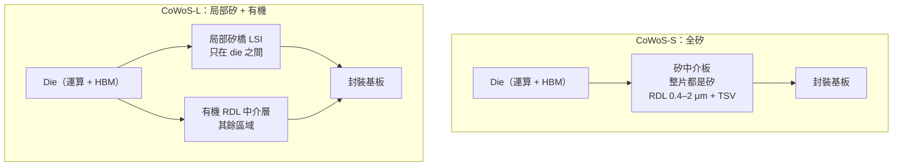
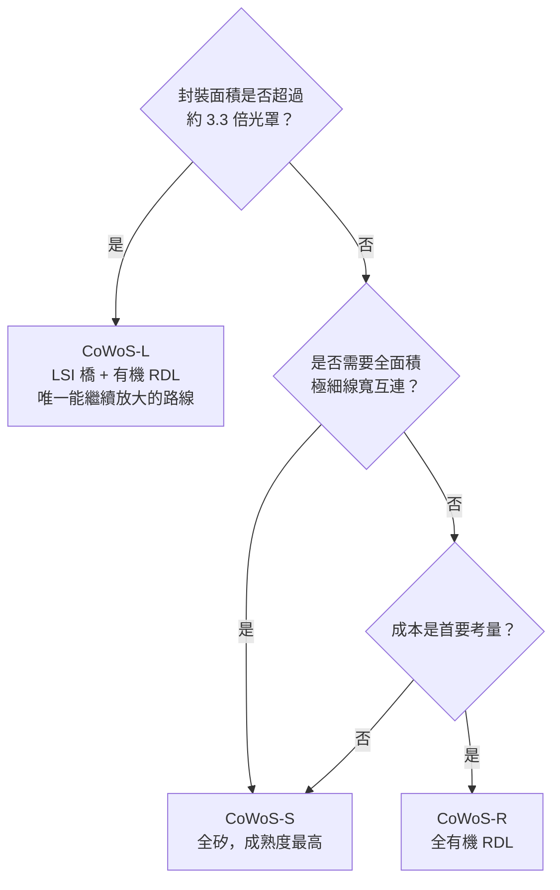

# CoWoS-R 與 CoWoS-L：有機與局部矽版本

> **一句話結論**：CoWoS-L 已經不是「折衷方案」，它是 **2026 年的旗艦主力**。NVIDIA Blackwell、Rubin、AMD MI400、AWS Trainium3 全部採用它。

CoWoS-S 效能卓越但成本高昂，且全矽中介板的面積放大同時受良率與晶圓幾何限制。CoWoS-R 瞄準成本敏感市場；CoWoS-L 則在 2024 年之後接手了所有超大封裝。

## CoWoS-R（RDL Interposer）

「R」代表 RDL-only，使用**有機再分佈層**取代矽中介板：

- **材料**：有機基板 + 精細 RDL（無矽基板、無 TSV）
- **線寬**：設計規則約 **2 μm / 2 μm 線寬線距**（比 CoWoS-S 的 0.4–2 μm 粗）[報導]
- **量產時間**：2023 年起投入生產 [報導]
- **成本**：明顯低於 CoWoS-S（不需晶圓廠製造矽中介板）
- **優勢**：有機材料的機械柔韌性反而比矽好，對大面積下的應力更友善
- **限制**：互連密度較低，不適合最高頻寬的 HBM 配置

## CoWoS-L（Local Silicon Interconnect）

「L」代表 Local Silicon，是**混合方案**：在有機 RDL 中介層裡**嵌入局部矽橋（LSI，Local Silicon Interconnect）**，矽橋只覆蓋需要極高密度互連的區域。

```mermaid
flowchart TB
    subgraph "CoWoS-S：全矽"
        S_D["Die（運算 + HBM）"]
        S_I["矽中介板<br/>整片都是矽<br/>RDL 0.4–2 μm + TSV"]
        S_B["封裝基板"]
        S_D --> S_I --> S_B
    end
    subgraph "CoWoS-L：局部矽 + 有機"
        L_D["Die（運算 + HBM）"]
        L_BR["局部矽橋 LSI<br/>只在 die 之間"]
        L_I["有機 RDL 中介層<br/>其餘區域"]
        L_B["封裝基板"]
        L_D --> L_BR
        L_D --> L_I
        L_BR --> L_B
        L_I --> L_B
    end
```

### 為什麼「局部」反而能做得更大

這是全書最反直覺、也最重要的一點：

> **全矽中介板愈大，良率愈差，且終究受晶圓尺寸與光罩拼接次數限制。CoWoS-L 只在需要極細互連的地方用矽，反而能把封裝面積推得比全矽方案更大。**

原因是良率的分配方式完全不同。全矽方案下，**整片幾千平方毫米的矽**都必須無缺陷；CoWoS-L 只需要幾片小矽橋是良品——小面積的矽橋良率極高，而其餘大面積用便宜、柔韌、可做大的有機 RDL 填補。

這正是為什麼旗艦產品在 2024 年之後集體從 CoWoS-S 遷移到 CoWoS-L。這個概念與 Intel 的 EMIB 同源，見[競爭技術比較](09-competing-technologies.md)。

### 2026 年的實際規模

截至 2026 年，TSMC 的量產旗艦是 **5.5 倍光罩尺寸的 CoWoS-L**：

| 項目 | 數據 | 等級 |
|------|------|------|
| 中介層尺寸 | 5.5 倍光罩（光罩單位約 858 mm²） | [官方，經媒體轉述] |
| 量產良率 | **超過 98%，部分產線達 99%** | [官方／報導] |
| HBM 支援 | 最高 12 顆堆疊 | [官方] |
| 封裝基板 | 大於 100 × 100 mm | [官方] |
| RDL 線寬線距 | 約 2 μm / 2 μm（矽橋區更細） | [報導] |
| micro-bump 間距 | die-to-die 約 35 μm；HBM 到中介層約 40–55 μm | [報導] |

「5.5 倍光罩、98% 以上良率」這組數字值得停下來想：**在近 4,700 mm² 的封裝上做到 98% 良率**，正是 LSI 橋策略在良率上的直接證據。若換成全矽中介板，[良率公式](10-reliability-manufacturing.md)算出來的數字會難看得多。

### 起步時的翹曲教訓

CoWoS-L 並非一開始就順利。2024 年下半有報導指出 Blackwell 遇到**運算 chiplet、矽橋、RDL 中介層與基板之間 CTE 不匹配造成的翹曲**問題，NVIDIA 重新設計頂層金屬與凸塊才改善良率 [報導]。

這是一個誠實的提醒：混合材料方案的好處（成本、面積）是用**更複雜的材料界面**換來的。CoWoS-L 有四種不同 CTE 的材料疊在一起，而 CoWoS-S 只有兩種。

## CoWoS-S 並沒有被淘汰

一個在 2024 年底一度流行、但**沒有成真**的說法是「TSMC 正在淘汰 CoWoS-S」。

實際情況相反：截至 2025 年底的報導指出 **CoWoS-L 與 CoWoS-S 皆全數訂滿**，TSMC 甚至調配設備**增加 CoWoS-S 產出** [報導]。

正確的理解是分工，而不是取代：

- **CoWoS-L**：最大面積的旗艦封裝（Blackwell、Rubin、MI400）
- **CoWoS-S**：中等面積、成本敏感的產品——較低光罩倍數的 ASIC、上一代 GPU、雲端業者自研晶片（如 Microsoft Maia 100）
- **CoWoS-R**：成本優先、頻寬需求較低的應用

## 三種變體的比較

| 特性 | CoWoS-S | CoWoS-L | CoWoS-R |
|------|---------|---------|---------|
| 中介層類型 | 全矽 | 局部矽橋嵌入有機 RDL | 全有機 RDL |
| 最細線寬 | 0.4–2 μm | 矽橋區最細，有機區約 2 μm | 約 2 μm |
| TSV | 有 | 矽橋含 TSV，有機區無 | 無 |
| 實務面積上限 | 約 3.3–3.5 倍光罩（約 2,700 mm²） | **5.5 倍光罩量產中，路線圖指向 14 倍以上** | 較小 |
| CTE 匹配 | 最佳（同為矽） | 材料界面多，需精細管控 | 較差 |
| 成本（相對） | 高 | 中高 | 低 |
| 成熟度 | 最成熟 | 2024 起量產，已是旗艦主力 | 2023 起量產 |
| 代表產品 | H100/H200、MI300X–MI355X、Maia 100 | **B200/B300、Rubin、MI400、Trainium3** | 成本敏感推論加速器 |

## 選擇邏輯

```mermaid
flowchart TD
    Q1{"封裝面積是否超過<br/>約 3.3 倍光罩？"}
    Q1 -->|"是"| L["CoWoS-L<br/>LSI 橋 + 有機 RDL<br/>唯一能繼續放大的路線"]
    Q1 -->|"否"| Q2{"是否需要全面積<br/>極細線寬互連？"}
    Q2 -->|"是"| S["CoWoS-S<br/>全矽，成熟度最高"]
    Q2 -->|"否"| Q3{"成本是首要考量？"}
    Q3 -->|"是"| R["CoWoS-R<br/>全有機 RDL"]
    Q3 -->|"否"| S
```

## 同一個架構，也可以做得更便宜

CoWoS-L 不是單一規格，而是一條光譜。**AWS Trainium3** 是最好的例子：它採用 CoWoS-L，但中介層用的是「**有機薄膜中介層**」——聚合物基板上做 6 層銅 RDL [報導]，成本遠低於矽，機械性質也更好。

這說明 CoWoS-L 的「局部矽 + 其餘有機」架構，允許設計者**按預算調整有機部分的規格**。對於頻寬需求不到旗艦等級的自研 ASIC，這是一條非常實際的路。

> 相關：[CoWoS 架構總覽](04-cowos-overview.md) ｜ [CoWoS-S](05-cowos-s.md) ｜ [封裝路線圖與產能](15-capacity-and-economics.md) ｜ [競爭技術比較](09-competing-technologies.md)
