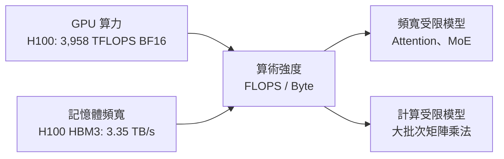
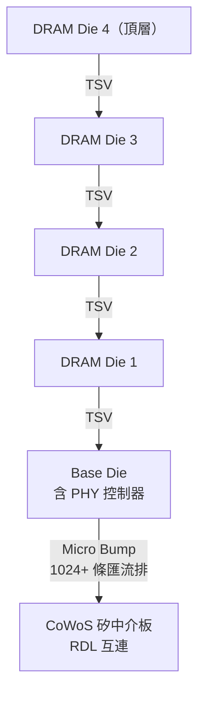
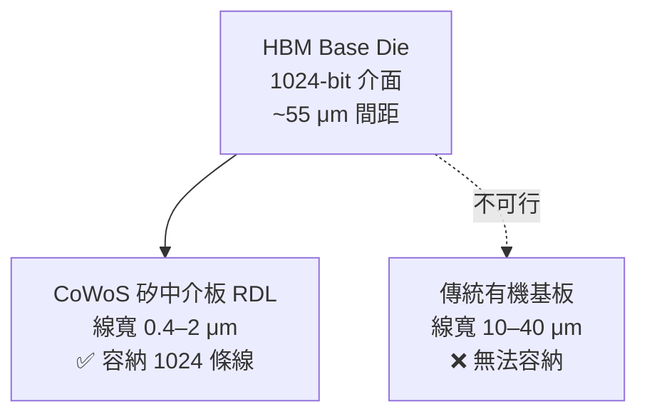

# HBM 整合與記憶體頻寬

HBM（High Bandwidth Memory）是 CoWoS 存在最重要的理由之一。了解為什麼需要 HBM，就能理解為什麼需要 CoWoS 這樣的先進封裝。

## 記憶體頻寬瓶頸

AI 模型的推理與訓練受限於「記憶體頻寬牆（Memory Wall）」：GPU 計算速度遠超記憶體供料速度。

若記憶體頻寬不夠，GPU 的計算單元大部分時間都在等資料，算力浪費。

## HBM 架構

HBM 是將多層 DRAM Die 垂直堆疊（3D IC），透過 TSV 串接，再接到一個 Base Die，最後由 Base Die 透過 Micro Bump 連接到 CoWoS 中介板。

## HBM 世代比較

| 世代 | 每顆頻寬 | 堆疊層數 | 介面寬度 | 代表應用 |
|------|---------|---------|---------|---------|
| HBM2 | 256 GB/s | 8 | 1024-bit | V100 |
| HBM2e | 460 GB/s | 12 | 1024-bit | A100 |
| HBM3 | 819 GB/s | 12 | 1024-bit | H100 |
| HBM3e | 1,200 GB/s | 8–12 | 1024-bit | H200、MI325X |

## 為何 HBM 需要 CoWoS

HBM 的 Base Die 有超過 **1024 條並行匯流排**，間距極細（~55 μm）。只有 CoWoS 矽中介板的細線 RDL 才能容納如此高密度的互連；傳統有機基板的線寬根本無法做到。

## 整體記憶體頻寬計算

以 NVIDIA H100 SXM5 為例：
- 封裝上有 6 個 HBM 位置，**僅啟用 5 顆**（第 6 顆為維持機械平衡的結構填充 die），共 80 GB
- 每顆啟用的 HBM3 運行約 5.2 Gbps，頻寬約 670 GB/s（819 GB/s 是 HBM3 規格上限 6.4 Gbps，H100 未跑滿）
- 總計：**5 × ~670 GB/s ≈ 3.35 TB/s**

相比之下，GDDR6X（如 RTX 4090）僅 1 TB/s，而且功耗更高。

> 相關：[CoWoS-S](05-cowos-s.md) | [AI 加速器應用](08-cowos-ai-hpc.md)
