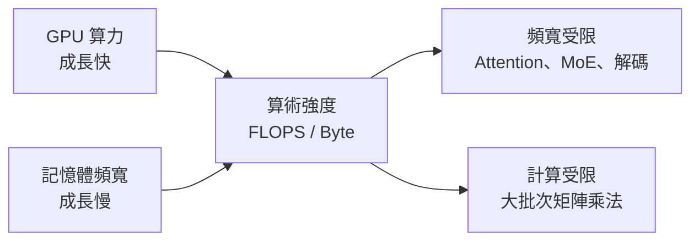
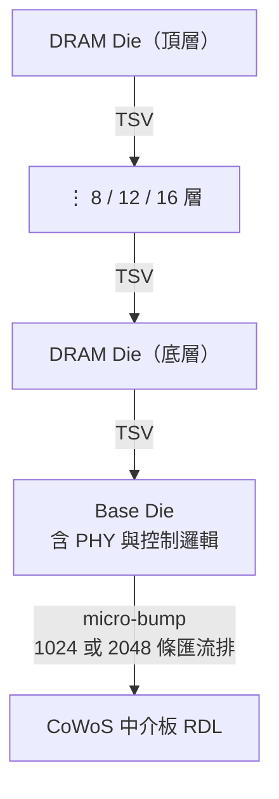
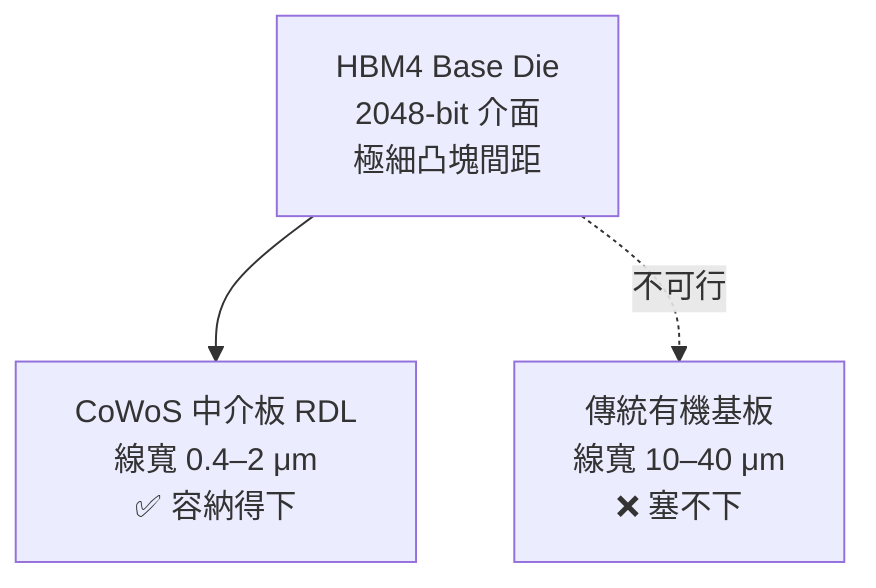

# HBM 整合與記憶體頻寬

HBM（High Bandwidth Memory，高頻寬記憶體）是 CoWoS 存在最重要的理由。理解 HBM 為什麼需要 CoWoS，就理解了整個 2.5D 封裝的價值主張。

## 記憶體牆：問題的本質

AI 模型的推理與訓練受限於「記憶體頻寬牆」：GPU 的計算速度遠超記憶體供料速度。若頻寬不足，計算單元大部分時間都在等資料，昂貴的算力被浪費。

```mermaid
graph LR
    A["GPU 算力<br/>成長快"]
    B["記憶體頻寬<br/>成長慢"]
    A & B --> C["算術強度<br/>FLOPS / Byte"]
    C --> D["頻寬受限<br/>Attention、MoE、解碼"]
    C --> E["計算受限<br/>大批次矩陣乘法"]
```

## HBM 架構：一疊 3D，再並排 2.5D

HBM 是把多層 DRAM Die 垂直堆疊（3D IC），透過 TSV 串接，再接到底部的 Base Die，最後由 Base Die 透過 micro-bump 連到 CoWoS 中介板。

```mermaid
flowchart TB
    D3["DRAM Die（頂層）"]
    D2["⋮ 8 / 12 / 16 層"]
    D1["DRAM Die（底層）"]
    BD["Base Die<br/>含 PHY 與控制邏輯"]
    INT["CoWoS 中介板 RDL"]
    D3 -->|"TSV"| D2 -->|"TSV"| D1 -->|"TSV"| BD
    BD -->|"micro-bump<br/>1024 或 2048 條匯流排"| INT
```

換句話說，**每一顆 HBM 本身就是一個 3D 封裝，而 CoWoS 負責把它們以 2.5D 的方式並排在運算 die 旁邊。** 一顆現代 AI 加速器同時是 3D 與 2.5D 的產物。

## 為何 HBM 非要 CoWoS 不可

關鍵不是速度，是**線的數量**。

HBM3 的 base die 有 **1024 條並行匯流排**，HBM4 更倍增到 **2048 條**，凸塊間距只有數十微米。有機基板的線寬是 10–40 μm，物理上塞不下這麼多條線；只有矽中介板等級的 0.4–2 μm 線寬才容納得下。

```mermaid
graph TB
    HBM["HBM4 Base Die<br/>2048-bit 介面<br/>極細凸塊間距"]
    RDL["CoWoS 中介板 RDL<br/>線寬 0.4–2 μm<br/>✅ 容納得下"]
    ORG["傳統有機基板<br/>線寬 10–40 μm<br/>❌ 塞不下"]
    HBM --> RDL
    HBM -.->|"不可行"| ORG
```

這也解釋了為什麼 HBM 的能效這麼好：**它用幾千條慢速線取代少數幾條高速線**，省掉了 SerDes 那一整套耗電的類比電路。詳細的能量帳見 [Die-to-Die 互連與供電](11-die-to-die-and-power.md)。

## HBM 世代比較（至 HBM4）

> HBM4 標準 **JESD270-4 於 2025-04-16 由 JEDEC 正式發布**。

| 世代 | 介面寬度 | JEDEC pin 速率 | 每堆疊頻寬 | 堆疊高度 | 單堆疊容量上限 | 代表產品 |
|------|---------|--------------|-----------|---------|--------------|---------|
| HBM2 | 1024-bit | 2.4 Gb/s | ~256 GB/s | 8-Hi | 8 GB | V100 |
| HBM2e | 1024-bit | 3.6 Gb/s | ~460 GB/s | 8–12-Hi | 16 GB | A100、Maia 100 |
| HBM3 | 1024-bit | 6.4 Gb/s | ~819 GB/s | 最高 12-Hi | 24 GB | H100、MI300X |
| HBM3e | 1024-bit | ~9.6 Gb/s | ~1.2 TB/s | 8-Hi / 12-Hi | 36 GB | H200、B200/B300、MI355X |
| **HBM4** | **2048-bit** | **8 Gb/s（規格基線）** | **最高 2 TB/s** | 4/8/12/**16-Hi** | **64 GB** | Rubin、MI400 |

### HBM4 最容易被誤解的一點

**HBM4 的 pin 速率並沒有比 HBM3e 快。** JEDEC 規格基線是 8 Gb/s，而 HBM3e 實際量產已跑到約 9.6 Gb/s。

那頻寬是怎麼翻倍的？答案是**匯流排寬度從 1024-bit 加寬到 2048-bit**（通道數由 16 倍增為 32，每通道 2 個 pseudo-channel）。

這件事在本書的脈絡下意義重大：**HBM4 的頻寬進步，本質上是一次「封裝互連密度」的進步，而不是「訊號速度」的進步。** 要在同樣的 die 邊緣塞進兩倍的線，對中介板 RDL 與凸塊間距的要求直接提高一級。沒有先進封裝，HBM4 的規格根本無法落地。

各家 DRAM 廠再透過客製化把實際 pin 速率推得比規格基線更高（SK hynix 稱達 10 Gb/s、Micron 目標 11 Gb/s 以上、Samsung 展示 13 Gb/s [報導]），但那是廠商在規格之上的加值，不是 HBM4 頻寬躍升的主因。

### 客製化 base die：記憶體開始走向邏輯製程

HBM4 的另一個結構性轉變是 **base die 走向先進邏輯製程**。標準 HBM4 base die 可用 TSMC 12FFC 或 N5；而**客製化 base die（custom HBM）則走向 N3P** [報導]。

這意味著記憶體廠與晶圓代工廠的邊界正在模糊——base die 上可以整合更多控制邏輯、甚至部分運算功能，讓 HBM 從「純記憶體」變成「帶邏輯的記憶體子系統」。Samsung 在 Hot Chips 2026 揭露的 **zHBM** 客製化方案就是這條路線的代表 [報導]。

## 容量與頻寬是兩個獨立的旋鈕

一個實務上非常有用的直覺：

- **頻寬** = 介面寬度 × pin 速率 × 堆疊數 → 由**介面**決定
- **容量** = 單 die 密度 × 堆疊層數 × 堆疊數 → 由**堆疊高度**決定

B200 → B300 就是純粹轉動「容量」旋鈕的例子：HBM3e 從 8-Hi 堆到 12-Hi，容量從 192 GB 變成 288 GB，**頻寬維持約 8 TB/s 不變**。

Blackwell → Rubin 則是純粹轉動「頻寬」旋鈕：同樣 288 GB 容量、同樣 8 顆堆疊，但因為換成 2048-bit 的 HBM4，頻寬從 8 TB/s 躍升到 **22 TB/s**。

而 AMD MI455X 是兩個旋鈕一起轉：**12 顆** HBM4 堆疊、432 GB、23.3 TB/s [報導]。

## 頻寬帳怎麼算

以 NVIDIA H100 SXM5 為例，示範一次完整的計算：

- 封裝上有 6 個 HBM 位置，**僅啟用 5 顆**（第 6 顆為維持機械平衡的結構填充 die），共 80 GB
- 每顆 HBM3 運行約 5.2 Gb/s（**未跑滿** HBM3 規格上限的 6.4 Gb/s）
- 每顆頻寬 = 1024 bit × 5.2 Gb/s ÷ 8 ≈ **670 GB/s**
- 總計 = 5 × 670 GB/s ≈ **3.35 TB/s**

相比之下，GDDR6X（如 RTX 4090）約 1 TB/s，而且每 bit 功耗高得多。

## 堆得愈高，愈熱

HBM 的容量成長靠堆疊層數，但堆疊有一個常被忽略的代價：**底層 DRAM 的熱出不去**。

一疊 12 層或 16 層 DRAM，最底層的熱要穿過上面所有層，而 DRAM die 之間的接合層與填充膠導熱都遠不如矽。同時 DRAM 對溫度特別敏感——溫度高則漏電快、refresh 要更頻繁，**有效頻寬直接下降**。

於是產生一個違反直覺的結論：在超大封裝上，**HBM 的溫度上限往往比運算 die 更早成為系統瓶頸**。這也是為什麼更高層數的 HBM 世代普遍被認為必須走向[混合鍵合](14-soic-3d-stacking.md)——拿掉層間的凸塊與填充膠，同時省下堆疊高度與熱阻。

不過這條路線的時程業界並不一致：SK hynix 表示混合鍵合要到 HBM5 才會導入，HBM4E 之前仍延用 MR-MUF；Samsung 則已在推混合鍵合的 HBM4 原型 [報導]。這是目前記憶體業最關鍵的製程分歧之一。

> 相關：[CoWoS-S](05-cowos-s.md) ｜ [AI 加速器應用](08-cowos-ai-hpc.md) ｜ [熱管理](12-thermal-management.md) ｜ [SoIC 與 3D 堆疊](14-soic-3d-stacking.md)
